#   Introduction to Computing and Development
##  Hoon School Lesson 0

**Homework**: https://forms.gle/u7WqAMPdeWVjSkuq5

**Video**: 

## Administrative
We have a syllabus at the following link. Please check it for anything administrative you may need to know, or for a list of useful resources.
https://docs.google.com/document/d/1LQL4B59B0uK75KFSErb-BFJ8pbhVxyoyA1tRiv4RBlc

## Roots of Computing
The origins of computing go all the way back to humanity's search for truth. Humanity wanted to understand the world clearly and represent truth in an unambiguous way. You could even say that this ability is an essential feature of our consciousness and what distinguishes us from other living creatures.

For example, it seems like an unambiously true statement that:
> Madrid is in Spain.

It also seems like an unambiguously true assertion (taking the previous statement as true) that:
> If I live in Madrid, then I live in Spain

However, we all know that Madrid and Spain are real places. To make the logical inference clearer, I could say 

> Suppose the city of Wazoomba is in Bajistan.

> Then if I live in Wazoomba, I live in Bajistan.

If you can suspend disbelief and assume the first statement is true, that automatically gives you the truth of the second statement. If the first statement is false, the second is meaningless. 

As a logical thinker, what matters here is not the existence of Wazoomba or Bajistan, but the structure of the argument, the logical connection betwen statement 2 and statmement 1.

Aristotle was one of the first to try to formulate logical truth like this. 

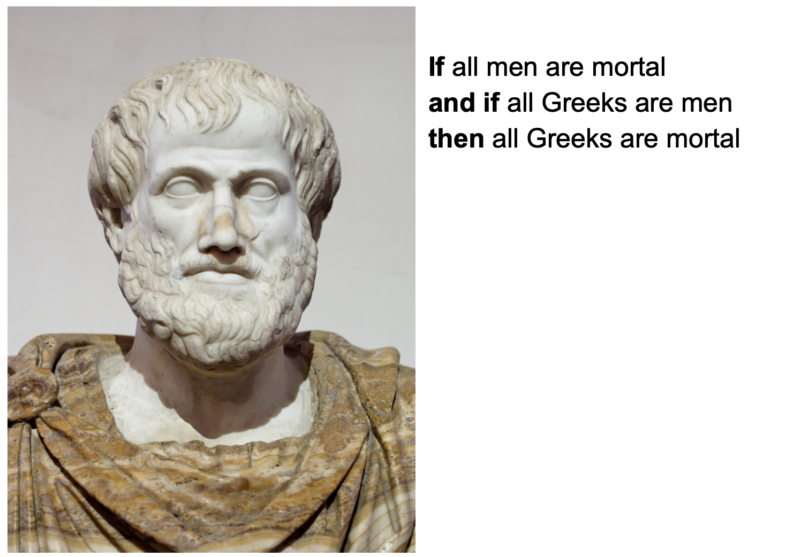

The problem is that ordinary language is slippery -- most of the speech we use does not fit neatly into the buckets of logic. For example, if I say "chair" everyone may think they know what a chair is. But can you precisely define it? This person thought they could.


A famous story goes, Plato used to refer to a man as a "featherless biped", and one day Diogenes brought in a plucked chicken and said "behold! a man".


Is there something that we can start with as a foundation to represent knowledge? What is the basis of knowledge? The simplest possible thing we can do -- perhaps the foundation of knowledge itself -- is to make a distinction. Either it is true that I have red hair, or it is false. Either it's true that I ate an apple today, or I did not. Yes/no, night/day, black/white, hot/cold, etc.

The idea of two things in opposition is philosophically fundamental. In the Bible, the first thing God did was create light and separate light from darkness. In Taoism, there is yin/yang, the two primordial forces, from which we get 8 elements, 64 hexagrams, and so on. We see this across the world in humanity's knowledge traditions.

## Representing Data

So this brings us to the bit. A bit is a singular value, which can be 0 or 1, representing a simple binary choice. This is a basis from which we can create many, many things.

What can we do with this humble 0 or 1? We can create numbers. How might we represent numbers with 0s and 1s? Here's one way:


According to this encoding, we represent the number three by the binary sequence `[0, 0, 0, 0, 0, 0, 0, 0, 0, 1, 1, ...]`
Is that a particularly good or efficient encoding? Probably not. But it is certainly unambiguous and therefore valid.


The standard way that we represent numbers using bits is called **binary representation**.


How does binary work? It's pretty similar to the decimal notation we are familiar with. The rightmost entry represents the 1's place -- a 0 means there is no 1, a 1 means there is a 1. Going left one hop, we get to the 2s place -- a 0 means there is no 1, a 1 means there is a 2. Going left again, we get to the 4s place -- a 0 means there is no 4, and so on. We add all these up to get our number.


What information does this sequence of bits represent? By what we just learned, we might be convinced that it represents the number 427,603.


However, not so fast. We didn't specify that we wanted to interpret the bits as a binary number. What if we use a different decoding scheme? Now it means the word MARS


And now it means the word CARS


So we learn an important lesson here -- what matters as much as the data itself are the rules that we apply to interpret it. We can interpret a sequence of bits in infinitely many ways. It can be a number, it can be words, it can be a data structure, it can be a picture -- it all depends on the rules you apply to make data into something meaningful.

All the data, all the binary bits that make up your computer, can be thought of as a really really big number. Your Urbit is a big binary number! And any possible information can be encoded in a binary sequence with a suitable decoding rule.

## Performing Operations

So we have gotten an idea of how information might be stored on a computer -- information that carries some meaning for us. However, a computer isn't a static lump of information. It manipulates that information according to instructions to produce results.

A computer is something that operates according to clear, strict, pre-defined instructions to perform tasks. We can tell our friends ambiguous things like "please get me a glass of water", they can understand and fulfill them approximately. However when we're programming computers, this doesn't work. We need to be very precise. How do we explain and understand this?

We begin the study of **formal systems**. A formal system consists of:

* **Axioms:** Starting points of the system, facts that are assumed to be true.
* **Inference Rules** Operations that can be repeatedly applied starting from the axioms to build new "truths"
* **Theorems:** Anything that can be reached by repeatedly applying inference rules starting from the axioms.

Why is it important to study systems like this? Well, suppose you can say the axioms correspond to all possible starting points of a computer, and the inference rules to the possible actions it can take. Then the set of theorems of the formal system precisely describes every possible state of the computer. This gives us correspondences such as:

This formal system **has a theorem** with X property <=> This computer **can reach a state** with X property

*For example, you can prove that your computer can perform some computation*

This formal system **has no theorem** with Y property <=> This computer **cannot reach a state**  with Y property

**All theorems of this formal system** have Z property <=>  **All states of this computer** have Z property

*For example, you could prove your computer cannot crash under certain circumstances*


This means that formal systems are extremely powerful tools for modeling and reasoning about computers.

More generally, returning to humanity's search for knowledge and truth. IF you believe that your formal system accurately corresponds to some aspect of the world, you can say things like,

<p style="text-align: center;">This formal system <b>has a theorem</b> with X property <=> ~X property <b>is true</b>  about the world</p>

<p style="text-align: center;">This formal system <b>has no theorem</b> with Y property <=> ~Y property <b>is false</b>  about the world</p>


To make this more concrete, let's look at an example of a formal system.

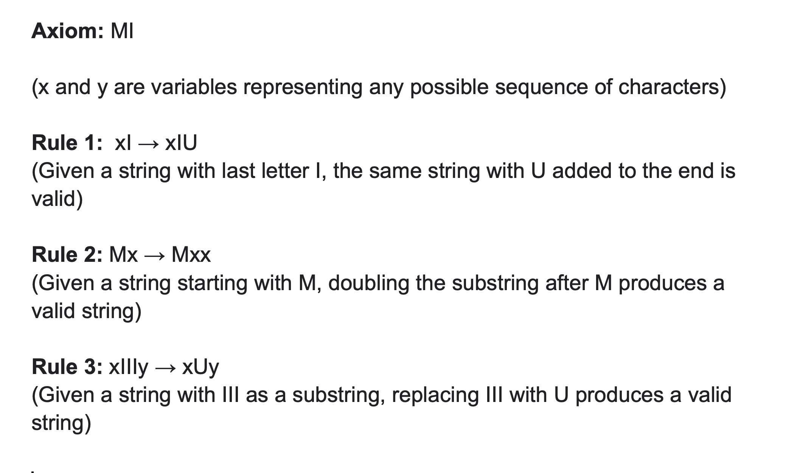

Can you come up with some theorems in this system?

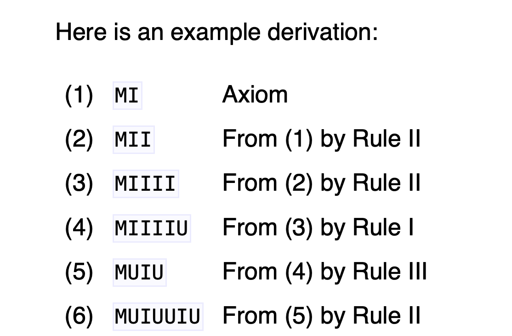

Let's learn about another formal system. Here the axioms of the system are strings of the form `xP-Qx-`
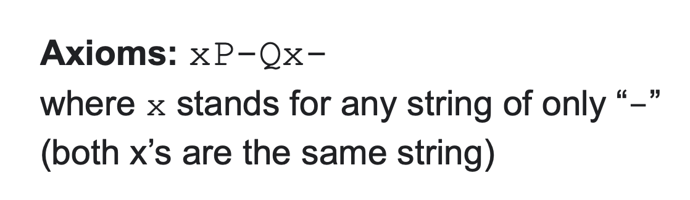

Something interesting about this system is that we don't have one axiom, like in the MIU system, we actually have an infinite number of axioms. In general, this is fine, as long as it is specified.
> Axioms of the P-Q system:
>
> -P-Q--
>
> --P-Q---
>
> ---P-Q----
>
> ...

This system has one derivation rule, if you have a theorem-string with some amount of dashes before `P`, some amount of dashes between `P` and `Q`, and some amount of dashes after `Q`, you can add a dash between `P` and `Q` and after `Q` to produce a theorem.


Some example derivations in this system:


This system has an interesting property. Can you tell what it is? In particular, for every axiom and theorem, count the number of hyphens before `P`, between `P` and `Q`, and after `Q`.

**Fact:** All theorems of this system have the number of "-" before `P`, plus the number of "-" between `P` and `Q`, equal to the number of "-" after `Q`.

**Another Fact:** For every true arithmetical statement of the form `x + y = z`, there is a unique theorem of the `p-q` system with `x` hyphens before `P`, `y` hyphens between `P` and `Q`, and `z` hyphens after `Q`.

We have modeled a simple computer which, under a certain interpretation, outputs all true facts about adding two positive whole numbers. Now the formerly meaningless symbols `P` and `Q` may come to mean in our minds 'plus' and 'equals'.

However, we must be careful to not go too far.

> -p-p-q---

is not a theorem of the system, even though it's true that `1+1+1=3`. It's impossible to produce a string with two `P`s. So we must not take an interpretation farther than the underlying computation allows us.

Let me show you one more formal system. Its theorems look like binary trees of numbers and the words `add` `sub` `mul` and `div`. In particular, here are how the axioms are defined:


For reference, here are some valid axioms:
```
6

157

-2.5999

   mul
  /   \
 2     3

       add
      /   \
    mul    5
   /   \
  2     3
```

Here is the full specification of the system. In short, whenever we have a subtree whos head is `add/sub/mul/div` and branches are <u>numbers</u> (not trees), we can collapse the subtree to just a number produced by performing the corresponding mathematical operation.


An example of a derivation in this system:


So we have created a simple system which models arithmetic.

## Variables and Functions

Let's zoom out a bit. What exactly is a computer? You sit down to a computer, and there's a lot of possible things you can do. The computer does not know what you will do next. You might click on a button, you might put some value in a form. It's job is to produce an appropriate response for any possible input you might give it. So you might think of a computer as a process which maps inputs to outputs.

We have something that is undetermined while awaiting an input, then upon receiving one, performs a mechanical series of operations to produce an output.

How can we model this in a formal system? How about this? 

```
       add
      /   \
    mul    5
   /   \
  x     3
```

This tree currently cannot be reduced according to our arithmetical system. That is because `x` is not a number, so the subtree with head `mul` cannot be collapsed. That subtree is not a number, so the tree with head `add` also can't be collapsed. So this expression has undetermined value.

If you give it a value for x, THEN we can apply our rules to reduce it. And for every possible numerical value you can assign x, this function reduces to a particular output.


Having just been introduced to variables and substitution, we note that they don't just apply to numbers. We can also substitute whole expressions for variables:


Having performed substitutions and bound all the variables to values, we can now reduce the tree using our rules.


Before, we substituted `x` into `y` and then `9` into `z`.
We can also do the substitutions in the other order -- first substituting `9` into `z`, then `x` into `y`, and get the same result:

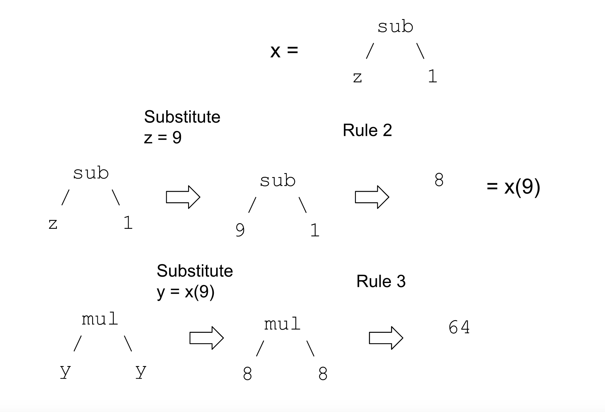


## Functional Programming

So why did we do all of this? It turns out that I have just introduced you to functional programming. Functional programming is a way to think about programming where everything is a function -- map from inputs to outputs. Here are the arithmetic diagrams we just covered, written in a functional language pseudocode. 

```
fun1(z):
  z - 1

fun2(y)
  y * y

fun2(fun1(z))

fun2(fun1(9)) -> 64
```

`fun1` and `fun2` are functions, mapping inputs to outputs.Their composition -- `fun2` ran on the output of `fun1`, is also a valid function. And when we plug in `9` to this composed function, we get the output `64`, just as before.


Many of you may already be familiar with programming in an imperative language, such as C or Python. In this paradigm, the computer has a state, and you tell it various commands to operate on the state. If you want to combine multiple operations, you sequence them one after another. However, If you think this way about a functional program, you will get confused.

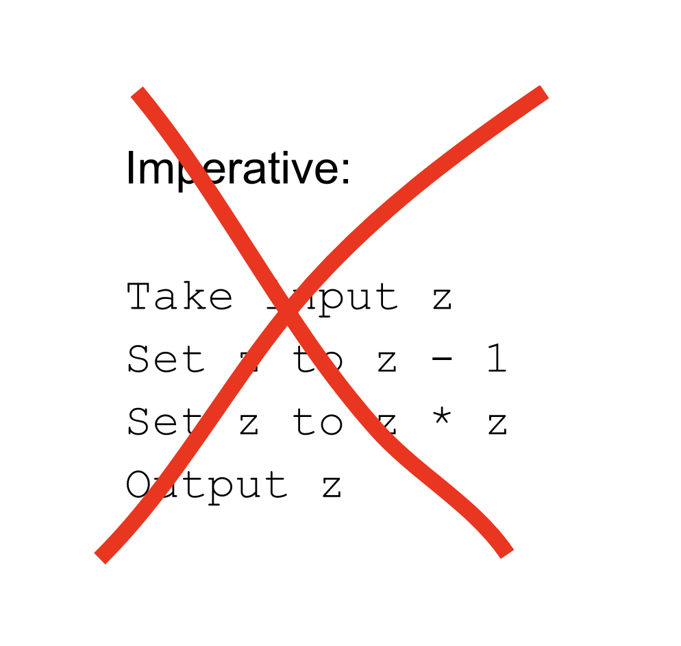

In functional program, you must concieve of of everything as functions from inputs to outputs. If you want to you combine operations, you pipe them -- you feed the output of a function as the input to another function, to create a new function. An Urbit instance is a function!

Here, you can visualize the pipe metaphor for our previous mathematical operation.

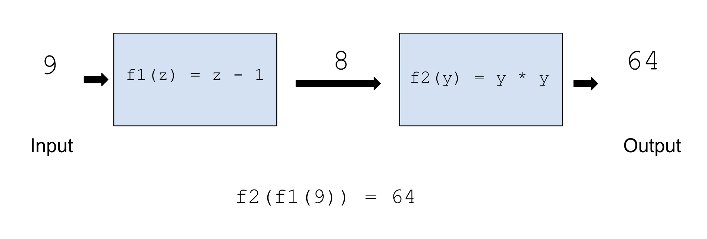

## Functions on a Binary Tree

A functional program consists of two things, data input and computational instructions on what to do with the input.

Let's look at a simple example of functional programs on a simple data structure: a binary tree. It'll become clear later why these are important.

A binary tree is a tree structure where each node either contains a number and no children, or splits into two branches, each of which may contain a subtree. To make this definition clearer, here are some examples of binary trees in our system:

```
64

 /  \
64   2

   /   \
 /  \   2
5   31

   /    \
 /  \   /  \
5   31 2   16

   /     \
 /  \    /  \
5   31 /  \ 16
      9   17
```
We also mentioned functions. There's only three functions in our system `LeftSubtree`, `RightSubtree`, and `Increment`.

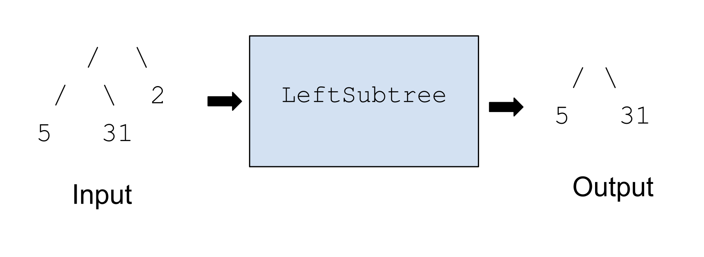

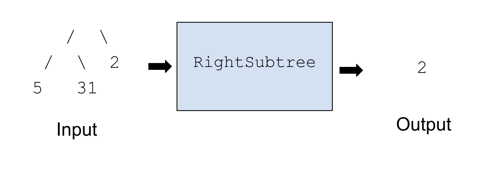


If the function is invalid, it results in a crash. Getting a subtree only works if the subtree exists.

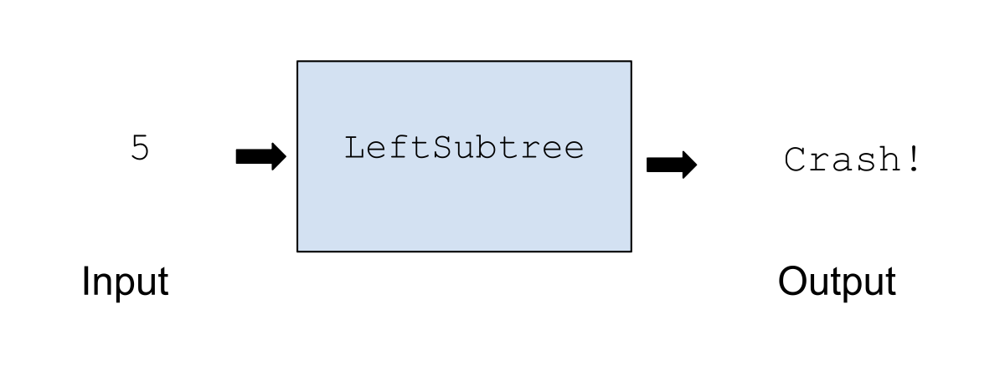

Incrementing only works if the tree is just a number.

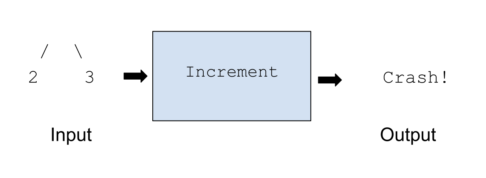

We can chain functions together to create new ones.


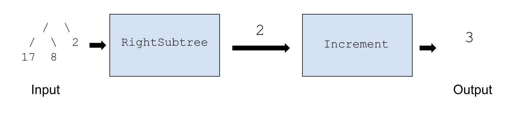

What does this one do?


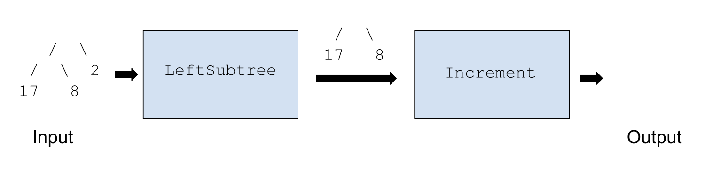


We will learn in the next lesson why these binary tree functions are important.

## Recursion 

Functions can call other functions in their definitions. Recall that we went over these two functions:

```
fun1(z):
  z - 1

fun2(y)
  y * y

fun2(fun1(z))

fun2(fun1(9)) -> 64
```

We can rewrite the same operation like this. Now `fun2` calls `fun1` in its definition, and you only invoke `fun2` for the same result.

```
fun1(z):
  z - 1

fun2(y):
  fun1(y) * fun1(y)

fun2(9) -> 64
```

But interestingly, functions can even call themselves in their own definitions. This is a very important concept called **recursion**. 

Consider this program:
```
function(n):
  if n = 0:
    return n
  else:
    return function(n-1)
```

Let's figure out what this psuedocode function does. On an input of 0, the `if` branch triggers, and returns 0. What happens on an input of 1? In that case, the `else` branch triggers, and we return `function(1-1)` which is `function(0)`. We just checked that `function(0)` returns `0`, so we have `function(1)` returning `0` as well. Continuing with this reasoning, we can confirm that this function returns `0` for all positive whole numbers.

Recursion has a potential danger. Let's consider this function. 

```
function(n):
  if n = 0:
    return n
  else:
    return function(n+1)
```
What happens on an input of `0`? The `if` is triggered, and it returns 0. Now let's try to understand `function(1)`. What happens? Calling the function on `1` skips to the `else`, and calls `function(2)`. What happens when `function(2)` is called? it skips to the `else` and calls `function(3)`. So on and so forth. 

Calling this function on an input of `1` or greater never returns a result. If you programmed this, it would make your computer run infinitely without returning.

## Time complexity

In programming, it's important to consider how many operations it takes to compute a result. Returning to our previous example, we may try to count how many calls to the function it takes to return. 

```
function(n):
  if n = 0:
    return n
  else:
    return function(n-1)
```
For an input of 0, it takes the first branch of the `if` and takes 1 function call to return. 

For an input of 1, it skips to the `else` and calls `function(1-1) = function(0)`, which itself takes 1 call and returns `0`. So it takes 2 calls to return.

For an input of 2, it skips to the `else` and calls `function(1)`. We just figured out that `function(1)` takes 2 calls to return, so an input of 2 takes `2+1=3` calls to return.

In general we can say this takes `n+1` function calls to return on an input of `n`. In computer science, we can say this function computes in `O(n)` time. For an input of size n, it takes a time to finish that scales up by a factor of n. (Note that recursing n times doesn't always mean a function takes O(n) time to compute -- it may take longer depending on the operations in the recursion).

Let's consider this new function. It's a bit trickier.

```
function(n):
  if n = 0
    return n
  else
    return (function(n - 1 ) + function(n-1))
```

 First, what does it do? Let's try `function(0)` first. It triggers the first `if` and returns 0. Now let's try `function(1)` It skips the `if` and goes to the `else`, returning 
 ```
 (function(1 - 1) + function(1 - 1)) = (function(0) + function(0))
 ```
 From our previous calculation, we know `function(0)` returns `0`. So therefore `function(1)` returns` 0 + 0 = 0`

 Continuing with this reasoning, we can see that this function returns 0 for every positive whole number input. So it turns out this function does the exact same thing as our last one! 
 
 However, there's an important difference. How many calls to the function does it take to compute `function(0)`? Just 1. How about `function(1)`? It takes 3 calls, the original call and `1+1` calls to compute `function(0)` twice. How about `function(2)`? That takes 7 calls, the original call and `3+ 3` calls to compute `function(1)` twice. Computing `function(3)` takes `1+7+7=15` calls.

In general, this function takes `2^(n+1) - 1` calls to compute `function(n)`. So although they compute the same thing, the original function took time that grew linearly in n, while this new one blows up exponentially.

Learning about runtime helps us understand when we may be able to rewrite code to save compute time while returning the same result.

We have finished covering the important basics to understand functional programming and start learning Hoon.

## Introduction to Development

### Development Environment
To write software, you need an ability to write text and save it as a file. Technically, you could simply write in a simple text editor, but that wouldn't have many affordances to help you write code. Most people use software called an IDE or Integrated Development Environment. There are many options on the market, including VSCode, Vim, Emacs, Xcode, and others.

If you don't have a personal preference, we like to use VSCode (or VScodium to go open source) in this course. This is because it has several plugins for Hoon that will greatly help you for writing code.

For official Hoon support, including syntax highlighting, use this plugin: https://marketplace.visualstudio.com/items?itemName=tloncorp.hoon-tloncorp

Hoon Assist is a plugin that can show you definitions of runes and functions when you hover over them: https://marketplace.visualstudio.com/items?itemName=nocsyx-lassul.hoon-assist

If you use VSCodium, you will have to download the .vsix file and then manually install it by going to Settings -> Extensions -> ... -> Install from VSIX.


Users of Vim and Emacs are welcome to try the following extensions, but be warned that there are reports that the install process may be out of date. It'll help me if you try it and let me know if things are working smoothly.

https://github.com/urbit/hoon.vim

https://github.com/urbit/hoon-mode.el

For further help on learning how to use VSCode or any IDE, there are plenty of resources available online.

### Git

Git is an indispensable tool for programmers. It lets you upload your projects, back up them up, share them and collaborate with others, and store the entire version history, so you can go back and forth across time.

If you haven't used it before, you should make an account on Github, make a repo, and try out some basic operations. This is a homework question.

There are many resources online for learning how to use git. I searched around and found a few links which can help you get started with it:

https://docs.github.com/en/get-started/quickstart/hello-world

https://github.com/git-guides

https://rogerdudler.github.io/git-guide/


##  Terminal

The last software development skill we want to cover is using  the terminal, or command line interface. Most computer users interface with the GUI, or the graphical interface. This is what we typically interact with, with icons representing files and folders and so on.

Although using the terminal is more challenging at first, learning it greatly unlocks your ability to quickly manipulate your computer. Here are a basic set of important skills:

* Seeing what files are in a directory
* Navigating between directories
* Making a new directory
* Moving a file from one place to another
* Copying a file from one place to another
* Deleting a file

There are many resources online to help you learn these skills. The details will differ depending on whether you use Linux/Mac or Windows.

In summary, to get started as a developer, you should get basic familiarity with using an IDE, using Git, and using the terminal.

**A note for Windows users**. Next week we will boot an Urbit instance on your computer. Urbit does not officially support running on Windows, only UNIX-based systems. Windows users have two options, which are either to run Windows Subsystem for Linux (a way to simulate Linux on Windows), or to dual-boot a Linux OS on their machine. Students have finished the course using WSL, but I have noticed they sometimes run into technical issues. I recommend dual-booting Linux -- distros like Ubuntu or Mint are easy to install.