#   Molds and Decision Making
##  Hoon School Lesson 3


**Homework**: https://forms.gle/FFPMn5ByvVPoHhz38

**Video**:  https://youtu.be/hxKw_FQnrqs

In this class, we'll increase our understanding of Hoon's type system and learn how to make more sophisticated types. Next, we'll learn how to do logical decision making, an essential task of any programming language. This is an important lesson, and we begin writing what starts to resemble real, complex Hoon code.


## Introduction to Molds

In last class, we went over how to use Hoon's type system for atoms (single values). We learned that auras are different ways of interpreting an underlying atom, such as as a `@t` text or `@p` ship name, and that auras cast to each other if they nest in a tree-like structure like this


We learned how to use the `^-` (kethep) rune as a "fence" to make sure the result of a computation is a certain type

```
> ^-  @ud  %-  add  [1 2]
3
```

We also learned how to use the `^+` (ketlus) rune, which uses type inference on its first argument, to do the same thing.

```
> ^+  ~zod  %-  add  [1 2]
~wes
```

And we learned how to get the default value of an aura with `^*` (kettar) and its sugar syntax.
```
> ^*  @rs
.0

> *@rs
0
```

This is all great, but so far we have just been dealing with single values. For general computing, you would need types for more complicated structures: cells, tuples, lists, sets, maps, and so on.

Hoon covers these sorts of types with what's called a **mold**. To use a chemical analogy, if atoms are like atoms, molds are like molecules -- more complex structures that are built bit by bit out of atoms. Molecules can be simple, like water, or complex, like DNA. The same goes for molds.


## Stucture vs Value Mode
When you are writing Hoon to create a mold, you are in what's called **structure mode**. Structure mode is when the Hoon parser is interpreting your code as a specification for a type, rather than directly writing something that computes a value.

Let's look at an example. In the code below, we are simply pinning the face `word` to the string `'hello'`, and then returning the face `word`.
```
> =/  word  'hello'  word
'hello'
```

We could have also added a bit of type information to the face `word` to specify that `word` must be of type `@t`.

```
> =/  word=@t  'hello'  word
'hello'
```

It turns out that this is actually sugar syntax for the following rune, `$=` (buctis).

```
> =/  $=(word @t)  'hello'  word
'hello'
```

The `$=` (buctis) rune takes as input two children -- the first of which is a face and the second of which is a specification for a type. In structure mode (when you're writing a type specification), it also sugars to `face=type`

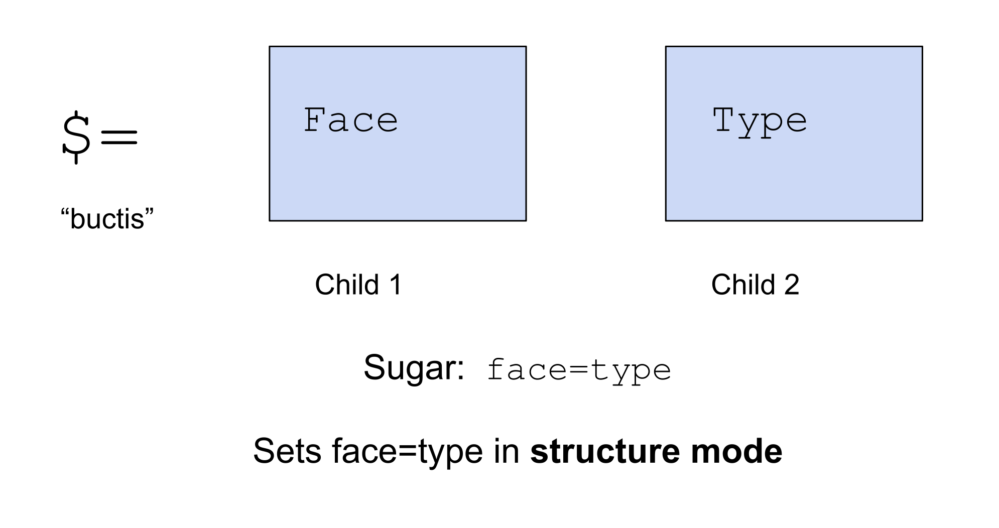

Importantly, we've now seen two different kinds of syntax where we write something like `a=b`. We have seen directly assigning a face to a value, such as:

```
> word='hello'
word='hello'
```
Or for a more complex example,
```
> a=[word='hello' num=2]
a=[word='hello' num=2]
```

In the last lesson, we learned that this is actually sugar for the `^=` (kettis) rune.


And if you'll recall, it can even handle sequential/nested face pinning like this

```
^=  [b c d=[x y]]  [1 2 3 4]
```


Alternatively, we can use this `a=b` syntax in the way we just learned, to specify that a face has to have a certain type:

```
> =/  word=@t  'hello'  word
'hello'
```

It's very important to note that these two syntaxes, even though they look similar, desugar to different things, depending on whether you're in value mode (writing directly about values) or structure mode (writing a type specification).


## Building and Using a Simple Mold

Let's go through an example of building and using an actual mold using structure mode. Suppose we are building a simple bank app. We might represent accounts by `@p`, and for each account, we might want to store how much money they have in a `@rs` floating point. We would want these two values to be linked together -- each account has its own amount of money.

To do so, we will use a new rune called `$:` (buccol). `$:` takes an indefinite number of children and creates a mold of a tuple of the type specified in each position. So it can have 2 children, and create a type that's a cell, 3 children and create a type that's a triple, and so on.

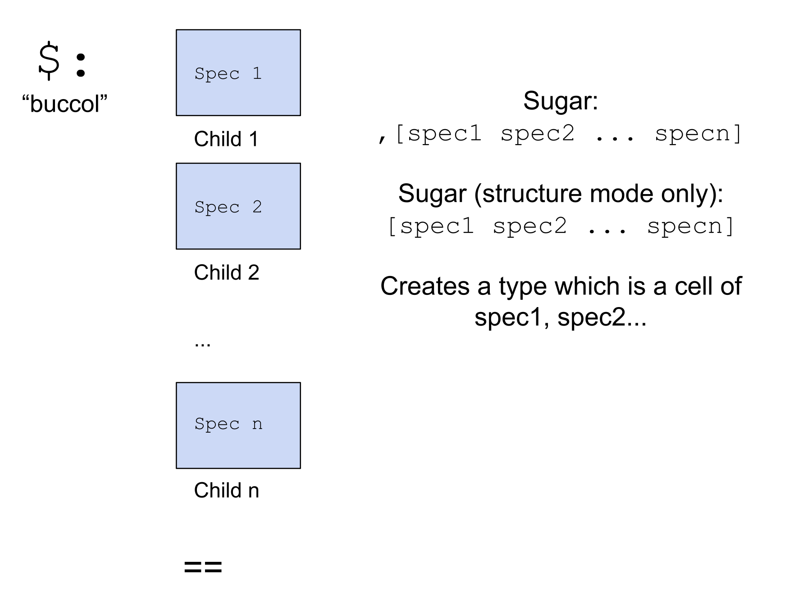


This code makes a new data type `bankaccount` and pins it to the subject of our Dojo:
```
=bankaccount $:  $=  ship  @p  $=  money  @rs  ==
```

Recall that this syntax is a Dojo-specific shortcut and not technically Hoon code. It saves the definition in our Dojo's workspace so other code we type can use it.

Let's parse this Hoon statement. Consider the abstract syntax tree breakdown of this statement below:


First we note the `$:` (buccol) which means we are creating a cell type. Next, the subexpression `$=  ship  @p` is the first child of the `$:` (buccol). It says that the face `ship` must be something of aura `@p`. The subexpression `$=  money  @rs` is the second child of the `$:` (buccol). It says that the face `money` must be something of aura `@rs`. The `$:`is closed by the `==` (tistis), to indicate there are no more children. Together, this expression creates a cell type which must have a `@p` in the head position and a `@rs` in the tail position.

Now let's check that our mold building worked. Certainly the following cell should fit this mold, right? The Hoon parser should know that the first entry is of type `@p` and the second entry is of type `@rs`. 

```
[~zod .123456.78]
```

We can use the `^-` rune in a way just like we did with atoms and auras.

```
> ^-  bankaccount  [~zod .123456.78]
[ship=~zod money=.123456.78]
```

The result with faces attached to entries indicates that casting with the `bankaccount` mold worked.

As an aside, for molds, the following sugar syntax is exactly equivalent to using `^-`:

```
`bankaccount`[~zod .123456.78]
```

Whereas if you'll recall for auras,

```
`@p`123
```

desugars to

```
^-  @p  ^-  @  123
```

### Understanding Mold Casting

We can substitute the definition of `bankaccount` into our above code to get the full version:

```
> ^-  $:  $=  ship  @p  $=  money  @rs  ==  [~zod .123456.78]
[ship=~zod money=.123456.78]
```

We parse this statement in two parts, which are the two children of the `^-` (kethep), shown in the following graphic:

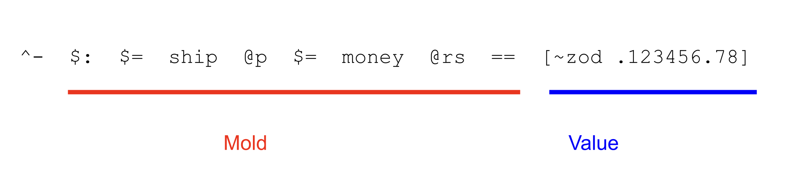


What is happening when we do this type casting? First, the Hoon compiler checks the first position in the mold, which we specified as `@p`. Then it checks the first position of the value, which is `~zod`, infers a type from it (which is `@p`) and checks that the inferred type `@p` nests into `@p`.


Then it checks the second position in the mold, which we specified as `@rs`, and makes sure that the inferred type of `.123456.78`, which is `@rs` nests into `@rs`.


Having passed all the checks, it returns the cell with with faces attached to it.


How about an example where it doesn't work? If we try the following, it will throw an error, because `@t` (the inferred type of `'hello'`) doesn't nest under `@p`. In this case, the `nest-fail` error is perfectly descriptive -- we have a `@t` and need a `@p`.

```
> ^-  bankaccount  ['hello' .123456.78]
mint-nice
-need.@p
-have.@t
nest-fail
```

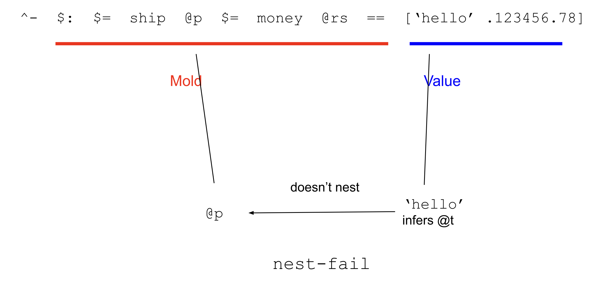


To reiterate the point, the following won't work either, because `@ud` doesn't nest under `@p` or `@rs`. In this case, neither of the values nest into their corresponding mold entries.

```
> ^-  bankaccount  [1 2]
mint-nice
-need.@p
-have.@ud
nest-fail
```

Sugared:
```
> `bankaccount`[1 2]
mint-nice
-need.@p
-have.@ud
nest-fail
```


### Sugaring Molds

In the wild, you'd probably encounter these sorts of mold definitions in a more readable way. We can apply sugar syntax to our above code, first for the two instances of `$=` (buctis) to get this:

```
^-  $:  ship=@p  money=@rs  ==  [~zod .123456.78]
```

Then for `$:` (buccol) to get this:

```
^-  [ship=@p money=@rs]  [~zod .123456.78]
```

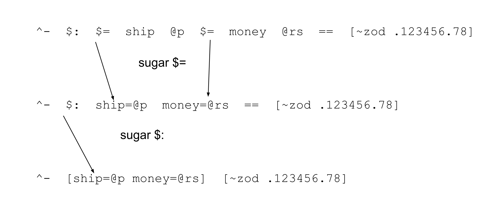

That's much simpler, and a common way you may encounter such a spec written.


Now we must note an important and subtle point. Suppose we wanted to define a new mold using the `=/` rune, such as in the following code:

```
> =/  bankaccount  $:  ship=@p  money=@rs  ==
  ^-  bankaccount  [~zod .123456.78]
[ship=~zod money=.123456.78]
```

In this case, if we wanted to sugar the `$:` rune, you would have to use this slightly different syntax. Note that you need this com `,` in front of the brackets. Why? 

```
=/  bankaccount  ,[ship=@p  money=@rs]  ==
```

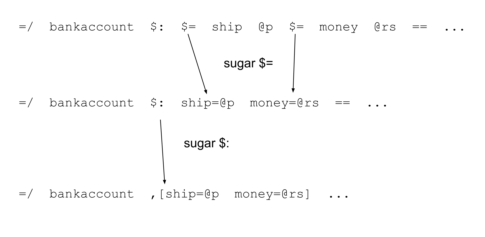

Why is that? Why is there an extra `,` (com) in front of the square brackets?

The  `=/` rune usually expects a value for its second child. We should be comfortable with its usage in cases such as:

```
> =/  numbers  [1 2]  numbers
[1 2]
```

in which case the `[1 2]` would desugar to the `:-` (colhep) rune.

```
=/  numbers  :-  1  2  numbers
```

So when we specify that the face `bankaccount` is pinned to a mold, the leading `,` differentiates it from being a value and makes it clear you are in structure mode, describing a type.

On the other hand, `^-` always has a type specification as its first child. This means there's no ambiguity and the following sugar form is perfectly fine:

```
^-  [ship=@p money=@rs]  [~zod .123456.78]
```


One more place that structure mode can show up is in the first argument to a `=/` (tisfas). We are used to using `tisfas` to assign a *single* face to a value or structure, but you can assign pairs or more of faces at once using structure mode.

Here we assign the faces `ship` and `money` to the values `~zod` and `.123456.78`.
```
> =/  [ship=@p money=@rs]  [~zod .123456.78]  ship
~zod
```

```
> =/  [ship=@p money=@rs]  [~zod .123456.78]  money
.123456.78
```

This desugars using the runes we just learned, `$:` (buccol) and `$=` (buctis)

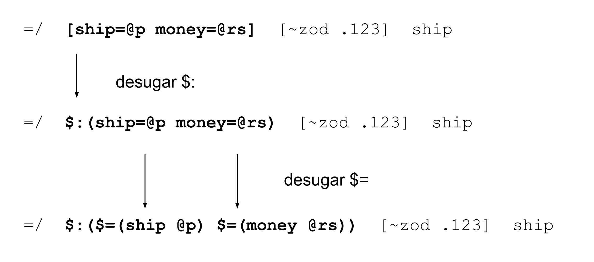

## Casting vs Molding

Let's now see something interesting. What happens if we call the mold like this?

Before we run it, let's look at that first rune and recall that it is `%-` (cenhep), the rune we've used for calling gates.

```
%-  bankaccount  ['hello' .123456.78]
```

When we run it, it works and returns a result.
```
> %-  bankaccount  ['hello' .123456.78]
[planet=~dozpel-bicreg-famtul money=.123456.78]
```

But oddly if we'll recall, when we tried the same exact code except with `^-` (kethep) instead of `%-` (cenhep), it threw an error.

```
> ^-  bankaccount  ['hello' .123456.78]
mint-nice
-need.@p
-have.@t
nest-fail
```

What's going on here? It turns out that molds are also gates, and any mold can be called as a gate, which gives different behavior than casting it with `^-` (kethep).

Recall that when we use `^-` (kethep), we're doing element-wise type checking to make sure each position in the cell matches each specification in the mold. When we call the mold as a gate using `%-` (cenhep), we treat the input cell as a raw noun with no type information whatsoever. Then we force the atoms in the underlying noun to fit auras in the mold.

We could have even done this on the cell `[1 2]` that also didn't work before:
```
> %-  bankaccount  [1 2]
[planet=~nec money=.3e-45]
```

In this case `~nec` is the `@p` representation of `1` and `.3e-45` is the floating point representation of `2`. We can of course use the sugar syntax for `%-` (cenhep) as well:

```
> (bankaccount [1 2])
[planet=~nec money=.3e-45]
```

These two usages of molds are respectively called **casting** and **molding**, and their differences are explained in the following graphic. In particular pay attention to the compile-time vs run-time difference, which means that casting with `^-` catches errors, while molding with `%-` may introduce errors. 

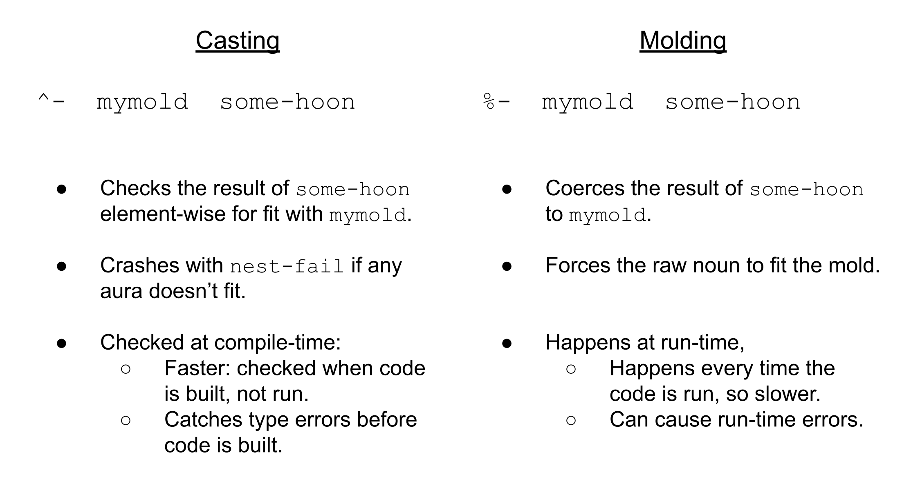

To see an example of a runtime error, let's try to mold something that doesn't fit. We know that the mold `bankaccount` describes a cell of two atoms. If we give it the triple `[1 2 3]` (which desugars to `[1 [2 3]]`), we get a runtime failure:

```
> %-  bankaccount  [1 2 3]
dojo: hoon expression failed
```

`bankaccount` expects an atom in its second entry, but this has the cell `[2 3]` -- there's no sensible way to coerce that cell to be an atom.

In short, **casting** is used as a fence to make sure that any data that goes past a point must match a particular type. It catches mismatches when the code compiles. **Molding** is an active action to make some data fit a type. They are different, and there's situations in which you may use both of them.

##  Type unions
There is one more rune we should learn for making molds. Suppose you want to create a type that is either text OR a floating point number OR a date. This is what's called a type union, and you create it with the following rune `$?` (bucwut).


Let's try an example. We can pin this to the Dojo:

```
=newtype $?  @t  @rs  @da  ==
```

Now we can check that `newtype` allows those three types to pass, and not others. If we give it a date, it passes.

```
> ^-  newtype  ~2023.6.15
 ~2023.6.15
```

and if we give it a @p, it fails.
```
> ^-  newtype  ~zod
mint-nice
-need.?(@da @rs @t)
-have.@p
nest-fail
```

If we pass it a `@t` or `@rs`, it passes, but the value defaults to formatting it as the last type in the type union, which in this case is `@da` (this is simply a quirk of the type system -- don't worry too much about it).

```
> ^-  newtype  'hello'
~292277024401-.1.1..00.00.00..0000.006f.6c6c.6568
```

```
> ^-  newtype  .123.45
~292277024401-.1.1..00.00.00..0000.0000.42f6.e666
```

In practice, type unions are not used much with auras -- they are most commonly used with the `@tas` `term` constants that we learned in last lesson. As you'll recall, a `term` is a unique type in and of itself. Let's try an example.

Here we pin to the Dojo subject a new type `reptile`, which is either a `%snake` `%lizard` or `%crocodile` constant.

```
=reptile $?  %snake  %lizard  %crocodile ==
```

We could have also written it with the sugar syntax for `$?`:

```
=reptile ?(%snake %lizard %crocodile)
```

To use this type, we can cast the constant `%snake`:
```
> ^-  reptile  %snake
%snake
```

Sugar:
```
> `reptile`%snake
%snake
```

and check that the constant `%elephant` does not pass:
```
> ^-  reptile  %elephant
mint-nice
-need.?(%crocodile %lizard %snake)
-have.%elephant
nest-fail
```

We can call it as a gate too. Here the big number is the number under the text `%lizard`.` 
```

> %-  reptile  110.442.424.461.676
%lizard
```

```
> (reptile 110.442.424.461.676)
%lizard
```

If the underlying integer doesn't cast to `%snake` `%lizard` or `%crocodile`, you'll get a runtime error:

```
> %-  reptile  1
dojo: hoon expression failed
```

## Combining Type Unions and Cell Types

Now suppose we are running a reptile care facility and need to keep track of how much we have fed the reptiles this week. To do so, we can combine the runes we just learned.

In case we haven't pinned the `reptile` type definition to the Dojo, we can pin it again. Then we can pin a new type definition `reptile-tracker`, whose first entry is the type union `reptile` and whose second entry is a `@ud`.

```
=reptile $?  %snake  %lizard  %crocodile  ==
=reptile-tracker $:  species=reptile  meals=@ud  ==
```

We can use it to cast:

```
> ^-  reptile-tracker  [%crocodile 3]
[species=%crocodile meals=3]

>`reptile-tracker`[%crocodile 3]
[species=%crocodile meals=3]
```

And we can use it to mold:
```
> %-  reptile-tracker  [110.442.424.461.676 4]
[species=%lizard meals=4]

> (reptile-tracker [110.442.424.461.676 4])
[species=%lizard meals=4]
```

Although this was a simple example of combining a type union and a cell type, you can combine them with as much complexity as you want -- type unions of cell types, cell types which have other cell types as their entries, and so on are all possible. 

## Bunting Molds

Like with atoms, we can get bunts, or default values for all the molds we just created, using the `^*` (kettar) rune.

For example, recall the cell type `bankaccount` we created earlier of `@p` and `@rs`.
```
=bankaccount ,[ship=@p money=@rs]
```

For a cell type, it will get the bunt of each atom and return those bunts in the cell.
```
> ^*  bankaccount
[ship=~zod money=.0]
```

Sugar syntax:
```
> *bankaccount
[ship=~zod money=.0]
```

For a type union, `^*` (kettar) defaults to getting the bunt of the last type in the union. Recall that `newtype` was a union of `@t` `@rs` and `@da`.
```
=newtype ?(@t @rs @da)
```

```
> ^*  newtype
~2000.1.1

> *newtype
~2000.1.1
```

The same logic applies for type unions of terms, returning the last type in the union.
```
> ^*  reptile
%crocodile

> *reptile
%crocodile
```


So for a combination of cell type and type union, it does what you expect:

```
> ^*  reptile-tracker
[species=%crocodile meals=0]

> *reptile-tracker
[species=%crocodile meals=0]
```

This concludes today's discussion of molds.

## Making Decisions

Let's context switch away from molds. In computer programming, making a decision based on whether a condition is met is very fundamental and important. Hoon has a family of runes for doing so, the `?` (wut) family, which are straightforward to use and understand.

The first and most fundamental rune is the `?:` (wutcol) rune. It takes 3 children -- the first child is a Hoon expression that evaluates to `%.y` or `%.n`. The second child is an expression to evaluate if the first child is `%.y`, and the third child is an expression to evaluate if the first child is `%.n`. 

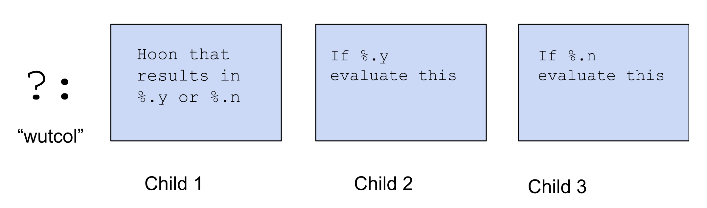

The simplest possible example usages of `?:` would be like this.

```
> ?:  %.y  1  2
1
```

Since the first child is `%.y`, we take the branch in the second child, and simply return `1`

```
> ?:  %.n  1  2
2
```

Now since the first child is now `%.n`, we take the branch in the third child and simply return `2`.

Pretty straightforward, right? To learn some more sophisticated usages, we'll take a quick detour to learn some arithmetic comparison operators in Hoon.

### Comparison Operators

We will now learn about the standard library comparison operators:


They pretty much work like you'd expect.

`1` is not greater than `2`:
```
> %+  gth  1  2
%.n
```

`2` is greater than `1`
```
> %+  gth  2  1
%.y
```

`10` is not greater than `10`
```
> %+  gth  10  10
%.n
```

`1` is less than or equal to `2`
```
> %+  lte  1  2
%.y
```

`2` is not less than or equal to `1`
```
> %+  lte  2  1
%.n
```

`10` is less than or equal to `10`
```
> %+  lte  10  10
%.y
```

They disregard type information, so `~zod` is less than or equal to `~wes` because `0 <= 3`.
```
> %+  lte  ~zod  ~wes
%.y
```
We should also recall the `.=` (dottis) rune that we learned before, which tests if two nouns are equal. It also has a sugar syntax.


```
> =(1 2)
%.n
```

```
> =(2 2)
%.y
```

```
> =((add 2 3) 5)
%.y
```

This rune ignores type information and just tests noun equality:
```
> .=  ~wes  3
%.y

> =(~wes 3)
%.y
```

And is not only for atoms
```
> .=  [1 2]  [1 2]
%.y

> =([1 2] [1 2])
%.y
```

### Back to Decisions

Since all of `gth` `lth` `gte` `lte` and the rune `.=` (dottis) return a loobean (`%.y` or `%.n`), we can plug them into our `?:` rune to compose more complex expressions.

Here we pin `x` to a value, then return the text 'x was greater than 2' or  'x was not greater than 2' based on the result of the comparison.
```
> =/  x  3
  ?:  %+  gth  x  2  
    'x was greater than 2'  
  'x was not greater than 2'

'x was greater than 2'
```

```
> =/  x  1
  ?:  %+  gth  x  2  
    'x was greater than 2'  
  'x was not greater than 2'

'x was not greater than 2'
```

You'll most commonly see this in the sugar form:

```
> =/  x  1
  ?:  (gth x 2)  
    'x was greater than 2'  
  'x was not greater than 2'

'x was not greater than 2'
```

Of course,further computation can go in the branches of the `?:` rather than just directly returning a value.

Here, we're saying, if x is greater than 2, return the result of multiplying x by 5, otherwise return the result of adding 10 to x.
```
> =/  x  1
  ?:  (gth x 2)  
    (mul x 5)  
  (add x 10)
11
```

### Loobean Operators

Hoon has the equivalent of `NOT` `AND` and `OR` -- basic logical operations that you'd expect in any programming language.

The rune for `NOT` is `?!` (wutzap).  It simply takes an expression that reduces to a loobean, and reverses the loobean.
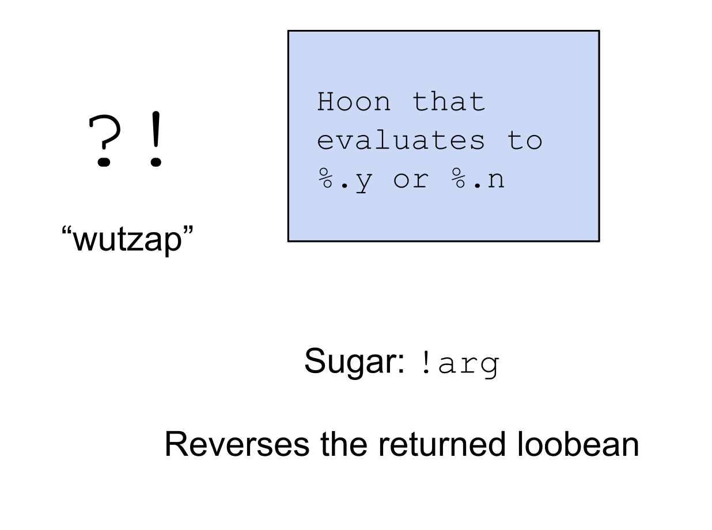

```
> ?!  %.y
%.n

> ?!  %.n
%.y

> ?!  (gth 2 3)
%.y
```

Sugar syntax:

```
!(gth 2 3)
```


The rune for `AND` is `?&` (wutpam). It takes an indefinite number of children, all of which should reduce to a loobean, and only returns `%.y` if *all* of the children do.
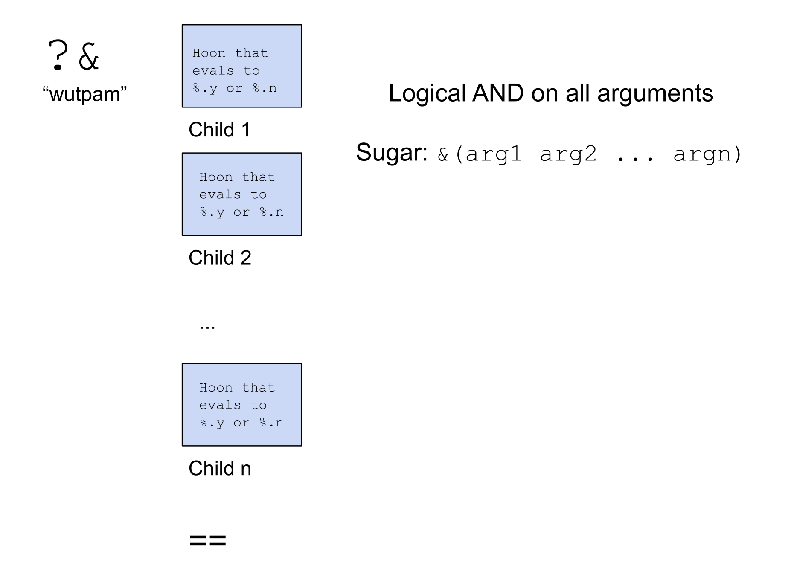

```
> ?&  %.y  %.y  %.n  %.y  ==
%.n

> ?&  %.y  %.y  %.y  %.y  ==
%.y
```

Sugar:

```
> &(%.y %.y %.y %.y)
%.y
```

And you can have more complex logical expressions:

```
> ?&  (gth 2 1)  (gth 3 2)  !(gth 4 3)  ==
%.n
```

The rune for `OR` is `?|` (wutbar). It takes an indefinite number of children, all of which should reduce to a loobean, and returns `%.y` if *any* of the children do.


```
> ?|  %.n  %.n  %.n  %.n  ==
%.n

?|  %.n  %.n  %.y  %.n  ==
%.y
```

Sugar:

```
> |(%.n %.n %.y %.n)
%.y
```

And of course you can have more complex expressions:

```
> ?|  (gth 1 2)  (gth 2 3)  (gth 4 3)  ==
%.y
```

## Branching on Null

The rune `?~` branches based on whether the first argument reduces to `~`. If it does, it takes the first code branch, else it takes the second.


### Mint-vain Error
However, what happens if we run the following code? Let's think through the logic. `a` has the value `~`, and then `?~` wants to evaluate its first branch and return the text 'it was null' if `a=~`. 

```
> =/  a  ~
  ?~  a  
    'it was null'  
  'it was not null'
```

However, running it actually gives us an error, `mint-vain`. What could this mean?

It turns out that in Hoon, the character `~` (sig) by itself is it's own special type. Because of this, the Hoon compiler knows that the type of `a` is just `~`, so it knows that the second branch of the `?~` can never be taken. **A `mint-vain` error is thrown whenever you have a branching conditional and the Hoon compiler knows a branch cannot be taken.**

However, we can confuse the compiler by casting the ~ to a naked atom `@`. A `@` can either be `0` (which is the same atom as `~` underneath), or some larger number, so the type system is no longer sure that you can't take a branch of the `?~`.

```
> =/  a  `@`~
  ?~  a  'it was null'  'it was not null'
'it was null' 
```

We can even just directly use a number, which is inferred by the compiler to a `@ud`, and gives the same behavior.
```
> =/  a  0
  ?~  a  'it was null'  'it was not null'
'it was null'
```

```
> =/  a  1
  ?~  a  'it was null'  'it was not null'
'it was not null'
```

A `mint-vain` error can sometimes pop up and confuse Hoon coders, so it's good to know why it happens.


## Type Branching
Using the type unions that we learned about earlier, we have access to more powerful branching tools. Recall that earlier we made the type:

```
=reptile $?  %snake  %lizard  %crocodile ==
```

which means that `reptile` is either type `%snake` or `%lizard` or `%crocodile`. We will use this with the `?-` case-switching rune, shown below. 


To make this clearer, let's see an example.

```
=/  reptile  $?  %snake  %lizard  %crocodile  ==
=/  r=reptile  %lizard
?-  r
  %snake  'im a snake'
  %lizard  'im a lizard'
  %crocodile  'im a crocodile'
== 
```

Breaking down this code,

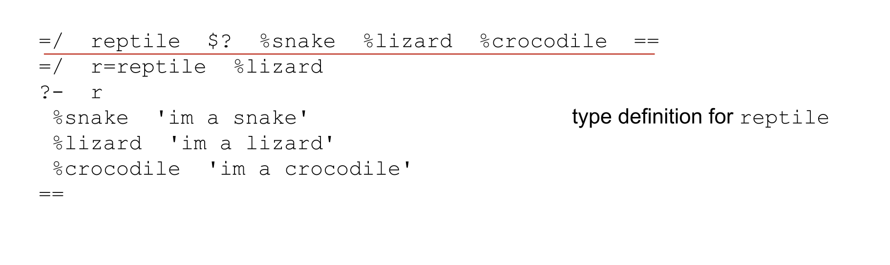


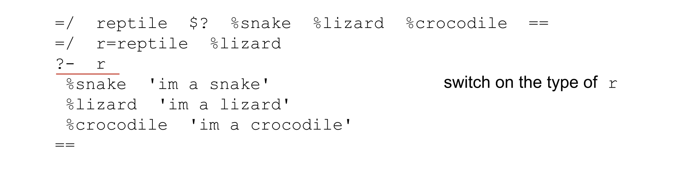

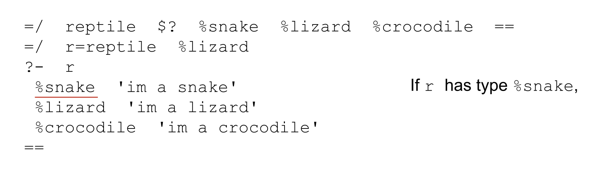

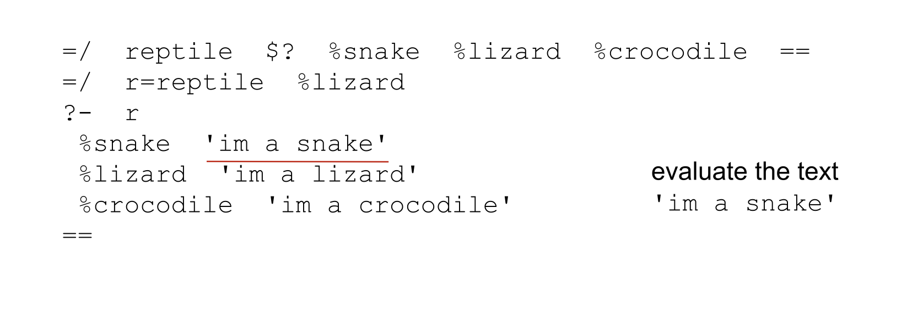

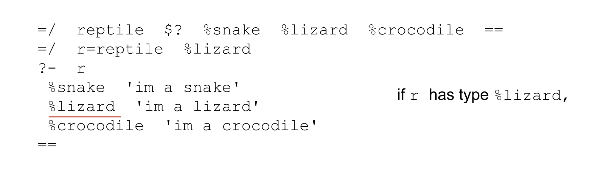


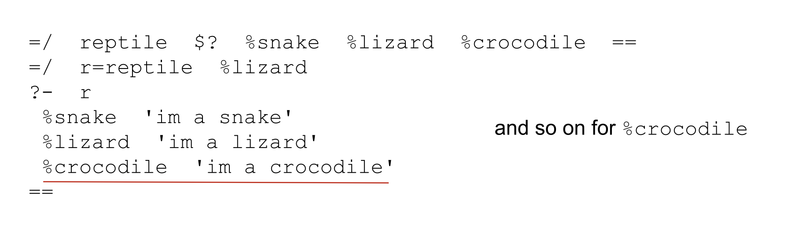


Running the code, it predictably returns the text 'im a lizard'.
```
> =/  reptile  $?  %snake  %lizard  %crocodile  ==
  =/  r=reptile  %lizard
  ?-  r
    %snake  'im a snake'
    %lizard  'im a lizard'
    %crocodile  'im a crocodile'
  == 

'im a lizard'
```

Of course, changing the value/type of `r` changes the outcome.

```
> =/  reptile  $?  %snake  %lizard  %crocodile  ==
  =/  r=reptile  %snake
  ?-  r
    %snake  'im a snake'
    %lizard  'im a lizard'
    %crocodile  'im a crocodile'
  == 

'im a snake'
```

What happens if we add an extra branch to our switch statement for the case `%turtle`?

```
> =/  reptile  $?  %snake  %lizard  %crocodile  ==
  =/  r=reptile  %snake
  ?-  r
    %snake  'im a snake'
    %lizard  'im a lizard'
    %crocodile  'im a crocodile'
    %turtle  'im an turtle'
  == 

mint-vain
```

If the switch statement has an extra branch that we can't take, because it's not in the type union of the input, we can get a `mint-vain` error

We also get a `mint-vain` if we don't specify the value `%snake` is of type `reptile` before it's inputted to the switch statement.

```
> =/  reptile  $?  %snake  %lizard  %crocodile  ==
  =/  r  %snake
  ?-  r
    %snake  'im a snake'
    %lizard  'im a lizard'
    %crocodile  'im a crocodile'
  == 

mint-vain
```


The `?+` (wutlus) rune is just like the `?-` (wuthep) rune, except you get to define a default behavior to perform if no matches happen.

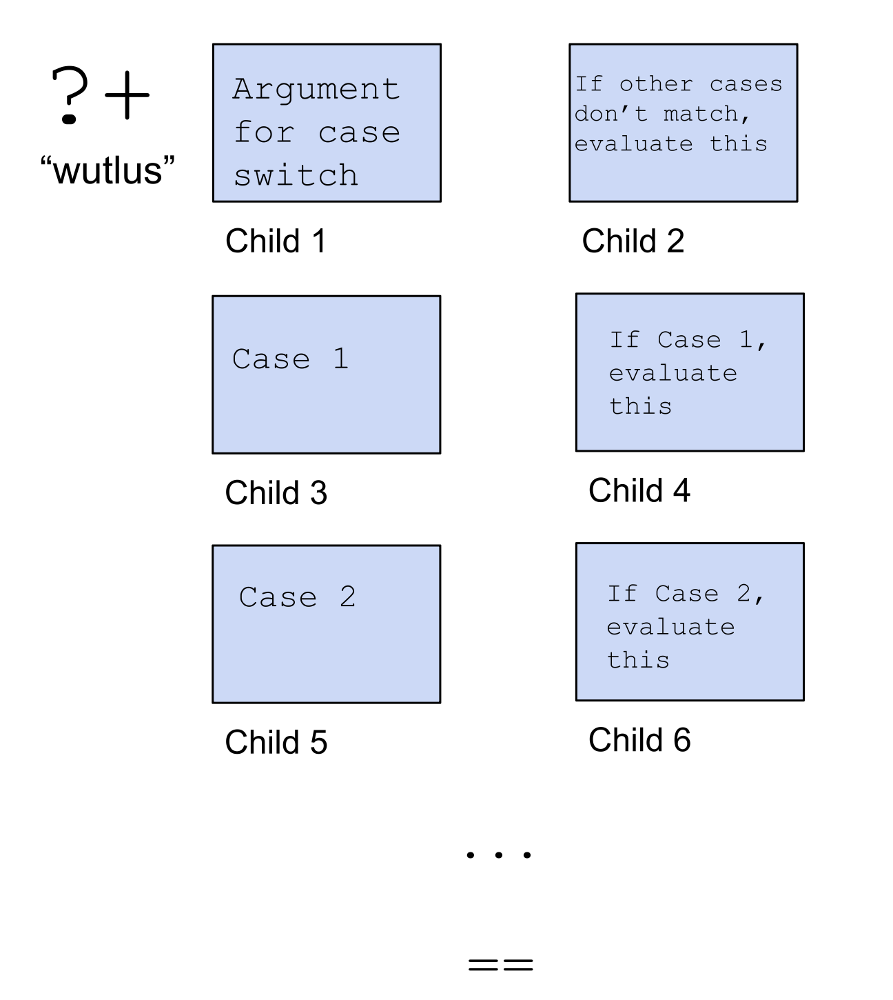

Let's see an example. 

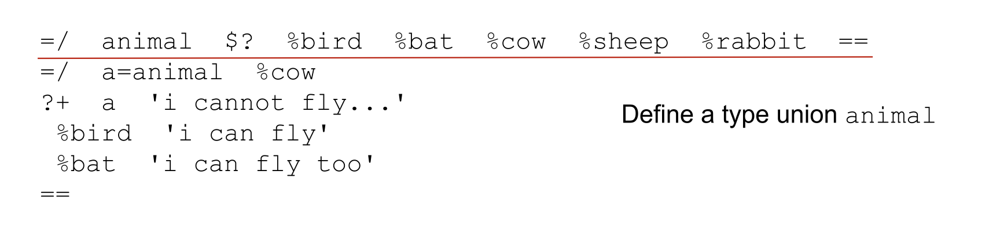

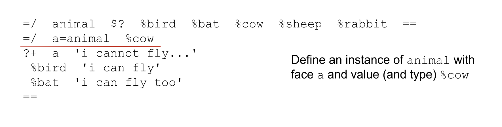

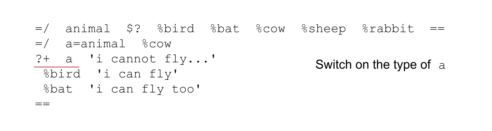

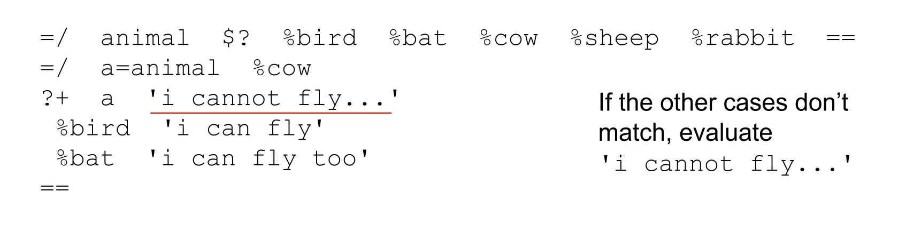


Here because the case `%cow` is not caught by the specified cases `%bird` and `%bat`, it computes the default branch.

```
> =/  animal  $?  %bird  %bat  %cow  %sheep  %rabbit  ==
  =/  a=animal  %cow
  ?+  a  'i cannot fly...'
    %bird  'i can fly'
    %bat  'i can fly too'
  ==

'i cannot fly...'
```

Of course, changing `a` changes the code's output.
```
> =/  animal  $?  %bird  %bat  %cow  %sheep  %rabbit  ==
  =/  a=animal  %bat
  ?+  a  'i cannot fly...'
    %bird  'i can fly'
    %bat  'i can fly too'
  ==

'i can fly too'
```

There is one more neat stylistic trick we can learn. 


This syntax is useful when you want to define an instance of a type, but you don't want to come up with a new name, so you give the instance the same name as the type.

If we complete this code by invoking animal, we'll see that it returns the particular instance which has value `%cow`.

```
=/  animal  $?  %bird  %bat  %cow  %sheep  %rabbit  ==
=/  =animal  %cow
animal
```

Whereas returning the original mold prints a very large object to the Dojo (we'll learn later why this happens).

```
=/  animal  $?  %bird  %bat  %cow  %sheep  %rabbit  ==
animal
```

### Code Style

We are finally learning how to write bigger and more complex pieces of Hoon code. This is a great place for a short discussion on style.

In terms of spacing, we learned that for technically correct Hoon, we only need to differentiate between a single space and two or more spaces. So all the following are technically the same valid Hoon code.

```
?:  %.y  1  2
```

```
?:
%.y
1
2
```

```
?:
    %.y
1  2
```

However, for every rune, there's a standard, neat way of formatting the spacing and indentation. If we check `docs.urbit.org` for the rune `?:` (wutcol), it will tell us that the following is the correct tall form:

```
?:  %.y
  1
2
```

Recalling our switch statements, you could technically write a rune like `?-` all on one line, like

```
?-  r  %snake  'im a snake'  %lizard  'im a lizard'  %crocodile  'im a crocodile'  == 
```

However, this is very difficult to read. The docs tell us that this is the proper formatting for `?-`:

```
?-  r  
%snake  'im a snake'  
%lizard  'im a lizard'  
%crocodile  'im a crocodile'  
== 
```

For the homework you'll still be working in the Dojo. But a useful tip at this point is to write your code in a notepad or code editor, then copy paste into the Dojo to test it. This is easier than writing large code blocks directly in Dojo.

Congrats on getting to the end, this was a big and important lesson for your Hoon learning.

