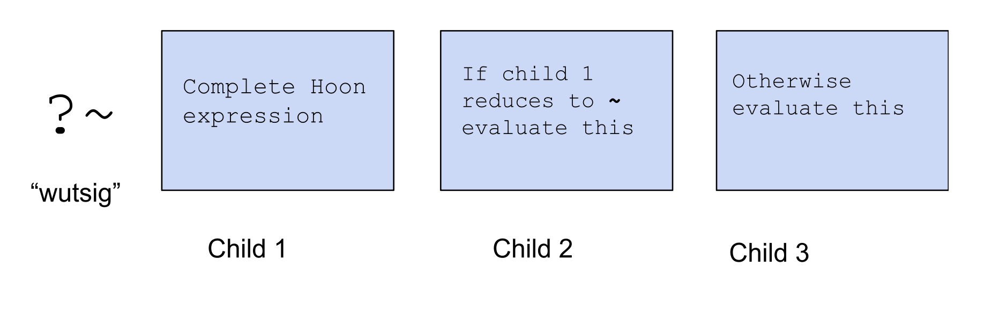
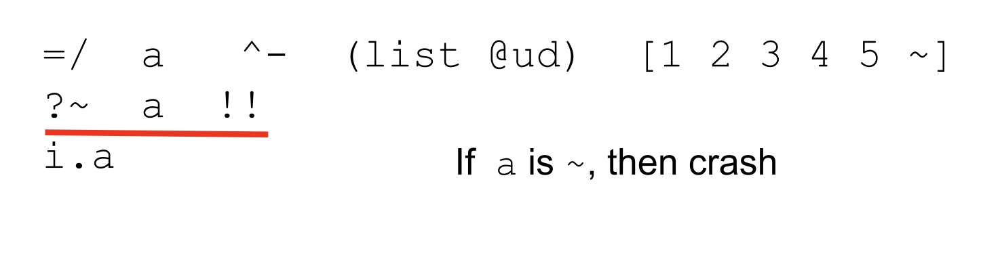
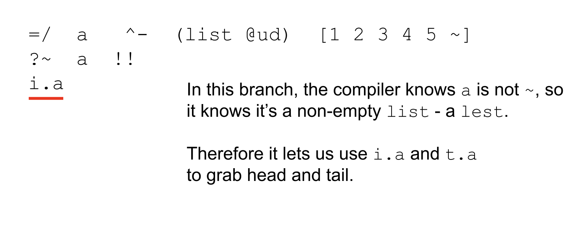
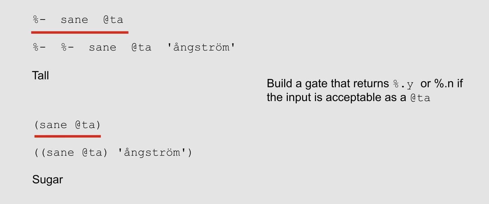
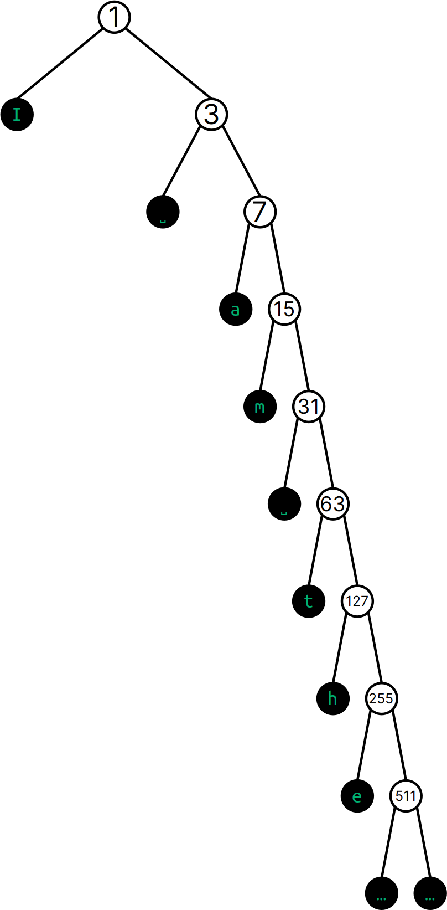

#   Working with Lists and Text
##  Hoon Academy Lesson 4


**Homework**: https://forms.gle/u1LgfWSQiapSAM3bA

**Video**: https://youtu.be/tOQRMJvNMQE

## Administrative

This is our last course before break and the official halfway point of Hoon Academy -- congratulations on making it here. Our next class will be Saturday, January 6. Office hours will be held this Monday, December 18 at 5pm ET, according to schedule, but the next office hours will be Friday, January 5.

I will be online and responding to messages throughout this time. Definitely reach out if you have homework or general questions. The break is a great opportunity to catch up with the course and make sure we're on the same page going into Lesson 5.

## Lists

Let's get into our big topic for today.

### List representation

Recall from last lecture that the cell types we made with the `$:` (buccol) rune expect a certain, fixed number of children.

For example, if I made a structure that's a cell of two numbers, that won't fit a cell of 3 numbers.

```
> =twonums $:  @ud  @ud  ==
  ^-  twonums  [1 2 3]
mint-nice
-need.@ud
-have.[@ud @ud]
nest-fail
dojo: hoon expression failed
```

Likewise, a type that's a cell of three numbers won't fit a cell of two numbers.

```
> =threenums $:  @ud  @ud  @ud  ==
  ^-  threenums  [1 2]
mint-nice
-need.[@ud @ud]
-have.@ud
nest-fail
```

However, sometimes you need a data type that doesn't know in advance how many entries it will have.  In Hoon, certain molds are recursive, where instead of requiring a fixed size, they specify a flexible structure that can be as small or as large as one needs. The simplest example of this is the list. A **list** is a structure with the same data type in all entries and a variable length. 

Let's try a simple example of making a list of numbers

```
^-  %-  list  @ud  [1 2 3 4 5 ~]
```

What's going on here? Let's dissect it bit by bit.First, let's focus on this latter half of the code, `[1 2 3 4 5 ~]`. Recalling that everything in Urbit is a binary tree, the internal data representation of the last argument to this expression looks like this.

```
 /  \
1  /  \
  2  /  \
    3  /  \
      4  /  \
        5    ~
```

We have a rightward branching binary tree whose last element is the null character `~` (sig). This is called a **null-terminated tuple**, which is the necessary structure for something to be a list. Written as a cell of cells, it looks like this:


```
[1 [2 [3 [4 [5 ~]]]]]
```
which sugars to
```
[1 2 3 4 5 ~]
```


The null-terminated tuple is a priveleged structure in Hoon, so there are a few different syntax options. The last sugar syntax above takes the `~` sig at the end and puts it at the front. This just helps make it clear that the last element is a `~`, without having to read all the way to the end.


```
~[1 2 3 4 5]
```

is equivalent to
```
[1 2 3 4 5 ~]
```

This is easier to read, because it makes it clear that the cell is list-shaped without having to read all the way to the end.


If we replace the `~` (sig) at the end with another number, that structure would just be a 6-tuple and could not be a list because it's not null-terminated.

```
[1 [2 [3 [4 [5 6]]]]]
[1 2 3 4 5 6]
```

The character `~` is a null-terminated tuple, the shortest possible one. A tuple containing one object is equivalent to just the object.

```
> [~]
~
```

However, just as the null character `~` can serve many purposes, and is not automatically understood to be an empty list, any null-terminated tuple is not automatically a list.

You may want to have these cells just be understood as tuples for whatever reasons:
```
[1 ~]
[1 2 ~]
[1 2 3 ~]
```

Or cells like these:
```
[~ ~]
[~ ~ ~]
```

The Hoon compiler will not assume that your null-terminated tuple is a list unless you explicitly cast it to one.


### `List` as a Mold Maker
This takes us back to the above piece of code. Let's now focus on the left side of it.

```
^-  %-  list  @ud  [1 2 3 4 5 ~]
```

We should notice the `%-` rune being used. If you'll recall this means that we are calling a gate. In particular, the term `list` refers to a gate. `list` is what's called a **mold maker gate**. It takes as input a mold (in this case `@ud`) and returns a mold which is a list of the input mold. 

Here, we pass the type `@ud` as the only argument to the gate `list`. This creates a type which is a list of `@ud` numbers. 

In production Hoon code you'll most often see this syntax in the sugared version:

```
^-  (list @ud)  [1 2 3 4 5 ~]
```

But you should always recall that this desugars to a gate call using the gate `list`. 

Finally, in our code, we are using `^-` to cast our list-shaped object to a type that is a list of `@ud` numbers.


We can use the mold maker `list` with any types, including custom ones. Recall that in last lesson, we defined a type union of `@tas` terms, `reptile`.

```
=/  reptile  $?  %snake  %lizard  %crocodile  ==
^-  %-  list  reptile  [%crocodile %snake %lizard %lizard ~]
```
Here we define the `reptile` type union, make a list-shaped structure with several fitting terms, and cast it to a `list` of `reptile.`

Sugaring `^-` (kethep) and `%-` (cenhep):

```
=/  reptile  $?  %snake  %lizard  %crocodile  ==
`(list reptile)`[%crocodile %snake %lizard %lizard ~]
```

This code will fail if one the terms in the list does not fit the `reptile` type union:

```
> =/  reptile  $?  %snake  %lizard  %crocodile  ==
  `(list reptile)`[%crocodile %snake %lizard %elephant ~]

mint-nice
- need
...
```

We can even make lists of other lists. Here we create and cast a list of lists of `@t` text. Note how the whole object is a null-terminated tuple, but so is every entry.

```
^-  %-  list  %-  list  @t  [['a' 'b' 'c' ~] ['d' 'e' 'f' ~] ['x' 'y' 'z' ~] ~]
```

Using sugar syntax for `%-` so it's easier to read,

```
^-  (list (list @t))  [['a' 'b' 'c' ~] ['d' 'e' 'f' ~] ['x' 'y' 'z' ~] ~]
```

`list` is the first mold maker gate we learn, but there are others that we will encounter later, such as `set` which can create a set of any type, and `map`, which can create key value pairs of any two types.


### Prepending to a List

If lists are represented as this binary tree, is it faster to add something to the head of the list, or the tail of the list?

```
 /  \
1  /  \
  2  /  \
    3  /  \
      4  /  \
        5    ~
```

It's much faster to add something to the head rather than the tail, because the head is immediately accessible, while adding to the tail requires navigating to the end. We can add something to the head of a list in a very simple way using cell notation.

```
> =/  mylist=(list @ud)  [2 3 4 ~]
  ^-  (list @ud)  :-  1  mylist
~[1 2 3 4]
```

Or using the sugar notation for `:-`.

```
> =/  mylist=(list @ud)  [2 3 4 ~]
  ^-  (list @ud)  [1 mylist]
~[1 2 3 4]
```

Here we have created a new list which has the value `1` as the head of the list and `mylist` as the tail of the list. Visualized as a binary tree, this is what we have done:


We have to make sure to cast the output with `(list @ud)`, otherwise the Hoon compiler will parse it as a cell of the value `1` and `mylist`. This is the same data structure, which is a list-shaped object, but not known to the compiler to be a list.

```
> =/  mylist=(list @ud)  [2 3 4 ~]
  :-  1  mylist
[1 ~[2 3 4]]
```

Looking at the output `[1 ~[2 3 4]]` we confirm the compiler interprets it as a cell of a number and a list.

### Lists and Lests
As we mentioned, an empty/null list would just be the single character `~` (sig). Hoon has a special type for lists that are known to be not empty/null, called `lest`. For example I can cast both of these to a `list`:

```
> ^-  %-  list  @ud  [1 2 3 4 5 ~]
~[1 2 3 4 5]

> ^-  %-  list  @ud  ~
~
```

However if I use `lest` instead of `list`, the first works and the second fails:

```
> ^-  %-  lest  @ud  [1 2 3 4 5 ~]
[i=1 t=~[2 3 4 5]]

> ^-  %-  lest  @ud  ~
mint-nice
-need.[i=@ud t=it(@ud)]
-have.%~
nest-fail
```

If you'll notice above, the output was slightly different between the two. If the compiler knows that your `list` is a `lest`, it attaches faces to the head and tail. You can grab the head of the list (the first element), with the face `i`:
```
> =/  a   ^-  (lest @ud)  [1 2 3 4 5 ~]  
  i.a
1
```

You can grab the tail of the list (the rest of the list) with the face `t`:
```
> =/  a   ^-  (lest @ud)  [1 2 3 4 5 ~]  
  t.a
~[2 3 4 5]
```

If you'll recall how lists are rightwards branching null-terminated tuples, the tail of a null-terminated tuple is also valid as a null-terminated tuple.


If the compiler only knows it's a regular `list` as opposed to a `lest`, you can't use these `i` and `t` faces, throwing a `find.fork` error.

```
> =/  a   ^-  (list @ud)  [1 2 3 4 5 ~]  
  i.a
-find.i.a
find-fork
```

You can also make the compiler know a list is non-null in the following way. Let's look at this following code and try to understand it:

```
=/  a   ^-  (list @ud)  [1 2 3 4 5 ~]
?~  a  !!
i.a
```

Recall that the `?~` (wutsig) rune says, compute the first child, if it reduces to `~`, then compute the second child, otherwise compute the third child.




The `!!` rune we haven't learned yet simply crashes the program.

```
> !!
dojo: hoon expression failed
```

Going back to our code, we can interpret the second line as saying "if `a` is null, then crash". 



This means that if we are in the third child of the `?~`, where we compute `i.a` the Hoon compiler knows that `a` must not be null -- it knows its a `lest` rather than a `list` -- and we can use these faces.



```
> =/  a   ^-  (list @ud)  [1 2 3 4 5 ~]
  ?~  a  !!
  i.a
1

> =/  a   ^-  (list @ud)  [1 2 3 4 5 ~]
  ?~  a  !!
  t.a
~[2 3 4 5]
```

Taking out the `?~` (wutsig) reintroduces the `find.i.a` error. 

```
> =/  a   ^-  (list @ud)  [1 2 3 4 5 ~]
  i.a
-find.i.a
find-fork
```

### List Library

Hoon comes with a very comprehensive library of gates to manipulate and make use of lists. Lists are a great way to represent data because they give you access to these utilities.

Here is a link you can use to reference all the list library gates: https://docs.urbit.org/language/hoon/reference/stdlib/2b 

Let's go through some examples. A bit of inconsistency in the library -- some of the gates take a null-terminated tuple and automatically cast it to a list. Others require you to cast it before passing.

Let's go through some examples.

`flop` simply takes a list a reverses it. It doesn't require a typecast.

```
> %-  flop  [1 2 3 4 5 ~]
~[5 4 3 2 1]
```

`gulf` takes as input two nonnegative integers and returns a list containing all the elements in that range.
```
> %+  gulf  5  20
~[5 6 7 8 9 10 11 12 13 14 15 16 17 18 19 20]
```

`lent` returns the length of a list. It also doesn't require a typecast.

```
%-  lent  [1 2 3 4 5 ~]
5
```

`snag` gets the element at a certain index. To use `snag`, it needs to know the input is a list, so we need to cast it.

```
> %+  snag  2  `(list @t)`['tomato' 'cucumber' 'orange' 'avocado' ~]
'orange'

> %+  snag  0  `(list @t)`['tomato' 'cucumber' 'orange' 'avocado' ~]
'tomato'
```


`snap` replaces the element at an index with another. We also need to use a casting here.

```
> %^  snap  `(list @t)`['tomato' 'cucumber' 'orange' 'avocado' ~]  2  'pepper'
[i='tomato' t=<|cucumber pepper avocado|>]
```
The output has `i` and `t` faces attached because the internal logic of `snap` has proved to the compiler the output is non-null. Also, the tail is formatted as `<|cucumber pepper avocado|>` rather than `~['cucumber' 'pepper' 'avocado]` because a `(list @t)` is a type called `wain` that Dojo has a special formatting for.

`sort` takes as input a list and a comparison gate -- this can be any gate that takes two nouns and returns a `%.y` or `%.n`. It then uses that comparison operator to sort the list. For example, if we pass in `lth`, it sorts these atoms in ascending order.

```
> %+  sort  [5 3 7 9 ~]  lth
~[3 5 7 9]
```

And if we pass in gth, it sorts them in descending order.
```
> %+  sort  [5 3 7 9 ~]  gth
~[9 7 5 3]
```

`weld` concatenates two lists and doesn't require a typecast:

```
%+  weld  [1 2 ~]  [3 4 5 ~]
~[1 2 3 4 5]
```

`roll` does something interesting. Perhaps you can infer it's behavior from these examples?

```
> %+  roll  (limo [1 1 1 1 ~])  add
4

> %+  roll  (limo [1 1 1 1 ~])  mul
1

> %+  roll  (limo [1 2 3 4 ~])  mul
24
```

It takes the input gate and applies it pairwise across the elements of the list, accumulating a result, then outputting it. For example, in the last code it multiplies `1 * 2` to get `2`, multiplies `2 * 3` to get `6`, and multiplies `6 * 4` to get `24`. It's the equivalent of `reduce` in other languages. (There are some details we are glossing over, but we will get into them when learn about gates). 

`turn` is very interesting too. It takes a gate and applies it to every element of the list, returning the transformed list. It's the equivalent of `map` in other languages. 

Here, `dec` is a gate that takes a positive integer and decreases it by 1.

```
> %+  turn  [2 3 4 5 6 ~]  dec
~[1 2 3 4 5]
```

The gate you use as input to `turn` doesn't have to be predefined -- you can write one yourself (same goes for `roll`, `sort`, etc.). We will learn how to write custom gates soon -- so don't worry about the details yet. Here we use a custom gate called `mul5`, which takes a number and multiplies it by 5. 

```
> =/  mul5  |=(a=@ud (mul a 5))
  %+  turn  [1 2 3 4 5 ~]  mul5
~[5 10 15 20 25]
```

`turn` doesn't need to preserve types. Here we convert a list of numbers to a list of `@p`.
```
> =/  numtoship  |=(a=@ud `@p`a)
  %+  turn  [1 2 3 4 5 ~]  numtoship
~[~nec ~bud ~wes ~sev ~per]
```

`skim` takes a list and a gate. That gate should take one argument and return either `%.y` or `%.n`. `skim` returns a list of only the elements that made the gate return `%.y`. It's the equivalent of `filter` in other languages.

Here we `skim` with a custom gate `iseven` which returns `%.y` if a number is even and `%.n` otherwise.

```
> =/  is-even  |=(a=@ud =((mod a 2) 0))
  %+  skim  `(list @ud)`[1 2 3 4 5 6 7 8 9 10 ~]  is-even
[i=2 t=~[4 6 8 10]]
```

This concludes the section on lists.

## Text

Let's get into our last major topic for this lesson, Hoon's text system. So far we have learned about and used the `@t` aura, which stores arbitrary text as an atom, and the `@tas` aura, which is more restricted and does double duty as type/value. The following graphic shows all the ways that you can represent text as atoms:


There's only one we haven't learned, which is the `@ta` knot. If you'll recall nesting properties for auras, this means `@tas` nests within `@ta` which nests within `@t`.

If you want to check whether some text is valid as a certain aura, you can use the library gate `sane`. `sane` is a gate that builds a gate.



It takes as input an aura formatted as a `@tas` (like `%p` or `%ta` instead of `@p` or `@ta`), and returns a gate that returns `%.y` or `%.n` whether an input string is valid in that aura.


```
> %-  %-  sane  %ta  'ångström'

```

Sugared,
```
> ((sane %ta) 'ångström')
%.n
```

Suppose you'd like to send some Urbit data, like a `@p` to display as text on a web frontend.. If you'd like to convert a value to a cord, you can use the gate `scot`. `scot` works as follows:

```
> %+  scot  %p  ~sampel-palnet
~.~sampel-palnet

> (scot %p ~sampel-palnet)
~.~sampel-palnet
```
The first argument tells it what type the atom is (formatted as a `term`). The second argument is the atom to convert to text.

The output is actually a `@ta` `knot`, but we can cast it to a `@t`.
```
> ^-  @t  (%scot %p ~sampel-palnet)
'~sampel-palnet'

> `@t`(scot %p ~sampel-palnet)
'~sampel-palnet'
```

Another example with a hexadecimal `@ux`:
```
> `@t`(scot %ux 0x12f)
'0x12f'
```

Suppose you're parsing some user input in text format to be stored in your Urbit backend. You can convert cords to atoms using `slav`.

Here we want to take the text `~sampel-palnet` and get the `@p`.
```
> %+  slav  %p  '~sampel-palnet'
1.624.961.343

> (slav %p '~sampel-palnet')
1.624.961.343
```

It returns the raw atom, so we need to cast it to finally get the correct `@p`.
```
> ^-  @p  (slav %p '~sampel-palnet')
~sampel-palnet

> `@p`(slav %p '~sampel-palnet')
~sampel-palnet
```

Giving `slav` an invalid input, such a text which is not a correct `@p`, causes a failure:

```
%+  slav  %p  '~abcdef-ghijkl'
dojo: hoon expression failed
```

## Tapes
Besides `@t` `@ta` and `@tas`, which all represent text as atoms, there is one more possible representation of text in Hoon. You can represent text as a list, which is powerful because it gives you access to all the list utilities we learned, while working on text.

In particular a **tape** is a list `@tD`. The aura `@tD`, means it's data of type `@t`, but limited to 8 bits (which is what the ending `D` represents, and it does need to be capital). So a tape is a list of `@t` data each limited to 8 bit chunks. 



In Hoon, the term `tape` means the exact same thing as the mold `(list @tD)` Whenever you see text with double quotes, that will be a **tape** (recall that cords (@t) use single quotes). 

```
> ^-  tape  "hello"
"hello"

> ^-  (list @tD)  "hello"
"hello"

> ^-  tape  "ångström"
"ångström"

> ^-  (list @tD) "ångström"
"ångström"

> ^-  tape  "Welcome to M@RS~"
"Welcome to M@RS~"

> ^-  (list @tD)  "Welcome to M@RS~"
"Welcome to M@RS~"
```


Any `cord` can be stored as a `tape`, and vice versa. `crip` converts a tape to cord (cord rip):

```
> %-  crip  "Welcome to M@RS~"
'Welcome to M@RS~'

```

And `trip` converts a cord to tape (tape rip):
```
> %-  trip  'Welcome to M@RS~'
"Welcome to M@RS~"
```

Tapes are easier to work with than cords, but use about 6x as much storage due to being stored in a list. A common practice is to use a `cord` for data storage, convert to a `tape` for processing the text, and convert back to a `cord`.


### Working with Tapes

Tapes have many useful library utilities, which you can reference fully here: https://docs.urbit.org/language/hoon/reference/stdlib/4b 

You can convert an atom of any aura to a tape with `scow`:

```
> %+  scow  %p  ~sampel-palnet
"~sampel-palnet"

> (scow %p ~sampel-palnet)
"~sampel-palnet"

> (scow %ux 0x12f)
"0x12f"
```

`cuss` makes a tape all uppercase:

```
> %-  cuss  "i wanna be loud"
"I WANNA BE LOUD"
```

`cass` makes a tape all lowercase:

```
> %-  cass  "I WANNA BE QUIET"
"i wanna be quiet"
```

`trim` splits a tape into a cell of two tapes at a certain index:

```
> %+  trim  16  "Merry Christmas and Happy New Year"
[p="Merry Christmas " q="and Happy New Year"]
```

Not only are there `tape`-specific utilities, we can enroll all the list library gates to do many useful things with tapes.

`find` returns the index of a matching sublist within a list:
```
> %+  find  "needle"  "aaaaaaaaaaaaneedleaaaaaaaaaaaa"
[~ 12]
```

`flop` reverses a list:
```
%-  flop  "URBIT"
"TIBRU"
```

`weld` concatenates lists:
```
%+  weld  "pepper"  "mint"
"peppermint"
```

`snap` replaces an element at an index.

```
> %^  snap  "there are bats in my house"  10  'c'
[i='t' t="here are cats in my house"]
```
To format the output nicely, we can cast back to a `tape`:
```
^-  tape  (snap "there are bats in my house" 10 'c')
"there are cats in my house"
```

Recall that a tape is a `list` of `@tD` atoms, so don't make the mistake of trying to replace a character in a tape with another tape (here the error is `"c"` instead of `'c'`):

```
> %^  snap  "there are bats in my house"  10  "c"
-need.?(%~ [i=?(%~ [i=@tD t=""]) t=it(?(%~ [i=@tD t=""]))])
- have
[ ?(i=%~ i=[i=@tD t=""])
  ?(t=%~ t=[i=@tD ?(t=%~ t=[i=@tD ?(t=%~ t=[i=@tD t=""])])])
]
nest-fail
```

Since a `tape` is a `list`, we can append things to the head of a tape easily using cell notation:

```
> ^-  tape  ['a' "bcdef"]
"abcdef"
```

You can render a Hoon expression as a tape with angle brackets around it (the Hoon expression must be wide/sugar form). Here we calculate the floating point square root of the number `42`, and render it as a tape:

```
> <(sqt:rs .42)>
".6.4807405"
```

You can also interpolate a tape within another tape with curly brackets:

```
> =/  x  "Saturday"
  "Good morning, it is {x}"
"Good morning, it is Saturday"
```

```
> =/  x  "Sunday"
  "Good morning, it is {x}"
"Good morning, it is Sunday"
```

Finally, you can combine both the angle bracket and curly bracket notations. Here we pin `x` to the floating point result of calculating the square root of `42`. On the second line, the angle brackets get the `tape` of `x`, and the curly brackets put that tape into the sentence.

```
> =/  x  (sqt:rs .42)
  "The square root of 42 is {<x>}"
"The square root of 42 is .6.4807405"
```

These text tools are very useful when working with userspace apps.

For additional reading on Hoon's text system, this link goes over the same topics in a bit more detail: https://docs.urbit.org/language/hoon/guides/strings 
