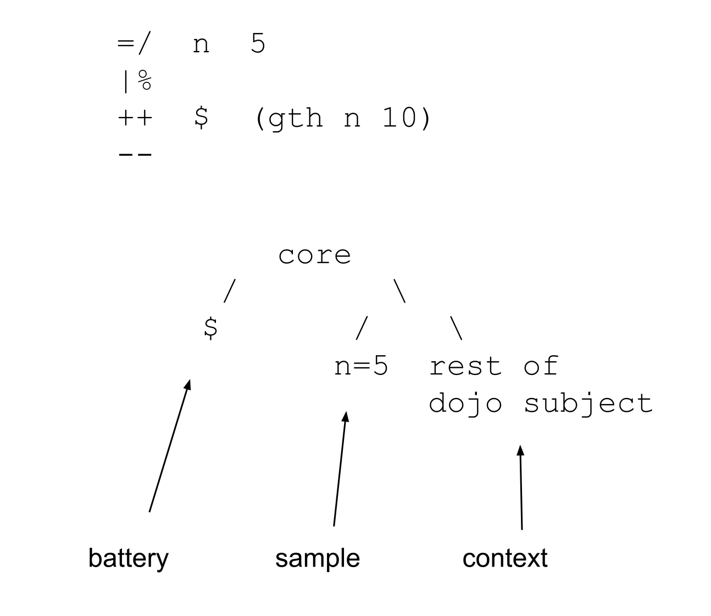

#   Cores
##  Hoon Academy Lesson 5

**Homework**: https://forms.gle/2asUR9qMt3fDcYVa8

**Video**: https://youtu.be/gmqAz1ej6W8 

We now begin learning about the very important pattern called **cores**. Cores are the last remaining major concept in learning Hoon. Once you understand them, you on your way to having a good understanding of the whole language. Basically every working piece of Hoon code you will encounter, from big to small, is a core.

## Core Preliminaries

What are cores? They are simply a pattern for **storing code as data**. What does that mean? If you'll recall from the earlier lectures, Hoon compiles to Nock, and everything in Nock is a binary tree of natural numbers. 

Recall that every pieece of Nock code is a pair of `[subject formula]`, with the subject being the data input for a computation, and the formula being the computation. Both of them are binary trees.


In technical programming language terms, when code and data have the same representation, that is called *homoiconicity* (don't worry if you aren't familiar with this terminology).

With this correspondence, it would be nice to store a binary tree at some location and say, "this is code that you can pull out and run later whenever you wish". This is precisely what cores allow you to do.

A core is simply a pattern for storing both code as data, and data as data in a binary tree. It's as simple as can be. Code goes in the left branch, and data goes in the right.

```
[code-as-data data-as-data]
          core
    /              \
code-as-data    data-as-data
```

In Urbit terminology, the left side of the core, containing the code-as-data, is called the **battery**. The right side of the core, containing the data-as-data, is called the **payload**

```
   [battery payload]
         core
    /            \
battery         payload
```

A core stores code in named addresses called **arms**, which go in the left side of the binary tree (the battery). Then it stores the subject that you built the core with, containing all the environment data, in the right side of the binary tree (payload).

## Runes

Before proceeding, let's recall the rune `=>` (tisgar) which we will use heavily throughout this lesson.


Let's also recall `=<` (tisgal) which is exactly the same, with arguments reversed.

Our first new rune, and the star of the show is the rune `|%` (barcen). `|%` is the general rune to declare a core. It takes pairs of arguments, which are faces of arms and definitions for them. Each arm is preceded by a `++` (luslus), and the whole expression is closed by `--` (hephep).


## First Core Example

We're ready to see our first core. Consider the following code:

```
|%
++  increment-100  .+  100
--
```

Here we have a breakdown of this code:


What happens when we run it? If you're trying this yourself, run `:dojo|wipe` in your Dojo to clear the memory -- this makes the output short.

```
> |%
  ++  increment-100  .+  100
  --

< 1.oks
  [ [our=@p now=@da eny=@uvJ]
    < 17.ayh
      34.ygp
      14.usy
      54.fbg
      77.kga
      232.mmf
      51.qbt
      123.ppa
      46.hgz
      1.pnw
      %140
    >
  ]
>
```

It returns a cell, the head of which is summarized as `1.oks`, indicating that there is one arm in the core -- the `increment-100` arm. 


What is in the tail of this cell? Recall from earlier lessons that any code we type in the Dojo is implicitly wrapped with:

```
=>   big-dojo-subject  your-code
```

This gives your code access to things like the Hoon standard library.

The tail of our core output above is the entire Dojo subject, written in a summarized way, showing that it contains a bunch of other cores with 17, 34, 14, 54, etc. arms.

Here we see a graphic describing the structure created by the code:


## Modifying the Payload

To convince ourselves that the right branch of the core does indeed contain the subject it was built with, we can modify the subject then build the core to see what happens.


Recall that the `=+` (tislus) rune pins something to the head of the subject and then computes the rest of the Hoon expression using that subject.

Consider this modification of the previous code where we pin `=+  num1=1` right before declaring the core.


Now, examining the output, see that `num1=@ud` has appeared at the head of the payload on the second line.

```
> =+  num1=1
  |%
  ++  increment-100  .+  100
  --

< 1.oks
  [ num1=@ud
    [our=@p now=@da eny=@uvJ]
    < 17.ayh
      34.ygp
      14.usy
      54.fbg
      77.kga
      232.mmf
      51.qbt
      123.ppa
      46.hgz
      1.pnw
      %140
    >
  ]
>
```

The `=/` (tisfas) rune does the same thing structurally as `=+` (tislus), just separates out the face as a separate argument.

Below see that `num2=@ud` appears right after `1.oks`:

```
> =/  num2  2
  |%
  ++  increment-100  .+  100
  --

< 1.oks
  [ num2=@ud
    [our=@p now=@da eny=@uvJ]
    < 17.ayh
      34.ygp
      14.usy
      54.fbg
      77.kga
      232.mmf
      51.qbt
      123.ppa
      46.hgz
      1.pnw
      %140
    >
  ]
>
```

Finally recall that the Dojo specific syntax `=face val` also pins something to the head of the Dojo subject. As opposed to the previous examples, this syntax makes the definition persist for future expressions.

```
=num3 3
|%
++  increment-100  .+  100
--
```

Now consider the following code. It's saying to set the subject to be just `~`, then build the same core as before.

```
> =>  ~
  |%
  ++  increment-100  .+  100
  --

<1.oks %~>
```

The output is now *much* shorter. It tells us it's a core with 1 arm in the battery, and a payload of just `~`. 

Here we see a visualization of the structure that's created:


## Code Stored as Data

Arms in a core are stored as uncomputed Nock. They're not evaluated yet. Let's prove this by pulling out the raw data in an arm.

If we recall our tree addressing, if the whole core is at the +1 address, then if the arm is stored in the left subtree, it should be at the +2 address, and the subject the core was built against should be at the +3 address.


The following code means, build the core and set it as the subject, then grab the +2 address of the subject. So, we should get the arm of the core.

```
> => 
  |%
  ++  increment-100  .+  100
  --
  +2

[4 1 100]
```

The result is the structure `[4 1 100]`. What does this structure mean? We can use our Nock evaluation skills to figure out.

When an arm is run, it's run against its parent core as the subject. To reduce, Nock 4 says to increment the result of the remaining computation. Nock 1, which we hadn't learned before, says simply to throw away the subject and return what comes after the 1. So the [1 100] evaluates to 100, and then we increment 100 to get 101.


We can also check by running the Nock code with `.*` (dottar). The first argument to `.*` is the subject and the second is the formula. Since the subject doesn't matter, we can just give it `~`.

```
> .*  ~  [4 1 100]
101
```

Indeed, this is the Nock code which computes `100 + 1`.

However, let's compare that to a different method of storing `100+1`. Recall that the `=/` (tisfas) rune pins something to the head of the subject, (the `+2` address of the subject).  Let's use `=/` to store `increment-100` in the subject and grab the stored data.

```
> =/  increment-100  .+  100
  +2
increment-100=101
```

In this case, grabbing the stored data returns the already computed result, `increment-100=101`. 

We come to an important difference: **arms in a core are stored uncomputed, and are computed when you call them**, while pinning with `=/` or `=+` computes the result and then stores it. Programmers from other languages may conceptualize this as lazy vs. eager evaluation.

## Running Arms

Running an arm from a core is simple. If the (unnamed) core is in the subject, just call the arm by name.

```
=>
|%
++  increment-100  .+  100
--
increment-100
```

The code above can be rendered visually:


If the core is in the subject under a name, we must address into the name. For example, if we call our core `mycore` with `=/`, we can't directly grab `increment-100`.

```
> =/  mycore
  |%
  ++  increment-100  .+  100
  --
  increment-100

-find.increment-100
```

However, changing the call to `increment-100.mycore` makes this work.

```
> =/  mycore
  |%
  ++  increment-100  .+  100
  --
  increment-100.mycore

101
```

Arms in cores can reference faces and values in the payload. Consider the following code, which is represented in the following graphics.

```
=>
=+  n=5
|%
++  increment-n  .+  n
--
increment-n
```

Bolded parts show correspondences:


Running it computes `5+1 = 6`

```
> =>
  =+  n=5
  |%
  ++  increment-n  .+  n
  --
  increment-n

6
```

Of course, a different value for `n` gives us different results from calling `increment-n`.

```
> =>
  =+  n=7
  |%
  ++  increment-n  .+  n
  --
  increment-n

8
```

As we mentioned before, the left branch of a core, with arms containing code, is called the **battery**. The right branch containing data is called the **payload**.

```
   [battery payload]
         core
    /            \
battery         payload
```

It's a really common pattern to pin something to the head of the subject before creating a core. This makes the pinned noun show up in the head of the payload. When this happens, we say the payload is a cell with the **sample** as the head and the **context** (data context) as the tail.

```
[battery [sample context]]
         core
    /            \
battery       /      \
           sample   context
```

We can map these terms back to our `increment-n` example.

```
=>
=+  n=5
|%
++  increment-n  .+  n
--
increment-n
```


We've been looking at cores with a single arm for simplicity, but that doesn't need to be the case.

```
> =>
  |%
  ++  one  1
  ++  two  2
  ++  three  3
  --
 three

3
```

Arms in cores can also refer to each other. Here the `three` arm increments the result of calling the `two` arm, and the `two` arm incrememnts the result of calling the `one` arm.

```
> =>
  |%
  ++  one  1
  ++  two  .+  one
  ++  three  .+  two
  --
  three

3
```

## Type Arms

So far, we have seen that cores have arms defined by the `++` (luslus) rune. There is one other arm type we should know, `+$` (lusbuc), which is used to store custom types.

Recall from lesson 3 how we created the custom types `reptile`, which was a type union:

```
=reptile ?(%snake %lizard %crocodile)
```

And `reptile-tracker` which was a cell type:

```
=reptile-tracker ,[species=reptile meals=@ud]
```

We can store these as arms in a core for easy usage later.

```
|%
+$  reptile  ?(%snake %lizard %crocodile)
+$  reptile-tracker  [species=reptile meals=@ud]
--
```

Notice how the `reptile-tracker` type references the `reptile` type arm from the same core in its definition. Also note that `+$` expects a type definition, so the definition of `reptile-tracker` is sugared as

```
[species=reptile meals=@ud]
```

rather than
```
,[species=reptile meals=@ud]
```

We can grab and use the type arms of this core to perform typechecking: 
```
=>
|%
+$  reptile  ?(%snake %lizard %crocodile)
+$  reptile-tracker  [species=reptile meals=@ud]
--
^-  reptile-tracker  [%lizard 12]
```

## Some Shape Rotation

Let's take a moment to make sure we understand what's going on with cores. A bit of mental shape rotation is required.

Whenever we use the `|%` (barcen) rune, we are storing a copy of the subject at the time the code was executed. We put that in the right branch, and we put some arms (code) in the left branch. We can think of a core as "wrapped around" the subject it was built with.


So if we then set the core as the subject to run some code, then the previous subject is still accessible, being contained in the payload of the core. 


If we use `=/` to make a core, name it, and pin it to the head of a subject, something different happens.


In particular, the new subject now has two copies of the old subject in it, one stored in the core that's pinned to the head of the new subject, and one in the tail of the new subject.


Fortunately, memory management in Hoon's implementation level (Vere, soon Ares) prevents this from actually creating a physical duplicate and using twice the memory. 


## Core Composition

If we follow the previous section, we are ready to understand core composition. We can compose cores by putting one core in the payload (the data branch) of another.


Let's break down and understand this code:

```
> =>
  |%
  ++  inner-core-arm  "this arm is in a core in the payload of another core"
  --
  =>
  |%
  ++  outer-core-arm  "this arm is in the outer core"
  --
  inner-core-arm

"this arm is in a core in the payload of another core"
```

To help us parse the Hoon, the syntax tree of this expression looks like this. The first `=>` has two children, a core with arm `inner-core-arm` and the rest of the expression. The second `=>` has two children, a core with arm `outer-core-arm` and the code `inner-core-arm`


The data structure produced by the code looks like:


## Scoping

With nested cores, we should understand scoping. When arms are called, they run against their parent core as the subject. 

In the code below, note that calling `inner-core-arm` gets the definition of `n` as `2` rather than `1`.

```
> =>
  |%
  ++  inner-core-arm  n
  ++  n  2
  --
  =>
  |%
  ++  outer-core-arm  n
  ++  n  1
  --
  inner-core-arm

2
```

This diagram shows the structure that is produced by this composition:


If we pin a new value for `n` before pulling the arm, we still get `n=2`. 

```
> =>
  |%
  ++  inner-core-arm  n
  ++  n  2
  --
  =>
  |%
  ++  outer-core-arm  n
  ++  n  1
  --
  =/  n  10
  inner-core-arm

2
```

Even though visually, it looks like we pin `n=10` right before calling something that invokes `n`, the n=10 is not in scope for `inner-core-arm`.

This diagram shows the structure produced by the above code:


Let's move the `=/  n  10`. If we assign it before defining the inner core, it ends up in the payload of the inner core, but `inner-core-arm` still finds the arm `n` with value `2` first.

```
> =>
  =/  n  10
  |%
  ++  inner-core-arm  n
  ++  n  2
  --
  =>
  |%
  ++  outer-core-arm  n
  ++  n  1
  --
  inner-core-arm

2
```

This diagram shows the structure produced:


If we delete the arm `n` from within the inner core, then we return the pinned value in the payload, `n=10`.

```
> =>
  =/  n  10
  |%
  ++  inner-core-arm  n
  --
  =>
  |%
  ++  outer-core-arm  n
  ++  n  1
  --
  inner-core-arm

10
```


If we move pinning `n=10` back to the outermost level,  `inner-core-arm` fails because it can't find `n` in its local scope. 

```
> =>
  |%
  ++  inner-core-arm  n
  --
  =>
  |%
  ++  outer-core-arm  n
  ++  n  1
  --
  =/  n  10
  inner-core-arm

-find.n
```


We can nest cores as deep as we want using composition. Consider this code. Usually when a core only has one arm, it's given a default face of `$` (buc). `$` is just a face and has no special properties besides that. 

If we then return the arm `$`, it searches for the closest match in the tree, which is in the outermost core and has the value 1.

```
=>
|%
++  $  3
--
=>
|%
++  $  2
--
=>
|%
++  $  1
--
$
```


Recall that when Hoon searches for a face, it does a depth-first search in the binary tree, going as deep as possible leftwards before going right. Because of the way these cores nest, this means searching all the arms of the cores before searching the rest of the subject. 

Recall that `^` (ket) before a face skips the first match to that face and returns the next one. We can use `^$` to grab `$` from the inner core, and `^^$` to grab it from the inner-est core.


## Cores in Arms
There's another way to nest cores inside each other: in the arms of other cores.

Consider the following code. It has a top-level core with a single arm `core-in-arm`. That arm contains a core, which has a single arm `inner-arm`, which returns the text "I'm inside an unbuilt core". 

```
> =>
  |%
  ++  core-in-arm
    |%
    ++  inner-arm  "I'm inside an unbuilt core"
    --
  --
  inner-arm

-find.inner-arm
```

We attempt to call `inner-arm` directly and get an error message. Why is that? Recall that we just learned arms of cores are stored as uncomputed Nock. That means the core in `core-in-arm` isn't built yet, and `inner-arm` doesn't yet exist.

However computing `core-in-arm` builds the core and makes `inner-arm` available. Here we show 3 equivalent syntaxes for doing so. The third is sugar syntax for the second.


```
> =>
  |%
  ++  core-in-arm
    |%
    ++  inner-arm  "I'm inside an unbuilt core"
    --
  --
  inner-arm:core-in-arm

 "I'm inside an unbuilt core"
```

To summarize, we have shown two ways that cores can be nested in each other: in the payload (data branch) or in the battery (code branch).

Since everything substantial in Hoon is a core, understanding how cores can nest within cores gets you towards being able to understand the structure of any Hoon program.

##  Cores as Reusable Functions

Cores unlock some new functionality for us. Since they let us pull code and run it whenever we want, we can simply change the data context for that code to get a different result. This reminds us of functions that give different outputs as we change the input.

Consider the following core. It has the value `n=5` pinned to the head of its subject, and has a single arm `$` which computes if `n` is greater than 10. 



Composing it with a call to the `$` arm returns `%.n` since `5` is not greater than `10`.

```
> =>
  =/  n  5
  |%
  ++  $  (gth n 10)
  --
  $

%.n
```

We can pin this core to head of the subject with the `=/` rune and call it `gth-10`, and return the whole core by calling `gth-10`, 

```
> =/  n  5
  =/  gth-10
  |%
  ++  $  (gth n 10)
  --
  gth-10

< 1.qet
  [ n=@ud
    [our=@p now=@da eny=@uvJ]
    < 17.ayh
      34.ygp
      14.usy
      54.fbg
      77.kga
      232.mmf
      51.qbt
      123.ppa
      46.hgz
      1.pnw
      %140
    >
  ]
>
```

Or we can run it by calling the `$.gth10` arm. Recall that when a named core is in the subject, you have to use `arm.core` to grab an arm, just `arm` will fail.

```
> =/  n  5
  =/  gth-10
  |%
  ++  $  (gth n 10)
  --
  $.gth-10

%.n
```

Let's learn a new rune to change the value of `n` before running the code.

The `%=` (centis) rune first takes a wing of the subject (any address, but in this case our core `gth-10`). Then it takes an indefinite number of pairs. The first element of the pair is a sub-wing of the first argument, and the second is a new value for it. We close the rune with `--` because it has an indefinite number of children.


Let's use it to create a new copy of our `gth-10` core, but with the value of `n` changed to `11`.

In tall form:
```
=/  gth-10
=/  n  5
|%
++  $  (gth n 10)
--
%=  gth-10
n  11
==
```

Sugar syntax:
```
=/  gth-10
=/  n  5
|%
++  $  (gth n 10)
--
gth-10(n 11)
```

However, if we run this code, it returns the whole core which just shows `n=@ud` as the sample, so we can't actually see the change.

To see the change, we can set the new core as the subject with `=>` and call its `$` arm.

```
> =/  gth-10
  =/  n  5
  |%
  ++  $  (gth n 10)
  --
  =>  gth-10(n 11)  $

%.y
```

This time, it returned `%.y` because `11` is greater than `10`.

`%=` has a neat trick to save a step. If the first argument to `%=` is an arm of a core, it immediately runs the arm after making changes to the parent core of the arm. So we could have written the above operation more succinctly as:

Tall:
```
=/  gth-10
=/  n  5
|%
++  $  (gth n 10)
--
%=  $.gth-10
n  11
==
```

Sugar:
```
=/  gth-10
=/  n  5
|%
++  $  (gth n 10)
--
$.gth-10(n 11)
```

We are not limited to changing a single value at once with `%=`. This core has the pair `[a=1 b=2]` at the head of the payload, and then its single arm compares if `a` is greater than `b`.

```
=+  [a=1 b=2]
|%
++  $  (gth a b)
--
```

It corresponds to this structure:


Running its `$` default arm gives us `%.n` since `1 < 2`.

```
=>
=+  [a=1 b=2]
|%
++  $  (gth a b)
--
$
```

We can use `%=` to change both values at once and recompute the `$` arm in the core.

Tall:
```
> =/  gth-a-b
  =+  [a=1 b=2]
  |%
  ++  $  (gth a b)
  --
  %=  $.gth-a-b
  a  5
  b  3
  ==

%.y
```

Sugar syntax:
```
> =/  gth-a-b
  =+  [a=1 b=2]
  |%
  ++  $  (gth a b)
  --
  $.gth-a-b(a 5, b 3)

%.y
```

There's one more rune we should learn that simplifies this operation even further. The `%~` (censig) rune takes 3 arguments, an arm in a core, a core with a sample, and a new sample value. It runs the arm after substituting in the new sample value.


Using `%~` (censig), our code becomes:

```
> =/  gth-a-b
  =+  [a=1 b=2]
  |%
  ++  $  (gth a b)
  --
  %~  $  gth-a-b  [5 3]

%.y
```

Sugar syntax:
```
> =/  gth-a-b
  =+  [a=1 b=2]
  |%
  ++  $  (gth a b)
  --
  ~($ gth-a-b [5 3])

%.y
```

We created something that resembles a basic function that allows you to substitute an input to calculate an output.

## Conclusion
This was a big and important lesson, congrats on making it here. We introduced cores as a major concept and comprehensively studied their mechanics. We used cores to create basic function-like behavior. In next lesson, we'll demonstrate the power and flexibility of cores by studying their wide applications throughout Hoon.
