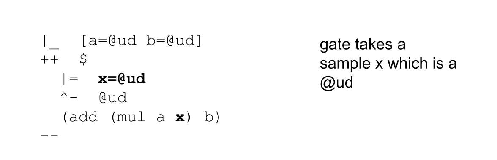
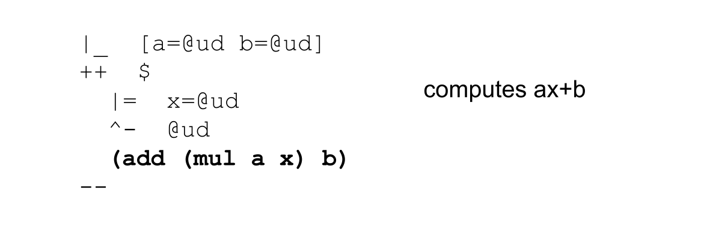

# Exploring the System and the Standard Library 
##  Hoon Academy Lesson 7

**Homework:** https://forms.gle/o5wk4N9Ex9YZvocp7 

**Video:** https://youtu.be/0iLxRacABwk 

Welcome to our next-to-last lesson of Hoon Academy. We're in the final stretch of the course now. At this point, we've gotten good practice in the fundamentals of how Hoon operates. Let's start this lesson by zooming out and getting a bigger picture of how your Urbit computer is structured.

## Exploring the Code Base

Urbit is unique among computer systems as a clean-slate operating system. The entire system is about 30,000 lines of code. The system is accessible to read and examine, and an individual can even come to understand all the parts of it, something that cannot be said about any other operating system in use today. As an Urbit user, this can give you a radical degree of autonomy by making your computer something that you can not only use, but understand and modify.

Let's open up our Urbit fakeship's Dojo and run `|mount %base` (if we haven't) so we can view the Martian file system in our Earthly file explorer. Going inside our `zod` folder (assuming our fakeship is named `~zod`, we should see a folder called `base`, which represents the `base` desk. Inside the `base` folder, we'll see several folders.

* `gen` -- This is the one we're familiar with, containing generators, which are reusable scripts.
* `lib` -- Library files, which are utilities that can be imported and used in your other code.
* `app` -- Core logic for any app that is installed on your Urbit.
* `sur` -- Structure files for apps, which define custom molds that your apps use.
* `mar` -- File types in the Urbit system -- think of .pdf or .txt.
* `ted` -- Threads, which are transient computations. We can learn more about these later.
* `sys` -- Fundamental system logic for your Urbit computer.

Of these folders, `sys` is the most essential for the computer's functiobality. Inside it, we see 4 files:

* `hoon.hoon` -- Language, compiler, standard library (including arithmetic, list library, etc.)
* `arvo.hoon` -- The fundamental event processing machinery of the OS, plus some basic type definitions.
* `lull.hoon` -- Type definitions used by Arvo.
* `zuse.hoon` -- User library with tools to deal with crypto, formatting, json, html and other miscellaneous stuff.

Each of these 4 files is a core, and these cores are composed together to form the standard Hoon subject, such as what you access in the Dojo.

```
=>  hoon.hoon
=>  arvo.hoon
=>  lull.hoon
zuse.hoon
```

Thus, any expression you type in the Dojo is can be more fully understood as:

```
=>  hoon.hoon
=>  arvo.hoon
=>  lull.hoon
=>  zuse.hoon
your-dojo-expression
```

Inside the `vane` folder are vanes, which are like kernel modules, or discrete parts of the operating system that handle different jobs. For example, `gall` handles apps, `clay` handles file systems, `dill` handles the terminal, and `behn` handles timers.

Vanes are plug-and-play to Arvo, the core OS machinery. For example, the vane `khan`, which handles Urbit's communication to external hardware devices, was recently added to the system.


## A Stroll Through hoon.hoon

As mentioned, `hoon.hoon` contains the language, compiler, and standard library. It is essentially the backbone of the system. The rest of this lesson is a look through this large file.

The `hoon.hoon` core is organized into chapters by the `+|` (lusbar) rune, which does nothing structurally and is purely for organization. As a guide for our explorations, we may reference the [official documentation for the standard library](https://docs.urbit.org/language/hoon/reference/stdlib), which basically documents this file.

[Chapter 1a](https://docs.urbit.org/language/hoon/reference/stdlib/1a) contains the basic atom arithmetic we've been using, such as `add` `sub` `div` `mul` `gth` `lte`, and more.

[Chapter 1b](https://docs.urbit.org/language/hoon/reference/stdlib/1b) contains utilities to find addresses in trees. For example, `peg` takes two atoms `[a b]` and returns the address of `+b.+a`

To illustrate `(peg 3 4)` returns `12` because `+4.+3` is the same address in a tree as `+12`.

```
                 1
              /     \
             /       \
            /         \
           2           3       <- here is the subtree `+3`
          / \         / \
         /   \       /   \
        4     5     6     7
       / \   / \   / \   / \
      8  9  10 11 12 13 14  15
     /\  /\ /\ /\ /\ /\ /\  /\
         (continues...)
```

### Units

[Chapter 2a](https://docs.urbit.org/language/hoon/reference/stdlib/2a) contains Unit Logic. What are units?

In Hoon the character `~` corresponds to the underlying value `0` -- not a null or non-existent value! If we cast it to an empty aura, we can confirm this.

```
> `@`~
0
```

Suppose that we are creating a database for a bank app in Hoon. We link `@p` to dollar amounts in `@ud`.

```
Key (@p)    Value(@ud dollars)
`~zod`      123.456
`~nec`      1.345.767
`~bud`      8.639
`~wes`      0
```

We might query our app for `~wes`, who is a customer with $0 in their account, and receive `0 = ~`. We might query our app for `~sev` who is not a registered customer and also receive `~ = 0`. How do we differentiate these two cases?

Hoon solves this problem with a data structure called the **unit**. A union is a type union of either `~`, indicating a non-existent value, or `[~ value]`, indicating an existent value.

Formally the term `unit` is a mold generator, just like the term `list`.

Recall that we could apply
```
%-  list  @p
```
or
```
(list @p)
```

to create a mold that is a `list` of `@p`. Similarly, you apply

```
%-  unit  @p
```

or

```
(unit @p)
```

to create a mold that is a `unit` of `@p`. We can use the created mold as follows. 

This passes:
```
> ^-  (unit @p)  ~
~
```

This also passes:

```
> ^-  (unit @p)  [~ ~sampel-palnet]
[~ ~sampel-palnet]
```

But this one fails, because `~sampel-palnet` by itself is not a unit.
```
> ^-  (unit @p)  ~sampel-palnet
mint-nice
-need.u(@p)
-have.@p
```

### Unit Library

The library gate `some` takes a value and wraps it in a unit.

```
> (some ~sampel-palnet)
[~ u=~sampel-palnet]
```

The library gate `need` takes a unit and returns the extracted value.

```
> (need [~ u=~sampel-palnet])
~sampel-palnet
```

It crashes if the unit was empty.

```
> (need ~)
dojo: hoon expression failed
```

There is a sugar syntax to put a value in a unit shaped structure --  a single tick `

```
> `2
[~ 2]
```

However, recall how a null-terminated tuple like `[1 2 3 ~]` is shaped like a list but not necessarily known to the compiler to be a list. The same goes for units and and unit-shaped structures like `[~ 2]`.

There are many utilities for working with units, but we will cover just one more. Suppose we want to apply a gate to a value in a unit, but we don't want to unwrap the unit and wrap the output. `bind` takes care of that.


For example, here we put the cell `[2 3]` in a unit and pass it to `bind` along with `add`. It returns the result `5` wrapped in a unit.

```
> %+  bind  (some [2 3])  add
[~ u=5]
```

If given an empty unit, `bind` returns the empty unit too.
```
> %+  bind  ~  add
~
```

Basically, it makes any gate operate in the world of units instead of the world of raw values.

### Continuing Through hoon.hoon

[Chapter 2b](https://docs.urbit.org/language/hoon/reference/stdlib/2b) contains the list library, which we covered well in lesson 4.

Chapters [2c](https://docs.urbit.org/language/hoon/reference/stdlib/2c) and [2d](https://docs.urbit.org/language/hoon/reference/stdlib/2d) pertain to manipulating bits, or data stored as 0s and 1s.


### Sets

[Chapter 2h](https://docs.urbit.org/language/hoon/reference/stdlib/2h) is Set Logic. What are sets?

Suppose we're throwing a big party and want to keep track of who to invite. As it approaches, we adjust, adding and removing people. If we use a list to keep track of this data, we might accidentally add "Alice" twice, which may result in sending her two invitations. We'd like to have a data structure that stores each unique piece of data once, and only once.

A **set** is an unordered grouping of data in which each entry is unique -- they can only appear once. Compare this to lists which are ordered, and allow duplicates.

Like other data structures, the term `set` in Hoon is a mold generator. It is a gate that takes a mold as input, and returns a mold.

The following syntax creates a mold which is a set of tapes:

```
%-  set  tape

(set tape)
```

We can create an instance of a set from a null-terminated tuple using the library gate `sy`:

```
> ^-  (set tape)  (sy ["Alice" "Bob" "Charlie" "Alice" "Dave" ~])
{"Alice" "Dave" "Bob" "Charlie"}
```

Notice how the input tuple had `"Alice"` twice but she only appeared once in the set.

If we don't cast the output to a `(set tape)`, then we get the raw data structure underneath the set, which is less nicely formatted. The `n` `l` `r` faces refer to the underlying `tree` data structure that implements the set. Don't worry about it for now.

```
> (sy ["Alice" "Bob" "Charlie" "Alice" "Dave" ~])
[ n=[i='C' t="harlie"]
  l={[i='A' t="lice"] [i='D' t="ave"] [i='B' t="ob"]}
  r={}
]
```

### Set Library `in`

There's many utilities available to work with sets using the door `in`, but we'll have to get used to a new pattern for calling them.

Recall that in last lecture we learned about a door which could build a gate representing any linear equation `y=ax+b`. 
 


Here is the code:

```
|_  [a=@ud b=@ud]
++  $  
  |=  x=@ud
  ^-  @ud
  (add (mul a x) b)
--
```

Here is the explanation:








We can name this door `linear` and then build the gate representing `y=4x+2`

```
=/  linear
|_  [a=@ud b=@ud]
++  $  
  |=  x=@ud
  ^-  @ud
  (add (mul a x) b)
--
~($ linear [4 2])
```


We can call that gate on some input like `x=1`

```
> =/  linear
  |_  [a=@ud b=@ud]
  ++  $  
    |=  x=@ud
    ^-  @ud
    (add (mul a x) b)
  --
  (~($ linear [4 2]) 1)

6
```

When we are working with the set library door `in`, the same pattern is occuring. This is a door that takes a set as a sample (input), and its arms build gates that let you work on that input set.

Suppose we want to add someone to our `party` set. We can use the `put` arm of the `in` door.


```
> =/  party  (sy ["Alice" "Bob" "Charlie" "Alice" "Dave" ~])
  `(set tape)`(~(put in party) "Edward")

{"Alice" "Dave" "Edward" "Bob" "Charlie"}
```

We successfully created a new set with the tape `"Edward"` added.


Unfortunately, you remembered that last time Dave was at your party, he puked everywhere and set the rug on fire. We can use the `del` arm of the `in` door to remove him from the set.


```
> =/  party  (sy ["Alice" "Bob" "Charlie" "Alice" "Dave" ~])
  `(set tape)`(~(del in party) "Dave")

{"Alice" "Bob" "Charlie"}
```

We can use the `has` arm of the `in` door to check if an element exists in the set.


```
> =/  party  (sy ["Alice" "Bob" "Charlie" "Alice" "Dave" ~])
  (~(has in party) "Frank")

%.n
```

```
> =/  party  `(set tape)`(sy ["Alice" "Bob" "Charlie" "Alice" "Dave" ~])
  (~(has in party) "Bob")

%.y
```

We can convert a set to a list using `tap`. In this case calling the arm directly gives us the result rather than giving us a gate.


```
> =/  party  (sy ["Alice" "Bob" "Charlie" "Charlie" "Dave" ~])
  `(list tape)`~(tap in party)

<<"Charlie" "Bob" "Dave" "Alice">>
```

Notice that chaining `sy` with `tap:in` returned the original list-structured data with any repeats removed. This is a useful trick to deduplicate lists.


We can apply a gate to every element of the set with `run`.


Here we apply `cuss` to capitalize every tape in the set. Maybe our party invitations are very loud.

```
> =/  party  (sy ["Alice" "Bob" "Charlie" "Alice" "Dave" ~])
  `(set tape)`(~(run in party) cuss)

{"BOB" "CHARLIE" "DAVE" "ALICE"}
```

There are many more set utilities, available to browse in the docs [here](https://docs.urbit.org/language/hoon/reference/stdlib/2h).


### Maps

[Chapter 2i](https://docs.urbit.org/language/hoon/reference/stdlib/2i) is Map Logic.

Key-value pairs, dictionaries, or **maps** are important constructs in any programming language. They store data under a name, which can be retrieved later by looking up the name.

The term `map` is a mold builder, which takes as input two different molds, and returns a mold which is a map with the first mold as key and second as value.

For example, the following creates a mold of a map with `@t` keys and `@ux` values.


```
%+  map  @t  @ux

(map @t @ux)
```

Suppose we are making an app and need to store and render some colors for the frontend. Let's make a map from `@t` text colors to their hexadecimal representations.


The standard library gate `my` takes a null-terminated tuple, each element of which is a pair, and creates a map using the pairs.

```
> (my ~[['red' 0xed.0a3f] ['green' 0x1.a638] ['blue' 0x66ff]])

[n=[p='green' q=0x1.a638] l=[n=[p='blue' q=0x66ff] l=[n=[p='red' q=0xed.0a3f] l={} r={}] r=~] r=~]
```

The output here with `n` `l` `r` refers to the underlying tree structure that implements the map -- no need to worry much about it now.

We can verify that this is indeed a `map` from `@t` to `@ux` by casting with `^-` (kethep):
```
^-  (map @t @ux)  (my ~[['red' 0xed.0a3f] ['green' 0x1.a638] ['blue' 0x66ff]])
```

### Map Library `by`

Lets use our map to put new key-value pairs, delete them, and look them up. There is a standard library door for working with maps called `by`. As with the door `in` for sets, `by` takes a sample (input) that is a map, and builds gates that operate on that input map.

To put a new entry in our `colors` map, we call  the `put` arm of the `by` door with our `colors` map as a sample.


```
> =/  colors  (my ~[['red' 0xed.0a3f] ['green' 0x1.a638] ['blue' 0x66ff]])
%-  ~(put by colors)  ['yellow' 0xfb.e870]

[n=[p='green' q=0x1.a638] l=[n=[p='blue' q=0x66ff] l=[n=[p='red' q=0xed.0a3f] l=~ r=~] r=~] r=[n=[p='yellow' q=0xfb.e870] l=~ r=~]]
```

Here we successfully created a new map with a new entry for `'yellow'`. The output is a bit hard to read, but we can see our new entry at the end.

We can remove an element from a map with the `del` arm of the `by` door.


Here we want to remove `'green'` from our map.

```
> =/  colors  (my ~[['red' 0xed.0a3f] ['green' 0x1.a638] ['blue' 0x66ff]])
  (~(del by colors) 'green')

[n=[p='blue' q=0x66ff] l=[n=[p='red' q=0xed.0a3f] l=~ r=~] r=~]
```

We can see that the resulting map has only 2 entries, with the `'green'` pair removed.

If we pass in a key that doesn't exist, the map is returned unchanged.

```
> =/  colors  (my ~[['red' 0xed.0a3f] ['green' 0x1.a638] ['blue' 0x66ff]])
  (~(del by colors) 'orange')

[n=[p='green' q=0x1.a638] l=[n=[p='blue' q=0x66ff] l=[n=[p='red' q=0xed.0a3f] l=~ r=~] r=~] r=~]
```

We can look up the value associated with a key using the `get` arm. `get` returns a `unit`. If the key didn't exist, it returns the empty unit, otherwise it returns the value wrapped in a unit. This is precisely the situation, which we covered earlier, that makes units useful.


```
> =/  colors  (my ~[['red' 0xed.0a3f] ['green' 0x1.a638] ['blue' 0x66ff]])
  (~(get by colors) 'red')
  
[~ 0xed.0a3f]
```

```
> =/  colors  (my ~[['red' 0xed.0a3f] ['green' 0x1.a638] ['blue' 0x66ff]])
  (~(get by colors) 'orange')

~
```

`got` works just like `get` except it directly returns the value instead of wrapping it in a unit. It will crash if the key doesn't exist, so be careful. Imagine if a user could crash their app with an invalid lookup.


We can convert an entire `map` to a `list` using `tap`. Unlike the previous pattern, calling the `tap` arm of `by` with a sample doesn't produce a gate, but  directly returns the result.


```
> =/  colors  (my ~[['red' 0xed.0a3f] ['green' 0x1.a638] ['blue' 0x66ff]])
  ~(tap by colors)

~[[p='green' q=0x1.a638] [p='blue' q=0x66ff] [p='red' q=0xed.0a3f]]
```

Similarly, the `val` arm returns a list of only the values, and the `key` arm returns a *set* of only the keys (keys in a map have to be unique).

There is a rich library of utilities for working with maps that can be seen fully [here](https://docs.urbit.org/language/hoon/reference/stdlib/2i).

### Functional Programming

[Chapter 2n](https://docs.urbit.org/language/hoon/reference/stdlib/2n) contains useful tricks for modifying the behavior of gates. If you have experience with other functional programming languages, these may look familiar. If not, no worries.

**Currying** means taking a gate and fixing one of its arguments to a certain value. This creates a new gate that already has an argument passed in, so takes one less argument than the original gate. 

The gate `cury` binds the leftmost part of the sample of a gate. 


Here we bind the first argument to `mul`:

```
> =/  mul-10  (cury mul 10)
  (mul-10 4)

40
```

The gate `curr` binds the rightmost part of the sample of the gate.

We can use it to bind the second argument to `gth`:

```
> =/  gth-10  (curr gth 10)
  (gth-10 11)

%.y
```

The gate `cork` takes two gates and creates a new gate which is `gate2` run on the result of running `gate1`.


For example, suppose we want to make a gate that reverses a tape and converts it to a cord in one step.

```
> ((cork cuss crip) "hoon")
'HOON'
```

We will cover one more useful functional trick, which is not from the standard library, but is actually a rune.

`;:` (miccol) makes it possible to run a gate that takes 2 arguments on an unlimited number of arguments.


For example, we can multiply all the numbers `1 2 3 4 5 6` with one use of `mul`:

```
> ;:  mul  1  2  3  4  5  6  ==
120
```

In sugar form:

```
:(mul 1 2 3 4 5 6)
```

Another example with `weld`:
```
> :(weld "Never " "gonna " "give " "you " "up")
"Never gonna give you up"
```

### Floating Point

[Chapter 3b](https://docs.urbit.org/language/hoon/reference/stdlib/3b) is the floating point library.

Floating point numbers are how computers usually represent numbers that aren't necessarily whole or positive. For example, `-3.3333`, `25.5`, `π`, etc.

Hoon has several different representations of floating point, along with associated libraries. 

The `fn`, `dn`, `rn` molds represent a floating point broken into several different pieces of information, such as the sign, the decimal exponent, and the number. If you've ever seen a calculator number followed by `e-17` or something like that, that means the number is multiplied by `10^(-17)`. We don't need to worry about these types too much for now.

The `@r` auras represent floating points as a single piece of data.


A single-precision float `@rs` uses a standard `32` bits to represent the number. Half, double, and quadruple are defined with respect to that 32 bits. These 4 implementations let you choose the right amount of precision for your application.

Here's how to read a `@r` floating point number.

```
.-2.5e-3
```


It's also valid to write the float without the exponent:

```
> .-0.0025
.-2.5e-3
```

We have library utilities you'd expect for manipulating floating point.

```
> (add:rs .2.5e1 .2.5e2)
.2.75e2
```

Recall that `add:rs` is sugar for `=<  add  rs`, which pulls the `add` arm of the `rs` core. If you're using `@rd` or another float type, use the corresponding core.

```
> (div:rs .4.5e1 .2.2e2)
.2.0454545e-1
```

```
> (gth:rs .1.2e1 .1.1e1)
%.y
```

### Continuing Through hoon.hoon

[Chapter 3a](https://docs.urbit.org/language/hoon/reference/stdlib/3a) contains tools for working with modular and signed integers (whole numbers that can be negative).

[Chapter 3c](https://docs.urbit.org/language/hoon/reference/stdlib/3c) contains tools for working with `@da` time. Useful for userspace apps.

[Chapter 4b](https://docs.urbit.org/language/hoon/reference/stdlib/4b) contains text processing tools such as `cuss`, `cass`, and `sane` that we've encountered before.

The rest of chapters 4-5 largely deals with parsing and the compiler.

This concludes our stroll through the standard library.

### Syntax

Let's wrap up our lesson by briefly covering some various syntax forms you might find in Hoon code. We have already seen `@` which represents the most generic type of an atom. There are a few symbols which represent generic molds.


To confirm this, we can bunt these with `^*` to get the default values for these molds.

For example the default value for a cell is a pair of `0`s.

```
> ^*  ^
[0 0]
```

For a noun:
```
> ^*  *
0
```

For a loobean:
```
> ^*  ?
%.y
```

The following syntax forms look like mathematical operations, but are actually shorthand for creating cells.


For example, this doesn't produce the number `3` as you might assume.
```
> 1+2
[%1 2]
```

```
> dog+'dachshund'
[%dog 'dachshund']
```

```
> cat/'maine coon'
[%cat 'maine coon']
```

```
> 1^2
[1 2]
```

### Conclusion

We have moved towards a greater understanding of the Urbit system and the Hoon language as a whole. In next lesson, we will conclude the course by learning how to build production-quality code, understanding the system more, and hinting towards what's in store in our advanced Academy courses.