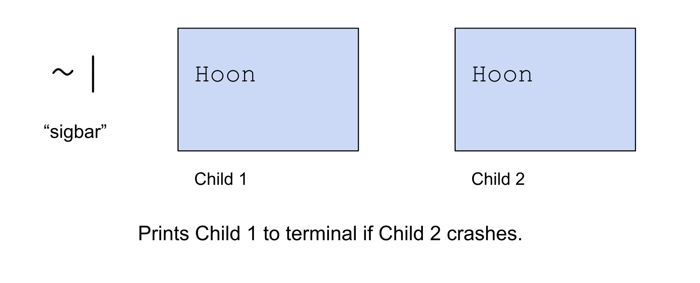

# Building Production Code and Looking Towards the Future
##  Hoon Academy Lesson 8

**Homework**: https://forms.gle/Xn5me5DJZGK9YAmV8 

**Video**: https://youtu.be/IRpUS4RxKx8 

Welcome to the final lesson of Hoon Academy.

## Building Production Code

For this section, let's consider the following code, which generates a list of all the prime numbers between `2` and the input:

```
|=  input=@ud
^-  (list @ud)
=/  output  (gulf 2 input)
=/  n  2
|-
  ?:  =(n input)
    output
  %=  $
  output  (skip output |=(a=@ud &(!=(a n) =((mod a n) 0))))
  n  (add n 1)
  ==
```

We can save it as `primes.hoon` in the `gen` folder, commit, and run it with `+primes 10`.

### Commenting

If we are looking at this code for the first time, how do we interpret what's happening? We can certainly read the Hoon and try to understand, but perhaps there's something the author could have done to make it easier for us.

When building production-quality code, including comments helps both yourself and others understand and keep track of things.

To write comments, simply use the `::` (colcol) rune. This makes everything typed after it on the same line into a comment. Note that `::` doesn't multiline, so every line that has comments should start with one. You can use `::` on the same line after code, though this is discouraged style these days.

Here we've augmented our `primes.hoon` generator with some informative comments, including a title at the top, and explanations for each step of the logic. We can save and run this, and it works the same.

```
::  primes.hoon
::  Outputs a list of prime numbers between 2 and the input number.
::
|=  input=@ud
::  create output list
::
=/  output  (gulf 2 input)
::  n is a counter to use for filtering out non-primes
::
=/  n  2
|-
  ::  terminate when n reaches the input number
  ::
  ?:  =(n input)
    output
  ::  recurse with: 
  ::  the output list filtered out by every number that's divisible by n,  unless it equals n
  ::  and n incremented by 1
  ::
  %=  $
  output  (skip output |=(a=@ud &(!=(a n) =((mod a n) 0))))
  n  (add n 1)
  ==
```

### Assertions and Crashes

When we're building complex code, there's a variety of tools that we can use to make sure that things are working.

In our `primes` code, it wouldn't have made sense if our input was `1` or `0`, because the smallest prime number is `2`. We can catch that case with a `?>` (wutgar), which asserts that a condition is true, and otherwise crashes. 


We've augmented our code with the assertion on line 3. No comments, for brevity.

```
|=  input=@ud
^-  (list @ud)
?>  (gth input 1)
=/  output  (gulf 2 input)
=/  n  2
|-
  ?:  =(n input)
    output
  %=  $
  output  (skip output |=(a=@ud &(!=(a n) =((mod a n) 0))))
  n  (add n 1)
  ==
```

We can save, `|commit %base` and run this code. It works the same for `10`:

```
> +primes 10
~[2 3 5 7]
```

But now crashes on input of `1`:

```
> +primes 1
dojo: naked generator failure
```

`?<` (wutgal) asserts that a condition is false, and otherwise crashes. 


This code does the same thing as above:


```
|=  input=@ud
^-  (list @ud)
?<  (lth input 2)
...
```


The `!!` (zapzap) rune takes no children and just crashes the program.

```
> !!
dojo: hoon expression failed
```

In general, these two pieces of code are exactly equivalent.

```
?<  a 
b
```

```
?:  a
  !!
b
```

So we can rewrite our logic with `!!`:
```
|=  input=@ud
^-  (list @ud)
?:  (lth input 2)
  !!
```

`!:` takes one Hoon expression as a child and turns on the debugging stack trace for that Hoon. If the code crashes, then it traces the line of code that caused the crash. It's generally inserted at the top of a Hoon file to make debugging easier.

If we put it at the top of our updated `primes.hoon` file, and then we cause a crash, we get 
```
> +primes 1
/gen/primes/hoon:<[3 1].[15 5]>
/gen/primes/hoon:<[4 1].[15 5]>
/gen/primes/hoon:<[5 3].[5 5]>
dojo: naked generator failure
```

We can read this error message as slowly narrowing down the source of the crash to between line 5 column 3, and line 5 column 5. That's exactly where the `!!` was in the last version of `primes`.

### Logging

There are a variety of tools to make Hoon code print out messages to the terminal. With the `~|` (sigbar) rune, we can print a debug message whenever a crash occurs.



We can modify our previous code to make it print a message when running `+primes 1` or `+primes 0`.

```
|=  input=@ud
^-  (list @ud)
?:  (lth input 2)
  ~|  "Crashed because input was less than 2"  !!
...
```

Suppose we want to peek inside of our code to see what's happening. We can use `~&` (sigpam) to always print something to the terminal.


Recall that our `primes` generator starts with a list of numbers from `2` to the input number, then filters out numbers divisible by `2,3,4...` in each step of the recursion. We may want to see the intermediate steps of the output list to verify the filtering works correctly.


Below, on line 6 of the code we added a `~&` to print out the `output` list in each iteration of the trap. 

```
|=  input=@ud
^-  (list @ud)
=/  output  (gulf 2 input)
=/  n  2
|-
  ~&  output
  ?:  =(n input)
    output
  %=  $
  output  (skip output |=(a=@ud &(!=(a n) =((mod a n) 0))))
  n  (add n 1)
  ==
```

Saving and running it gives us the following terminal output:

```
~[2 3 4 5 6 7 8 9 10]
~[2 3 5 7 9]
~[2 3 5 7]
~[2 3 5 7]
~[2 3 5 7]
~[2 3 5 7]
~[2 3 5 7]
~[2 3 5 7]
~[2 3 5 7]
> +primes 10
~[2 3 5 7]
```

A final neat trick for logging is that adding `>` before a message to be printed to the terminal changes the color of the text.

Green:
```
~&  >  output
```

Yellow:
```
~&  >>  output
```

Red:
```
~&  >>>  output
```

You can try it for yourself.


### Libraries

A common pattern in most programming languages is to save code as **library files**, which are collections of utilities that can be imported and used in other code.


In Hoon, you can create a library by saving a core containing utilities in its arms in the `lib` folder.

Let's save the following file as `primes-lib.hoon` in the `lib` folder. This `filter` arm contains logic which takes a list of numbers and a number `n`, and removes all the multiples of that number, besides the number itself. If we'll recall, this is the logic that the `primes` generator uses in every iteration of the recursion to filter the list.

```
|%
++  filter
  |=  [numlist=(list @ud) n=@ud]
  (skip numlist |=(a=@ud &(!=(a n) =((mod a n) 0))))
--
```

Let's change `primes.hoon` to import and use this library file. The `/+` (faslus) at the top is the rune to import a library file from the `lib` folder. We then call the `filter` arm of the `primes-lib` library core with this syntax: `filter:primes-lib`, on line 10.

```
/+  primes-lib
|=  input=@ud
^-  (list @ud)
=/  output  (gulf 2 input)
=/  n  2
|-
  ?:  =(n input)
    output
  %=  $
  output  (filter:primes-lib output n)
  n  (add n 1)
  ==
```

Recall that `a:b` is sugar syntax for `=<  a  b`.

If we import the library file with a `*` in front of the name, we can access its namespace and just call the `filter` arm directly. Below, see the differences on lines 1 and 10.

```
/+  *primes-lib
|=  input=@ud
^-  (list @ud)
=/  output  (gulf 2 input)
=/  n  2
|-
  ?:  =(n input)
    output
  %=  $
  output  (filter output n)
  n  (add n 1)
  ==
```

### Importing Library Files to Dojo

Unlike generators, saved and committed library files aren't immediately available to be used in the Dojo. However, you can build them and make them available with the following Dojo command. 

```
> =primes-lib -build-file %/lib/primes-lib/hoon
```

Let's dig into the syntax.


We can then call arms of our imported library core in the Dojo with the following syntax:
```
> (filter:primes-lib ~[1 2 3 4 5 6 7 8] 2)

~[1 2 3 5 7]
```

## Vases

Let's quickly cover an important topic before getting into our next big section. A vase is a pair `[type noun]`, where the type describes the noun. Vases are used all over Urbit to send and receive data while clearly communicating its type. This often comes up when being asked to compile and run other Hoon code. 

The `!>` (zapgar) rune creates a vase from a noun. We saw this before, briefly.


```
> !>  ~zod
[#t/@p q=0]
```

The `!<` (zapgal) rune unwraps a value from a vase.


Here we put `~zod` in a vase and unwrap it into a `@p` again.
```
>  !<  @p  !>  ~zod
~zod
```

If there's a type conflict between the type specified and the type in the vase, `!>` fails.

```
>  !<  @ud  !>  ~zod
-need.@ud
-have.@p
nest-fail
```

## Unit Tests

Testing code is a very important part of shipping clean, high-quality software. Let's test our `primes` generator.

We create a `test` folder in the `base` desk and save the following code in there as `primes.hoon`.

```
/+  *test
/=  primes  /gen/primes
|%
::  test to make sure code works
::
++  test-01
  %+  expect-eq
    !>  `(list @ud)`~[2 3 5 7]
    !>  (primes 10)
++  test-02
  %+  expect-eq
    !>  `(list @ud)`~[2]
    !>  (primes 2)
++  test-03
  %+  expect-eq
    !>  `(list @ud)`~[2 3 5 7 11 13 17 19 23 29 31 37 41 43 47]
    !>  (primes 50)
::  test to make sure code fails when supposed to
::
++  test-04
  %-  expect-fail
    |.  (primes 1)
--
```

Let's break down and understand this code.


After saving the code and running `|commit %base`, we can run the tests with the following command. 

```
-test %/tests/primes
```

The syntax `-test` is the syntax to run a thread, which is a transient computation that lives in the `ted` folder. The argument to that thread is the location of the test to run.

Here the `%` is a shorthand for the default ship, desk, and case, such as `/zod/base/current-time`. We can also write it with this triple `=` (tis), which refers to the same thing.

```
-test /===/tests/primes
```

The result of running the thread shows all 4 tests passing:

```
>   test-04: took µs/332
OK      /tests/primes/test-04
>   test-03: took ms/1.435
OK      /tests/primes/test-03
>   test-02: took µs/935
OK      /tests/primes/test-02
>   test-01: took µs/971
OK      /tests/primes/test-01
> -test %/tests/primes
ok=%.y
```

[Urbit.org Unit Testing Docs](https://docs.urbit.org/userspace/apps/guides/unit-tests)
[Further reading on Urbit unit testing from Neal E. Davis.](https://medium.com/dcspark/writing-robust-hoon-a-guide-to-urbit-unit-testing-82b2631fe20a)


## `%say` Generators

So far, we have learned how to work with regular generators: writing, saving, and running them. It turns out that what we have worked with so far are called **naked generators**, and most generators in the system are a slightly more sophisticated version called **`%say` generators**.


First let's look at a simple naked generator. What does this code do? It accepts any noun as input. Then it just returns the number 42 (not using the input at all.)
```
|=  *
42
```

We can save this as `example.hoon`, `|commit %base`, and run it. Note that to run it, it requires something as input, even though that input is totally unused.
```
> +example 'abc'
42

> +example 1
42
```

Calling it with no argument throws an error.

Let's write the above code as a `%say` generator instead.

```
:-  %say
|=  *
:-  %noun
42
```

If we save this code in the same file and `|commit %base`, we can actually run it without passing in any arguments at all.

```
> +example
42
```

Let's look at the code and understand what's going on. We have a `:-` (colhep), whose first argument is `%say` and second argument is the whole gate. Inside the gate, there is a `:-` (colhep) whose first argument is `%noun` and second argument is the code inside the gate.

```
:-  %say
|=  *
:-  %noun
42
```

So the whole structure is a cell whose head is the tag `%say` and whose tail is a gate.

```
[%say gate]
```

Inside the generator, the result is not returned directly, but as a cell head-tagged with `%noun`.

```
[%noun result]
```


The tags `%say` and `%noun` are metadata information communicated to the system. `%say` communicates that this is a special type of generator. `%noun` is what's called a **mark**, which in the Urbit system is like a file type. It communicates that the result has a particular type (in this case a noun, the most general mark).

When running a `%say` generator, Dojo uses these metadata tags, but parses them out so that we only see the result.


### `%say` Generator Sample

In our above `%say` generator, the sample of the gate was just `*`, which is the most general argument possible -- any noun. We were also able to use the `%say` generator without passing in any argument at all. Compared to naked generators, `%say` generators have a special structure to their sample which gives them access to much more information.

A `%say` generator's sample is a triple, consisting of first a triple of `[now=@da eny=@uvJ bec=beak]`, then a list of named arguments (mandatory args), then a list of unnamed arguments (optional args).


When writing your `%say` generator, you can specify any sample that satisfies this triple structure. If there's any part you don't need to use, stub it out with the generic noun mold `*`

For example, the following are all valid ways to specify the sample of a `%say` generator.

When you need to reference nothing in the sample:
```
*
```

Only need to use the current time:
```
[[now=@da * *] * *]
```

Only need two named arguments
```
[* [text=@t planet=@p ~] *]
```

Only need a single optional argument
```
[* * [option=@tas ~]]
```

With `now`, `eny`, `bec`, a mandatory and optional argument:
```
[[now=@da eny=@uvJ bec=beak] [arg=@t ~] [option=@ud ~]]
```


`%say` generators can augment the power of generators tremendously by letting us access useful system info, randomness, and optional arguments.

### Randomness
Above we noted the argument `eny` to a `%say` generator lets us use randomness. `eny` is a random seed, which is a very large number passed to Urbit from UNIX's random number generation system.

Let's go through an example of using `eny` to generate pseudo-random outputs. Consider the code below, which we can save as `dice.hoon` in our `gen` folder, commit, and run. It takes a required argument `n`, which makes it roll a n-sided dice. It also takes an optional argument `bet`. It prints to the terminal that you won `roll * bet` amount of dollars.

```
:-  %say
|=  [[now=@da eny=@uvJ bec=beak] [n=@ud ~] [bet=@ud ~]]
:-  %noun
=/  roll  (~(rad og eny) n)
~&  "You won {<(mul roll bet)>} dollars"
roll
```


Let's try this generator out. 

```
"You won 0 dollars"
> +dice 6
2
```

When we don't pass in a value for the optional argument `bet`, it becomes the bunt of its type, in this case the value `0` -- that's why we win `0` dollars.

```
"You won 300 dollars"
> +dice 10, =bet 100
3
```

Let's break down how this code works.


How does the pseudo-random number generation work? The door `og` is a library for handling psuedo-random number generation. Calling its `rad` arm with a seed creates a gate that takes a `@ud` number and returns a number between `0` and that input number.


We mentioned that the random seed `eny` is just some large number. We can see by running:

```
>`@`eny

8.712.640.268.777.843.711.122.798.835.789.081.918.654.720.829.721.477.604.588.918.383.388.593.118.925.379.528.109.398.844.563.570.660.305.500.344.878.070.354.490.816.449.329.981.970.298.605.528.949.220.699
```

Running this repeatedly returns a different number each time.

This means we can use any number as a seed, including the number `0`:

```
> (~(rad og 0) 100)
5
```

```
> (~(rad og 222.222) 100)
69
```

However, so long as the seed is the same, the output of the code is the same. The psuedo-randomness comes externally from the unpredictability of the `eny` value, not from the `og` core.

### Optional Section: Repeated Random Number Generation

What if we need to generate more than one random number? Hoon has a particular pattern for that.

A naive strategy to generate multiple random numbers in a row may be to ask for a new random seed each time. However, this approach is resource-intensive and gates the computation by the speed of the seed generation. Imagine if we needed to generate 1 million random numbers. 

A more efficient strategy is to use the initial seed to generate both a (psuedo)random number and a new random number generation core, containing a new (pseudo)-random seed. That way, only one seed is required for as many numbers as needed.

In Hoon we implement this with the `rads` arm of the `og` psuedorandom number core.


An example:

```
> (~(rads og eny) 10)
[5 <4.itl [a=@ <51.enr 137.yvb 33.sam 1.pnw %139>]>]
```

For repeated randomness, we use the following pattern.

```
> =/  rng  ~(. og eny)
    =^  num1  rng  (rads:rng 10)
    =^  num2  rng  (rads:rng 10)
    =^  num3  rng  (rads:rng 10)
    [num1 num2 num3]
[2 2 6]
```

The syntax `~(. og eny)` creates a new `og` door with eny substituted in for the sample. We pin that to the face `rng`.

We call the `rads` arm of the `rng` door with sample `10` to get a pair of a random number between `0` and `10`, and a new door.

The `=^` (tisket) rune is new to us. Basically, it is taking the pair generated by `(rads:rng 10)`, pins the head to a new face, and uses the tail to change an existing face. Basically, it stores the newly generated random number under `num1` and stores the new randomness door under `rng`.

Using this pattern repeatedly ensures that the `rng` core is freshly seeded for every new number -- otherwise it would output the same number.

## Tiny Agent

Let's take a moment to look towards what comes next in our advanced Academy courses. App Academy is for building userspace apps in Urbit, and Core Academy teaches you comprehensively about the Urbit system.


Urbit is a **state machine**, meaning its entire functioning can be understood as a system that has some state, receives some input, changes to a new state, and possibly produces some effects.


Since every substantial piece of code in Urbit is a core, in practice this looks like a pair of `[input core]` transitioning to a pair `[effects new-core]`.

Let's see a basic piece of code that models how an Urbit app, or your entire Urbit system, stores itself and records changes to its state. This `tiny-agent` code below models a simple version of a bank account app. It receives input and changes state by producing a new copy of itself with changes. However, unlike more sophisticated apps, it does not emit any effects.

```
|_  balance=@ud
++  this  .
++  on-init
    |=  amount=@ud
    this(balance amount)
  ++  on-poke
    |=  [tag=?(%add %sub) amount=@ud]
    ?-  tag
     %add  this(balance (add balance amount))
     %sub  this(balance (sub balance amount))
   ==
  ++  on-peek
    balance
--
```

Let's break it down.


How do we use `tiny-agent`? We start with the door and call an arm to make a new door with the state changed. We can do this repeatedly, then we can call the `on-peek` arm to read the state.


Below, we call the `on-init` arm of the original door to make a new door with updated balance, then call the `on-peek` arm of that new door to see the balance.

```
=>
|_  balance=@ud
++  this  .
++  on-init
    |=  amount=@ud
    this(balance amount)
  ++  on-poke
    |=  [tag=?(%add %sub) amount=@ud]
    ?-  tag
     %add  this(balance (add balance amount))
     %sub  this(balance (sub balance amount))
   ==
  ++  on-peek
    balance
--
=>  (on-init 100)
on-peek
```

Below, we call the `on-init` arm of the original door to make a new door with balance set to `100`. Then we call the `on-poke` arm of that door to create a new door with subtracted value, then again to add value, then we call the `on-peek` arm of the final door.

```
=>
|_  balance=@ud
++  this  .
++  on-init
    |=  amount=@ud
    this(balance amount)
  ++  on-poke
    |=  [tag=?(%add %sub) amount=@ud]
    ?-  tag
     %add  this(balance (add balance amount))
     %sub  this(balance (sub balance amount))
   ==
  ++  on-peek
    balance
--
=>  (on-init 100)
=>  (on-poke [%sub 3])
=>  (on-poke [%add 20])
on-peek
```

Instead of chaining multiple calls to `=>` (tisgar) to repeatedly set something as the subject, perform an operation, and set the result of that as the subject again, we can use the rune `=~` (tissig).


With `=~` we can rewrite our above code as:

```
=~
|_  balance=@ud
++  this  .
++  on-init
    |=  amount=@ud
    this(balance amount)
  ++  on-poke
    |=  [tag=?(%add %sub) amount=@ud]
    ?-  tag
     %add  this(balance (add balance amount))
     %sub  this(balance (sub balance amount))
   ==
  ++  on-peek
    balance
--
(on-init 100)
(on-poke [%sub 3])
(on-poke [%add 20])
on-peek
==
```

This usage of `tiny-agent` is a simplified version of a pattern you'll see throughout App Academy.

## Hoon Academy Conclusion

As far as entire operating systems and network protocols go, Urbit is very small and simple. As a Hoon Academy finisher, you have a good basis for starting to understand the entire system.

Urbit is a growing and evolving system that is still under construction. Don't consider anything you've learned in this course to be frozen. This is early-stage open source software. If there's something you don't like, jump in and change it. 

It's important to cultivate a sense of agency because, **YOU**, the Hoon Academy graduate, will be essential for the future of this project. You've hopped on the ride to making new foundations for the internet, and you can help steer too.

We have a grants and bounty system that awards Stars to those that complete projects. This is also a great way to get noticed and work your way up -- it's how got on the path to working for the UF. If you ever want to discuss what to do next on the network, definitely reach out to me.

We look forward to having you around the network and at Urbit events. We're very excited to see what you'll build with your new skills.