#   Introduction to Urbit and Hoon
##  Hoon Academy Lesson 1

**Homework**: https://forms.gle/hxsNDQ1CxarobbaRA 

**Video**: https://youtu.be/6CPCQl3qs0U 

## Urbit Preliminaries

So far, you may have heard talk about planets, moons, stars, and so on. What are these things exactly? An Urbit ship is a running instance of Urbit with a unique network identity like ~sampel-palnet. As a computer, an Urbit ship has state (which ultimately reduces to data stored as 0s and 1s), and operations (formal rules for transforming the 0s and 1s).

Your planet that you use on the network is whats called a **liveship**. Live network identities are finite and valuable -- there are 4,294,901,760 planets, 65,280 stars, and 256 galaxies. To be safe with live identities, most people prefer to develop on what are called **fakeships**. You can run Urbit instances on your local machine that are not connected to the wider network. 

Let's get a fakeship up and running. This was a question in homework 0, but let's walk through it here. Before we proceed, we should note that Urbit will run on any UNIX based machine, so Mac or Linux. If you use Windows, we suggest dual booting Linux or using Windows Subsystem for Linux to simulate Linux inside of Windows.


First make a `/urbit` folder on your computer where you want your Urbit files to live. Then navigate inside the newly created urbit directory with `cd`.

Then navigate to [this page](https://docs.urbit.org/manual/getting-started/self-hosted/cli), scroll down to section 2 and select the architecture of your system, then copy and paste the command into your terminal. This will download the Urbit binary into your `/urbit` folder.

Now we can run the Urbit executable we just downloaded to create an instance of a fakeship, with the command
```sh
./urbit -F zod
```

The `-F` flag specifies a fakeship, and `zod` is the identity we give our fakeship.

After a few minutes of processing, this will boot your fakezod -- you'll see a welcome screen. When a fakeship ship is already booted, simply run it from the directory containing your urbit executable with the command 

```sh
./urbit /path/to/fakezod/folder
```

In this case, it's just

```sh
./urbit zod
```

## Files and Folders on Earth and Mars
So now that we've booted our ship, we are introduced to something called the **Dojo**. The Dojo is simply Urbit's command line environment, where you can use commands to access and manipulate your computer.

If we run `+ls %` , similar to the same command in the Unix terminal, we can see a list of the files and folders at our current directory in our Urbit instance. What happens if we go to the `/zod` folder in Unix? Strange -- nothing is there.

What's going on? Here we introduce an analogy called Earth and Mars. Earth is your Unix computer and Mars is where Urbit lives. On Mars, Urbit organizes collections of code and data as **desks**. Every ship loads with just one desk by default -- the `%base` desk, but you can create other desks too. Importantly, desks are not synced with Earth by default. If you want a desk (in this case, the `%base` desk) to be seen from Earth, you run the Dojo command:

```
|mount %base
```

Now we can go back to Earth, and check the folder under `/zod` -- the `%base` desk folder just appeared. If we go in there, we can see the corresponding files and folders that showed up when we ran `+ls %` on Mars. So that shows us how to download information from Mars to Earth. How about the other way?

Suppose you want to make some manual change to your Urbit such as adding or editing a file. You would do this on Earth and then push the changes to Mars by committing. Let's try an example. A **generator** is a saved snippet of code that you can run from the Dojo. Suppose we wanted to run a generator (which takes no arguments) called `hello-world` -- we would run it with this syntax:
```
+hello-world
```
What happens if we try to run it now? We get an error message. It's not necessary to understand the whole error, but what it means is that that generator doesn't exist on Mars.

On Earth, we will open up a text editor and paste the following Hoon code into it:

```hoon
:-  %say
|=  *
:-  %noun
"hello world"
```

Then we can save the file in `/zod/base/gen/hello-world.hoon`. On Mars, in the Dojo we then run the following command:

```
> |commit %base
```
This syncs the changes we just made on Earth into Mars. Now we can try to run our generator again, and it works:
```
> +hello-world
"hello world"
```

In future lessons, we will use this series of actions to store and run code that you're developing.

To close your ship at any time, either type `|exit` or `Ctrl`+`d` to send the stop signal.  When you start your ship again (with `./urbit zod` only), it will resume at the exact event from which you left off.

As you learn to develop programs in Hoon, you will inevitably break your fakeship. To save time, you can back up your fakeship, so you can restore from backup. Run the following command from Earth:

```sh
$ cp -r zod zod-backup
```

To restore, simply delete zod, rename zod-backup to zod, and boot it from there.

[Optional further reading on setting up your Urbit dev environment is here.](https://docs.urbit.org/courses/environment)

## Running Code in Dojo

The Dojo is not just for poking around in your Urbit system and accessing files. You can also run Hoon code directly in your Dojo. The important thing to keep in mind is that the Dojo will only let you input syntactically correct Hoon code. If you try to type something invalid, it will stop you from doing so and make a sound.

For example, in Hoon, numbers greater than 999 are represented with dots marking each 3 digits, instead of commas. This is fine:
```
> 999
999
```

If you try to type this, Dojo won't let you past the second "0". 
```
> 1000
```

It's necessary to include the dots to make valid Hoon code. Correcting the syntax like this lets you input the number.
```
> 1.000
1.000
```

This misformed number also can't be inputted:
```
> 100.0
```

The dots go every 3 digits from right to left.
```
> 1.234.567.890
```

## Dojo Tips
We will be using the Dojo heavily throughout this course, so its good to get comfortable with it. Here are some useful tips and tricks to improve your Dojo experience.

* Pressing **up arrow** scrolls up through the history of things you've entered.
* Pressing **down arrow** scrolls down through them. Keep pressing down arrow and you'll clear the line.
* When you press enter and the bracket is outwards facing `>`, that means the last line was as complete Hoon expression that finished computing and returned a result. For example, a number by itself is a complete Hoon expression. 
* If the bracket is inwards facing `<`, it means you have entered an incomplete Hoon expression. What you type next will be attached to the previous expression to try and complete it, unless you type **backspace/delete** to clear the incomplete line.
* If you're ever stuck on a computation, perhaps an infinite loop, **Ctrl+c** kicks you out of it.
* **Ctrl+a** to navigate to the beginning of the text line.
* **Ctrl+e** to navigate to the end of the text line.
* Completions: typing something incomplete and then pressing **tab** shows you the valid commands you can input to finish the line.


## Data in Urbit
What is your Urbit?

We discussed last week that information is data + interpretation. On one level it's a very long sequence of 1s and 0s. If we go up to the highest level of intepretation, it's a computer that lets you use apps, network with other computers, and so on. But in between those, there are different levels we could understand the computer on. As a programmer, this is where you will be working.

If we go up one level of interpretation from the binary code, we can say your Urbit is a big binary tree of natural numbers (positive whole numbers). This binary tree structure is at the heart of the Urbit system, so it's important to understand it well.

In Urbit, an **atom** is a single non-negative whole number. 

Here are some examples of atoms:
```
0
1
5
168
2.000.000.001
...
```

 A **noun** is defined recursively (using a definition that invokes itself) as either an atom or a cell of two nouns. **Everything in Urbit is a noun**.

Here are some examples of nouns:
```
5
[4 2]
[[15 7] 8]
[[1 1] [2 9]]
[[29 3] [8 [6 8.452]]]
...
```

But I just mentioned that Urbit's structured as a binary tree, and these are cells containing cells -- how these correspond to each other? These structures are the same, just represented two different ways. Here we can see the correspondence:


In particular, note how a single number being replaced with a cell corresponds exactly to expanding a single node in the binary tree into a left and right branch.

## Binary Tree Addressing

If we are storing data in binary trees, we need to be able to access parts of the tree. We can number the nodes of the tree as follows, and obtain addresses for every location in the tree. For example, 1 corresponds to the whole tree, 2 corresponds to the subtree under node 2, and 8 corresponds to the value stored in node 8.


For a concrete example, consider the following noun:
```
[[[8 9] [10 11]][[12 13] [14 15]]]
```
We can represent it in a tree in the following manner.


Grabbing address 1 grabs the whole tree. Grabbing address 2 grabs the left subtree [[8 9] [10 11]]. Grabbing address 5 grabs the right subtree of the left subtree, [10 11]. And grabbing address 10 grabs the value 10. 

To see this more clearly, we can also consider this equivalent representation. Here we show the structure returned at each address within the tree node.


## Tree Navigation in Urbit

Using the same tree we just examined, let's try this operation in the Dojo. First we need a way to store a piece of data in the Dojo's memory, under a name, so we can access it later. This is called pinning a face. 

**Important note**: this is not technically Hoon code, just a Dojo-specific shorcut. The distinction will be important later.

```
=a 1
> a
1

=b 2
> b
2

=a 3
> a
3
```

Let's pin the tree data structure we were examining to the face `mytree`.
```
=mytree [[[8 9] [10 11]] [[12 13] [14 15]]]
```

Now, we can grab subtrees of the tree with the following syntax:
```
> +5.mytree
[10 11]
> +10.mytree
10
```

The dot `.` means that we are searching for something within something else. `+5.mytree` means search for the address `5` within the closest thing in memory called `mytree`.

We can even use it repeatedly.

```
> +2.+5.mytree
10
```

This means within the subtree at the `+5` address of `mytree`, find the thing at the `+2` address.

### Tuples

A very important and simple data structure in computing is the **tuple**. This is an object that contains 2 things, 3 things, 4 things, or so on. In Urbit, we can express tuples, but they are represented as binary trees underneath. They are always encoded as a rightwards branching tree structure.

In cell form, the rightwards branching tree structure looks like repeatedly expanding the right number of the most inner cell into a cell.

```
1
[1 2]
[1 [2 3]]
[1 [2 [3 4]]]
[1 [2 [3 [4 5]]]]
...
```
The Dojo will pretty-print (format) the above structures to look like this. They are the same data structure underneath.

```
1
[1 2]
[1 2 3]
[1 2 3 4]
[1 2 3 4 5]
...
```

Expressed as trees,

```
[1 2] = [1 2]

  /  \
 1    2
```

```
[1 [2 3]] = [1 2 3]

  /  \
 1  /  \
   2    3
```

```
[1 [2 [3 4]]] = [1 2 3 4]

  /  \
 1  /  \
   2  /  \
     3    4
      
```

```
[1 [2 [3 [4 5]]]] = [1 2 3 4 5]

  /  \
 1  /  \
   2  /  \
     3  /  \
       4    5
```

We can test in the Dojo to see the equivalence:
```
> [1 [2 3]]
[1 2 3]

> [1 [2 [3 4]]]
[1 2 3 4]
```

`[1 [2 [3 4]]]` and `[1 2 3 4]` are simply two ways of writing the underlying structure. No modification or computation is being done here.

### Lark Notation
Above, when we used addresses to navigate within a tree, that's a bit like navigating in the real world with an instruction like, "Go to 200 Main St. in Springfield, Illinois". However, you could also navigate with something like "go right for 1 block, then go left for 2 blocks, then go right for 1 block." In Urbit this is what's called **lark notation**.


Lark notation uses the four characters, `-, +, <, >`. You always begin with `-`  or`+` to indicate left or right, then `<` or `>` to indicate left or right, then continue alternating between these pairs. To see an example, we can return to our previous tree example in the Dojo.

```
> =mytree [[[8 9] [10 11]] [[12 13] [14 15]]]

> -.mytree
[[8 9] 10 11]

> +.mytree
[[12 13] 14 15]

> -<.mytree
[8 9]

> -<-.mytree
8
```

Returning to our analogy of navigating in the real world, sometimes addresses are so notable that you don't need specific directions. For example, "Go to the Eiffel tower", or "Go to the White House" are quite clear about your destination. 

In Urbit, we can assign what are called **faces** to parts of our tree. Going back to our Dojo example, we have the same tree, but with names attached to some parts of it.

```
> =mytree [[[8 9] [a=10 b=11]] [c=[d=12 13] [14 15]]]
> a.mytree
10

> b.mytree
11
> c.mytree
[d=12 13]

> d.c.mytree
12
```

You can even use duplicated faces -- there is no error or namespace collision. When you call a face, Hoon performs a depth first search and returns the first match. 

_A depth-first search will go down the tree, choosing the left branch whenever possible, then when it hits bottom, back up and take the first unexplored rightwards branch, then continue going all the way down leftwards, back up and take the first rightwards branch, and so on and so forth._

In this Dojo example, `b=1` is the first value found by the depth-first-search for the face `b`.

```
> =a [b=1 [b=2 [b=3 b=4]]]
> b.a
1
```

However, we can access all the matches with this notation:
```
> ^b.a
2

> ^^b.a
3

> ^^^b.a
4
```

## Computation in Urbit
We have just given a brief overview of the way that data is stored in your Urbit. However, we have said nothing about how the computer actually computes. 

Let's recall the functions on a binary tree that we introduced in last lesson. Recall that any functional procedure consists of two parts: the data input, and the computational instructions on what to do with the data.

In this image, can you identify which part is the data input, and which part is the computational instructions?


The data input is the binary tree
```
   /  \
 /  \  2
17  8
```

While the instructions are to increment the result of taking the right subtree of the input. We could have also rewrote it like this:


This shows the steps we take to reduce this pair of data and computation to a result.

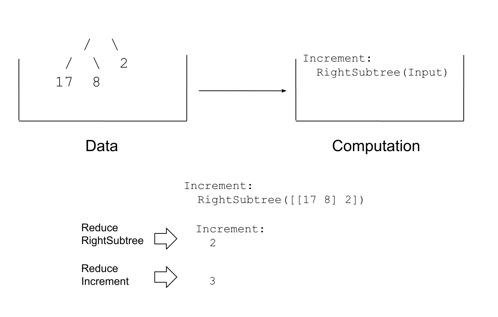

Another example to get comfortable with it:


Now, let's just rename things. Let's call the data input the **subject** and the computation the **formula**. 


We are getting close to something like **Nock**, the formal system and machine code that underlies Urbit.

## Nock
A Nock computation consists of two parts. The **subject** is the data input, and the **formula** is the computational instructions. Both the subject and the formula are binary trees of natural numbers.

The formula contains unambiguous instructions on how to transform the subject and return a result. It's just like what we saw above, except the instructions are encoded as numbers in a tree.

Let's go through some concrete examples. 

**Nock 0** is a code that says "take the number immediately after the 0, and return what's at that address in the subject". Here, our subject is our binary tree `[[[8 9] [10 11]] [[12 13] [14 15]]]` that we worked with earlier. Interpreting the formula `[0 2]` we grab the subtree of that tree under address 2, returning `[[8 9] [10 11]]`. (If you forget why address 2 is that subtree, feel free to scroll up and look at the tree numbering again).


We can also interpret the formula in plain English:

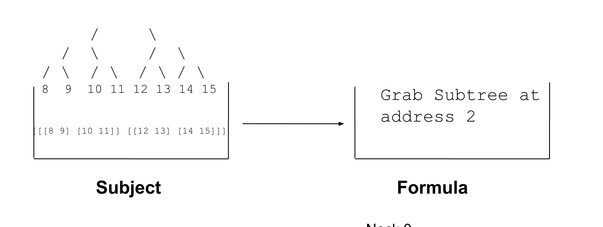

Nock operations can also be chained together. Consider the following plain English formula and reduction:

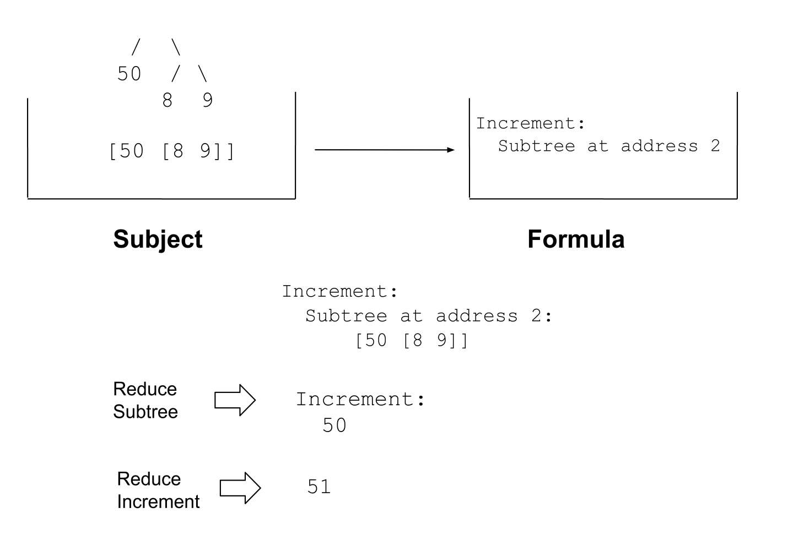

**Nock 4** is a code that says "compute the formula after the 4 on the subject, and then increment the result by 1". Here, we first pull out the Nock 4 to get `[50 [8 9]] [0 2]`. Then, recalling the Nock 0 rule, we pull out the data in the subject at address 2, which is the atom `50`. Finally, we increment `50` to get `51`.


**Nock 3** works similarly to Nock 4, except it returns a `0` if the result of the computation is a cell, and `1` if it's an atom.

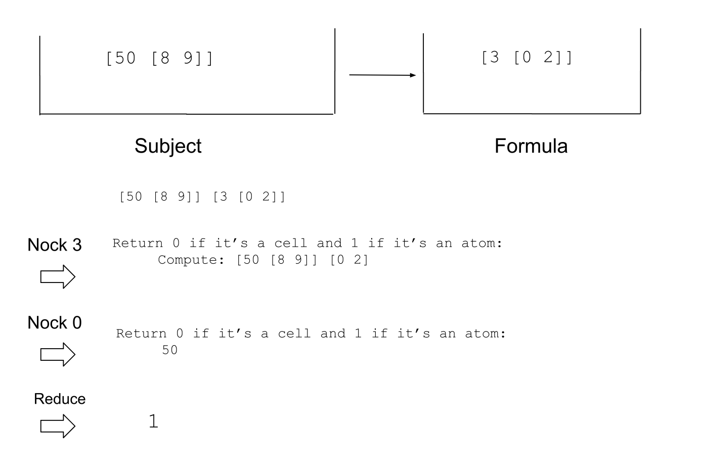

A **Nock 5** is followed by two formulas. It says: compute both of these formulas on the subject. Then return 0 if the results are equal, and 1 if not.
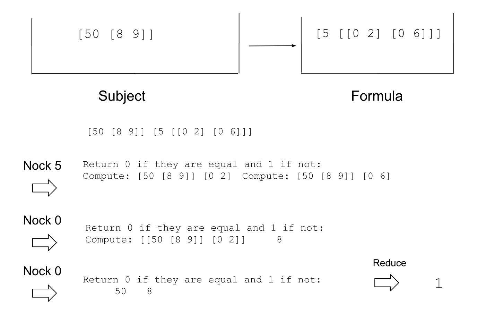

The point of this section is not to fully and completely understand Nock. However, we want to get the flavor of it. Nock is a simple, mechanical formal system based on binary trees that underlies all of Urbit. Hoon compiles to Nock and is close to it structurally. By getting a feel for Nock, we can get a feel for why Urbit and Hoon are the way they are.

_Some computer science nerd bait -- the Nock rules 0-5 are enough to make it Turing-complete. There are 12 rules total -- the rest are just for ease of annotation and can be reduced to combinations of rules 0-5._

If you're interested, I would highly recommend this [clear and simple Nock guide written by ~timluc-miptev.](https://blog.timlucmiptev.space/part1.html) 

The official Nock documentation is [here](https://docs.urbit.org/language/nock).

## Hoon

Let's begin our dive into the Hoon language.

###  Runes

Runes are combinations of two symbolic characters. They are Hoon's way of specifying operations -- like keywords in other languages. The simplest possible rune we can learn is the rune to make a cell -- `:-` (pronounced "colhep")
```
>  :-  1  2
[1 2]
```

We don't have to just give atoms as input to the rune, we can give a cell:

```
>  :-  [1 2]  3
[[1 2] 3]
```

Something important to note about Hoon's syntax is spacing. In particular, Hoon differentiates between an "ace" which is exactly one space, and a "gap", which is 2 or more spaces. If I try to run the previous code with just one space in between the parts, Dojo won't let me type it. But I can run it with three or more spaces in between. 
```
>  :-        1       2
[1 2]
```

Or I can even press the enter key in between.
```
> :-
  1
  2
[1 2]
```

We mentioned that the rune is called "colhep". Hoon has a system by which every symbol used is mapped to a monosyllable name, so that each rune has a two syllable name. You don't have to learn them all immediately, but you'll learn them over time as you read and write Hoon code. If you're curious, [this link contains all the pronounciations](https://docs.urbit.org/glossary/aural-ascii).


Going back to our humble colhep rune, here we see something interesting.

```
:-  1  :-  2  3
```
 The colhep rune takes two arguments. But it seems that its second argument is not a number or a cell, but a colhep rune followed by two numbers. What's going on here? 

Colhep is a rune with two children, like so

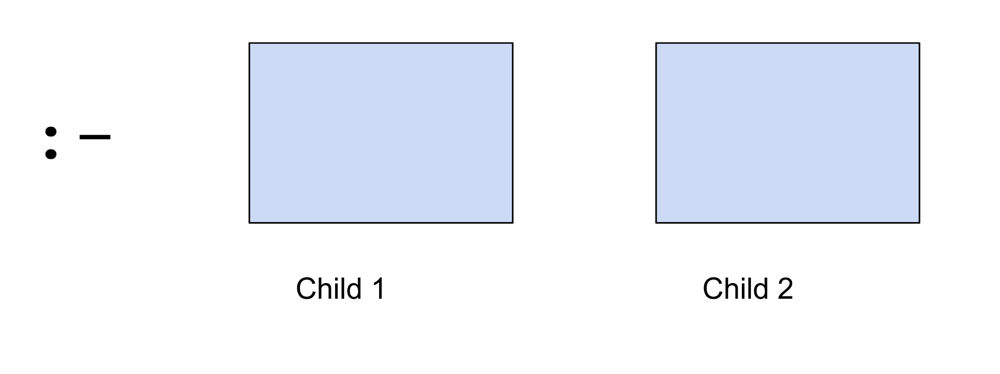

Each of these two children could be nouns, but more generally, they can be any valid Hoon expression that reduces to a noun.

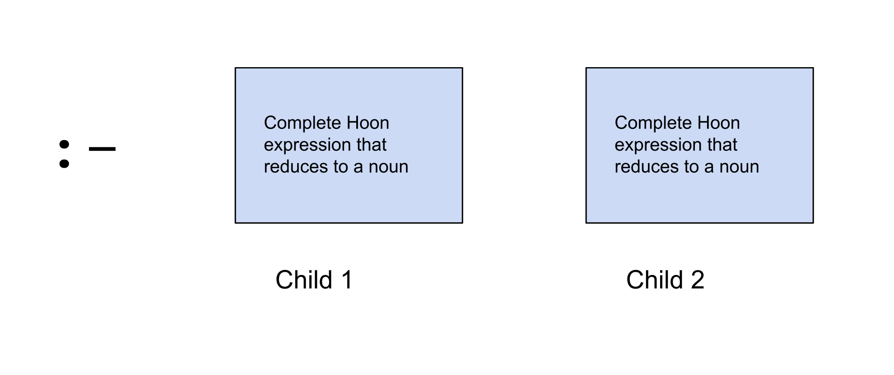

What we did here is shown in the following image. It's perfectly correct Hoon. In this case the inner Hoon expression `:-  2  3` parses to the noun `[2 3]`

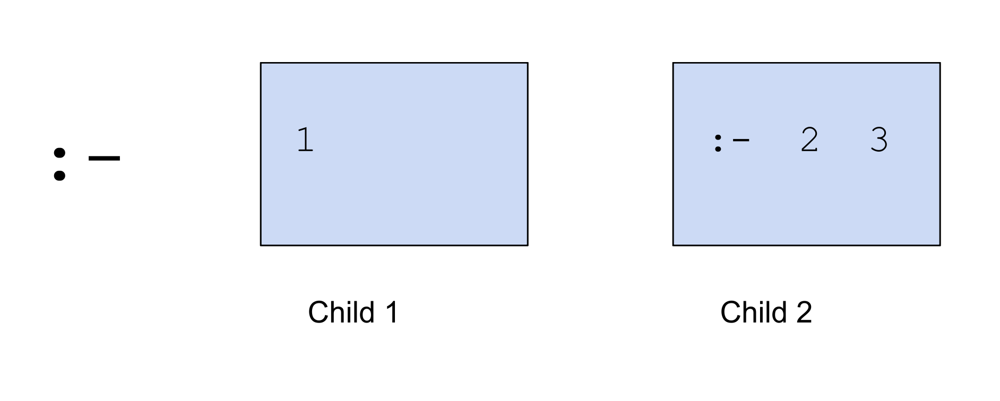

We can parse Hoon expressions as trees of runes and their children. It's very useful to be able to translate back and forth between a piece of Hoon and its tree form.

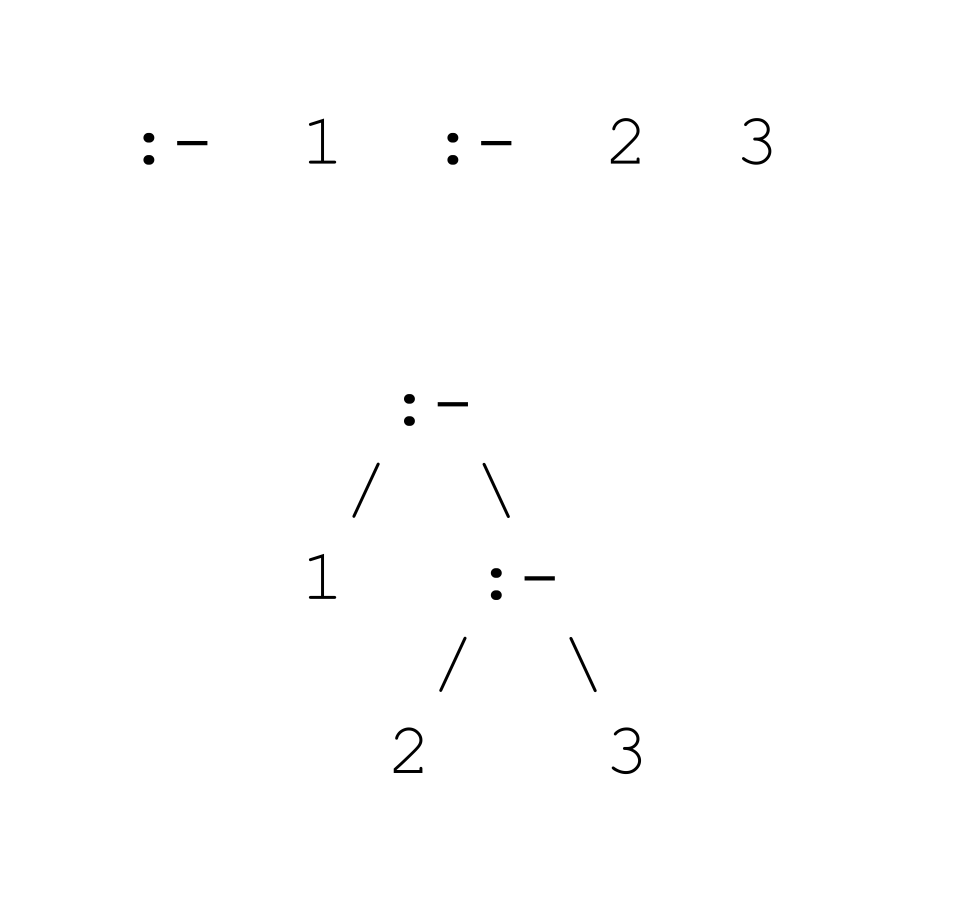

Consider the similar Hoon expression
```
:-  :-  1  2  3
```

Again, this may be slightly confusing at first. The expression parses as a tree in the following way. The inner `:-` grabs the `1  2` as its two arguments, and reduces to a cell `[1 2]` That cell becomes the first argument of the outer `:-`.

```
> :-  :-  1  2  3
[[1 2] 3]
```

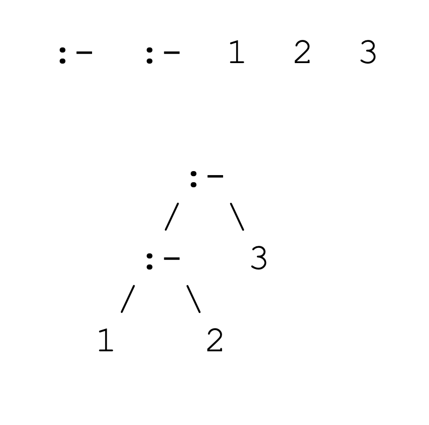

In general, a Hoon expression is parsed from innermost to outermost. A rune is read, indicating it has some number of children which should be complete expressions by themselves. We go into the first subexpression and possibly encounter another rune, or a noun. If rune has children that are all just nouns, we can reduce that rune. Then move onto the next rune.

Here you can see an example of the steps in reducing a Hoon expression to a noun.
```
:-  :-  1  2  :-  3  4

:-  [1 2]  :-  3  4

:-  [1 2]  [3 4]

[[1 2] [3 4]]

```

Here is an incomplete Hoon expression:
```
:-  :-  1  2
```
Is is the inner `:-` or the outer one which is missing a child? In this case it's the outer.

How about this one?
```
:-  1  :-  2
```
In this case the inner `:-` is missing a child.


## Nocking in Hoon
Let's learn a few more runes that allow us to do Nock-like operations.

Every Hoon expression consists of a pair of subject and formula (data and computation, if you'll recall) -- just like Nock. The `=>` ("tisgar") rune sets a pair of subject-formula and computes the formula against the subject.

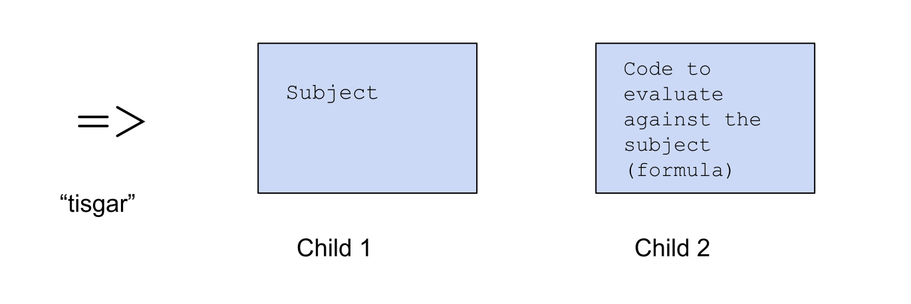

Let's try some examples.

Here we use our tree from before. The `.` notation refers to the current subject. So this Hoon simply sets the tree as the subject, and returns it.
```
> =>  [[[8 9] [10 11]] [[12 13] [14 15]]]  .
[[[8 9] 10 11] [12 13] 14 15]
```

We can also address like before. This code says "with the tree as the subject, return the +2 address of it".

```
> =>  [[[8 9] [10 11]] [[12 13] [14 15]]]  +2
[[8 9] 10 11]
```

```
> =>  [[[8 9] [10 11]] [[12 13] [14 15]]]  +4
[8 9]

> =>  [[[8 9] [10 11]] [[12 13] [14 15]]]  +8
8
```

This is the equivalent of the Nock code `0` that we learned above.

The rune  `=<` (tisgal) is the same as `=>`, just with the arguments reversed.


```
> =<  .  5
5

> =<  +3  [1 2]
2
```

The next rune is very simple. `.+` (dotlus) takes a single child, which must be reduce to an atom (a single value, not a cell) and returns it incremented by 1.

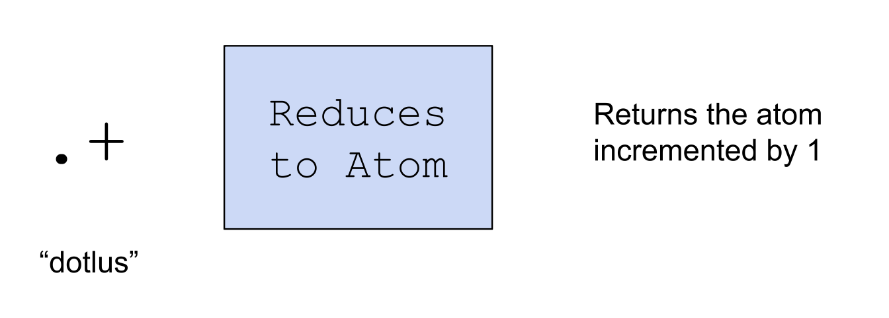

This says, "set the number 5 as the subject, and return it"
```
> =>  5  .
5
```

This says, "set the number 5 as the subject, and return it incremented by 1"
```
> =>  5  .+  .
6
```

This says, "set the cell [31 32] as the subject, and return the number in the +3 address of it, incremented by 1".
```
> =>  [31 32]  .+  +3
33
```

`.+` (dotlus) is basically the equivalent of the Nock code 4 we learned above.

However, if my goal is to add `1` to `5`, I can also just type the following in the Dojo by itself, and get the result. No `=>` is needed.
```
.+  5
```
Earlier we said that every Hoon expression has a subject and formula, but it seems like this is just a formula without a subject. What gives?

It turns out that every expression you type into the Dojo is implicitly wrapped in a *hidden* `=>`, giving it a **default Dojo subject** to evaluate against.

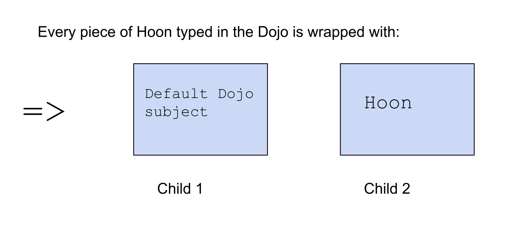

This default subject gives you access to many things such as standard definitions and libraries. We don't use these yet, but it will become important later. The important thing is that when you're coding in the Dojo, even if it looks like there's no subject, the subject is there.

So if you just enter the expression `.+ 5` in the Dojo, it's actually interpreted as:

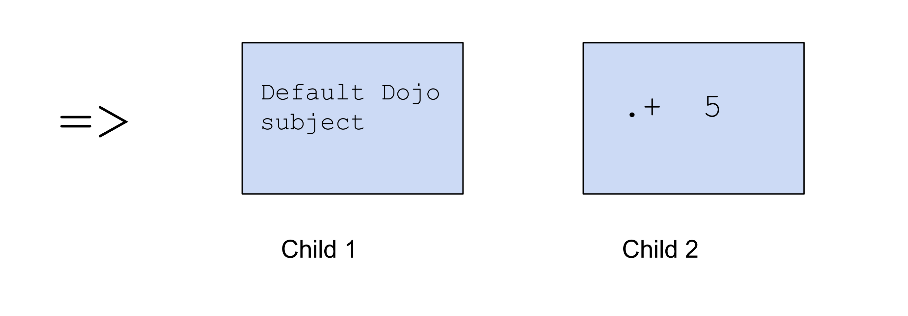

Moving on, `.?` (dotwut) takes one child and returns 0 if that child reduces to a cell, 1 if it's an atom.


This code sets `[50 [8 9]]` as the subject and asks if the entry in the `+2` address is a cell or an atom.
```
> =>  [50 [8 9]]  .?  +2
%.n
```

```
>  .?  1
%.n

>  .?  [1 1]
%.y
```
This rune is like the Nock code 3 we learned above.

`.=` (dottis) takes two children, runs both of them against the subject, and returns `0` if they are equal, and `1` otherwise.

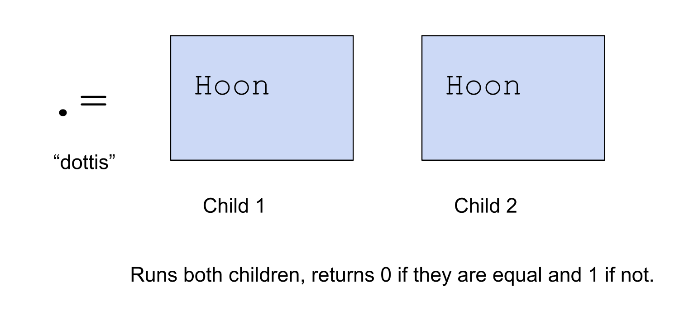

Here we set `[50 [8 9]]` as the subject, and ask whether the things in the `+2` and `+6` addresses are equal.
```
> =>  [50 [8 9]]  .=  +2  +6
%.n
```

Combining with the `.+` (dotlus) rune we learned before, we ask if `1` plus the number in the `+6` address equals the number in the `+7` address.
```
> =>  [50 [8 9]]  .=  .+  +6  +7
%.y
```

We can also directly run it in the Dojo:
```
> .=  [1 2]  [1 2]
%.y
```

We mentioned earlier that `.=` and `.?` return `0` or `1`, but it looks like they are actually returning `%.y` and `%.n`. What's going on?

It turns out that `%.y` is just the atom `0` underneath, and `%.n` is the atom `1` underneath. This is what's called a **loobean** -- Urbit's version of a binary yes or no. (the name loobean is because it's reversed from what we usually expect from a boolean).

We can test this fact with `.=` (dottis):

```
> .=  %.y  0
%.y

> .=  %.y  1
%.n

> .=  %.n  1
%.y

```
## Atoms and Auras

So far, we have only been working with natural numbers. But for practical computing purposes, we need more data types such as negative numbers, floating point (decimal) numbers, text strings, and so on.

Nock really only understands natural numbers. Hoon has more options though. Hoon's type system for atoms is a metadata layer over Nock, which tells you to parse the underlying number a certain way.

We just showed how loobeans are numbers underneath. Urbit's famous `~` (sig) symbol is actually equal to the number `0`

```
.=  ~  0
```

And so is the galaxy `~zod`

```
.=  ~zod  0
```

An **aura** is a way to parse an underlying natural number into a different representation. To interpret an atom as a certain "aura", we use this syntax with the two ` tick characters.

@ is the empty aura, the most fundamental one. It simply returns the number.
```
> `@`100 
100

> `@`~zod
0
```
We represent fractional numbers with the aura `@rs`. For example, we can convert the following big number to a floating point.

```
> `@rs`1.078.529.622
.3.1415
```
`@rs` fractional numbers always start with a `.` to differentiate them from whole numbers.

We also have binary and hexadecimal numbers. These are just whole numbers represented in base 2, or base 16, rather than base 10 as usual.
```
`@ub`100
0b110.0100

> `@ux`100
0x64
```

The `@t` aura is for text strings. We can convert the following large number into text:

```
> `@t`478.560.413.032
'hello'
```

The `@p` aura represents ship identities, which are also numbers underneath. We saw earlier that the number `0` corresponds to the galaxy `~zod`. If we convert the following number into a ship,

```
> `@p`1.624.961.343
~sampel-palnet
```

We don't have to start with an integer -- we can also go directly between different auras. For example, if I convert the following `@p` to a `@t` text, I get:
```
> `@t`~dozpel-bicreg-famtul
'hello'
```

Why is this the case? Because `~dozpel-bicreg-famtul` is the number`478.560.413.032`, which is the number representation of 'hello', converted to a `@p`.

Hoon's type system has many more auras than what we can cover here. You can find a comprehensive reference [here](https://docs.urbit.org/language/hoon/reference/auras)

## Running Nock
Finally, let's cover one final rune that will help you while learning and working with Nock. `.*` (dottar) takes a Nock subject and formula, and computes the result.


```
> .*  [8 9]  [0 1]
[8 9]

> .*  [8 9]  [0 2]
8

> .*  [8 9]  [0 3]
9
```

## Conclusion
In short, we have learned how to set up your fake ship for development, and learned how to sync files between Earth and Mars. We studied how to address and manipulate binary trees and the fundamentals of Nock, Urbit's machine code. We began our study of Hoon with some straightforward runes and correspondences to Nock. Finally, we learned about auras, Hoon's type system for atoms. This was a big lesson -- congratulations on starting to get a handle on Hoon.