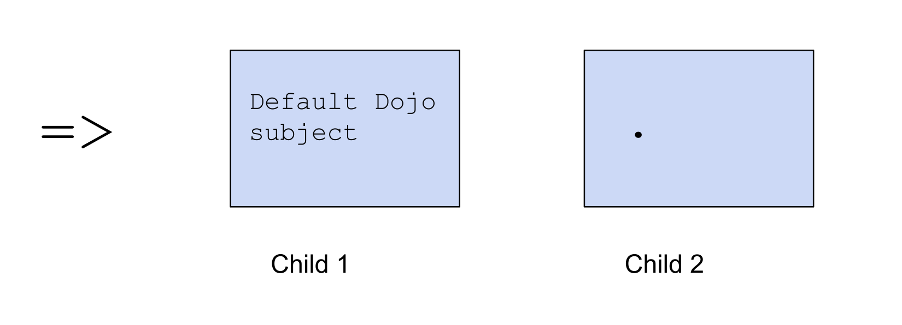

#   Using the Subject, Syntax, and Auras
##  Hoon Academy Lesson 2

**Homework**: https://forms.gle/Bz5BZYrySyhDvoM66 

**Video**: https://youtu.be/cO4AHEasqnk 

## Subject Rehash

Recall that in last lesson, we learned that every Nock code has two parts, the **subject** (which corresponds to the data input), and the **formula**, which corresponds to the computation we do on the input. And recall that due to Hoon's tight correspondence to Nock, any Hoon code has the same structure.

We learned the rune `=>` (tisgar) which sets its first child as the subject and second child as a formula, and runs them together.

Here we simply set the number `1` as the subject, and use the `.` (dot) notation to return the whole subject.
```
> =>  1  .
1
```

Here we are using the lark notation we learned in last lecture to ask if the head of the subject is equal to the tail.

In this case they are not equal,
```
> =>  [1 2]  
  .=  -  +

%.n
```

And in this case they are equal.
```
> =>  [1 1]  
  .=  -  +

%.y
```

We learned that every Hoon code we run in the Dojo is implicitly wrapped in a hidden `=>` which composes it with the standard Dojo subject. 


This is why if you press `.` and enter in the Dojo, it prints a large structure. This is the pretty-printed or summarized representation of the Dojo subject. Don't worry about understanding it for now.


## Modifying the subject

The `=` "tis" family of runes is about modifying the subject. Let's learn some more runes in that family.

`=+` (tislus) takes two children. It computes the first child and sets it as the head of the subject, while setting the old subject as the tail of the subject. Then it computes its second child against this new subject.



The below graphic makes it clearer what this means:


Let's go through some simple examples.

Here we set the cell `[2 3]` to be the subject, pin `1` to the head of the subject, then return the whole subject with `.`, returning `[1 2 3]`
```
> =>  [2 3]  
  =+  1  
  .

[1 2 3]
```

If we use the lark notation `-` (hep) to get the head of the new subject, it returns `1`:
```
> =>  [2 3]  
  =+  1  
  -

1
```

If we use the lark notation `+` (lus) to get the tail of the new subject, it returns the original subject:

```
> =>  [2 3]  
  =+  1  
  +

[2 3]
```

Let's introduce another rune, `=/` (tisfas). `=/` structurally _does the exact same thing_ as `=+` (tislus), except it also attaches a face (a name) to the pinned object.


Let's look at an example. The below code sets the number `2` as the subject, then pins `a=1` to the head of the subject. Returning the subject returns `[a=1 2]`

```
> =>  2  
  =/  a  1  
  .

[a=1 2]
```

We can also access the newly named element with its face:
```
> =>  2  
  =/  a  1  
  a

1
```

We can also use `=/` (tisfas) directly with the Dojo subject. Here we pin `c=[5 6 7]` to the head of the Dojo's subject.

```
> =/  c  [5 6 7]  
  c

[5 6 7]
```

Why does the `-` (hep) grab `c=[5 6 7]` in this code?
```
> =/  c  [5 6 7]  
  -
c=[5 6 7]
```

The `-` is lark notation, referring to the head (left branch) of the subject.


Let's learn another new rune. The `=.` (tisdot) rune changes one address of the subject, then computes something in the new subject.


In this code, we use `=>` (tisgar) to set the cell `[a=1 b=2]` as the subject, then we use `=.` (tisdot) to create a new modified subject where `a` has the value `100`. Then we return the whole subject.

```
> =>  [a=1 b=2]  
  =.  a  100  
  .

[100 2]
```

We could have done the same operation with lark notation. Here the `-` (hep) tells `=.` (tisdot) to seek and modify the head of the subject.

```
> =>  [a=1 b=2]  
=.  -  100  
.

[100 2]
```

We can work directly with the Dojo subject as well. Here we pin `a` to 1, change it to `100`, and get the value of `a`.

```
> =/  a  1  
  =.  a  100  
  a

100
```


For our last new `=` (tis) rune, we have `=:` (tiscol). `=:` (tiscol) does just what `=.` (tisdot) does, except it can change multiple things at once. This is the first rune that we've seen that doesn't have a fixed number of children, but a variable number. 


When a rune has a variable number of children, it uses the delimiter `==` (tistis) to know when to stop parsing children. Let's see an example.

```
> =>  [a='apple' [b='banana' c='cherry']]  
> =:  a  'avocado'  b  'berry'  ==  .
[a='avocado' b='berry' c='cherry']
```

Here, we set the tree `[a='apple' [b='banana' c='cherry']]` as the subject, then look for `a` in the subject and change it to 'avocado', look for `b` in the subject and change it to 'berry', and then return the new modified subject.

To conclude this section, here is a summary of all the `=` (tis) runes we have learned so far:


## Calling Gates

We mentioned that the Dojo subject has a lot of useful definitions and standard utilities. Let's make use of it. For example, it contains functions, or what we call **gates** which allow us to do things like basic math.

Let's learn a new rune `%-` (cenhep).


Here is a simple example:
```
> %-  add  [1 2]
3
```

What happened? Somewhere in the huge Dojo subject binary tree, there is a definition of `add`. When we call `%- add`, it looks up the closest instance of that definition, and pulls it to use as a gate.

The `add` gate's definition specifies that the argument must be a cell of two atoms. If we give it something else, it will throw an error.

```
> %-  add  1

-need.[a=@ b=@]
-have.@ud
nest-fail
```

```
> %-  add  [1 2 3]

-need.@
-have.[@ud @ud]
nest-fail
```

There are several other standard arithmetic gates that do what you would expect:

```
> %-  sub  [5 1]
4
```

```
> %-  mul  [4 3]
12
```

```
> %-  div  :-  8  2
4
```

```
> %-  pow  [2 3]
8
```

Something interesting: the below code doesn't work -- throwing an error `find.add`, which means that it was unable to find something named add in the subject. Why is that?

```
> =>  [a=1 b=2]  
  %-  add  [a b]

-find.add
```

Here when using `=>` (tisgar) rune, we set the subject to just the cell `[a=1 b=2]`. So in the `%-` (cenhep) call, we don't have access to the whole Dojo subject, which contains the definition for gates like `add`.

We can make this code work by changing one rune, `=>` to `=+` (tislus).

```
> =+  [a=1 b=2] 
  %-  add  [a b]

3
```

Instead of making the cell `[a=1 b=2]` into the whole subject, we pin it to the head of the Dojo subject. So definitions like `add` are still available to the `%-` (cenhep) call.

## Syntax Forms

Consider this long and complicated Hoon expression. At first glance, it's difficult to see which parts of this code go under which other parts. When typed in the Dojo, it returns `32`.

```
> =/  x  %-  add  :-  1  1  =/  y  %-  div  :-  10  2  %-  pow  :-  x  y
32
```

The below image breaks down how to parse this statement. The long story short is that we are setting `x` to `(1 + 1) = 2`, setting `y` to `10 / 2 = 5`, and calculating `2^5`.


Fortunately, this is not the only way that we can write such an expression. The way that we have learned to write so far is called **tall form**. Although tall form is the most formal way, and pretty much all Hoon has a tall form expansion underneath, we have other, more legible options for writing.


### Wide Form
Every Hoon rune also has something called **wide form**. Let's see the wide form for runes we've learned. So the important thing to note is that in tall form, you use double spaces (gap) only, but in wide form you use single spaces (ace), and surround the arguments with parentheses.

`:-` (colhep)

```
> :-  1  2
[1 2]

> :-(1 2)
[1 2]
```

`.+` (dotlus)

```
> .+  1
2

> .+(1)
2
```

`=>` (tisgar)

```
>  =>  [a=1 b=2]  a
1

>  =>([a=1 b=2] a)
1
```

`=+` (tislus)

```
> =+  100  -
100

> =+(100 -)
100
```

`%-` (cenhep)

```
>  %-  add  :-(1 2)
3

> %-(add :-(1 2))
3
```

`=.` (tisdot)

```
> =>  [a=1 b=2]  =.  a  100  .  
[a=100 b=2]

> =>  [a=1 b=2]  =.(a 100 .)
100
```

`=:` (tiscol) -- note how this one needs commas to separate the variable pairs of arguments

```
> =>  [a='apple' [b='banana' c='cherry']]  
> =:  a  'avocado'  b  'berry'  ==  .
[a='avocado' b='berry' c='cherry']

> =>  [a='apple' [b='banana' c='cherry']]  
> =:(a 'avocado', b 'berry' .)
[a='avocado' b='berry' c='cherry']
```

`=/` (tisfas)

```
> =/  x  2  %-  div  [20 x]
10

> =/(x 2 %-(div [20 x]))
10
```

At this point, you probably get the gist of how wide form is formatted. We surround the children of the rune with parentheses to clearly delineate where they are, and use single spaces in between.

Important note: **You can use wide form as a subexpression in tall form, but you can't use tall form as a subexpression in wide form.** 

For example, consider this expression. We are trying to use a wide form for `=/` (tisfas) outside and a tall form for `%-` (cenhep) and `:-` (colhep) inside. If you try to type this in the Dojo, it won't let you enter.

```
=/(x 2 %-  div  :-  20  x)
```
However, if we swap things and  use a wide form for `%-` and `:-` INSIDE of the tall form for  `=/`, such syntax is totally fine and encouraged.

```
=/  x  2  %-(div :-(20 x))
```

So always remember, wide inside tall, not tall inside wide. In fact, wide inside tall is a pattern that is generally encouraged for readability.

Let's rewrite our previous long expression using some wide form (and replacing some `:-` with cells):

```
=/  x  %-(add [1 1])  =/  y  %-(div [10 2])  %-(pow [x y])
```

Already, it's easier to read.

### Sugar Syntax

Some Hoon runes have an even more readable version called  **sugar syntax**. Not every rune has sugar syntax, but the most commonly used ones tend to have them. Actually, we have already used a few forms of sugar syntax.

For example, the syntax `[1 2]` is actually sugar for the rune `:-  1  2`! 

To aid our understanding, let's first introduce a few more runes in the `:` (col) family for making cells. Recall that a triple is made in a nested fashion:

```
> :-  1  :-  2  3
[1 2 3]

> [1 [2 3]]
[1 2 3]
```

The rune `:+` (collus) can make it directly:
```
> :+  1  2  3
[1 2 3]

> :+(1 2 3)
[1 2 3]
```

It also has a sugar syntax, which is simply the triple,
```
> [1 2 3]
[1 2 3]
```

Similarly, we can construct a quadruple directly with the `:^` (colket) rune. This is all pretty similar to the last one, with a similar sugar syntax:

```
> :^  1  2  3  4
[1 2 3 4]

> :^(1 2 3 4)
[1 2 3 4]

> [1 2 3 4]
[1 2 3 4]
```

Finally, for tuples of size larger than 4, there is a one size fits all rune `:*` (coltar), which works like this:
```
> :*  1  2  3  4  5  6  7  8  ==
[1 2 3 4 5 6 7 8]

> :*(1 2 3 4 5 6 7 8)
[1 2 3 4 5 6 7 8]

> [1 2 3 4 5 6 7 8]
[1 2 3 4 5 6 7 8]
```

Note that we have to close the tall form with a `==` (tistis) rune since we have a variable number of arguments.

The important thing to note here is that all of these tuples are sugar syntax that correspond to different runes. 

```
[1 2]
[1 2 3]
[1 2 3 4]
[1 2 3 4 5]
```

To help us learn more sugar syntax, let's consider runes for calling gates, in the `%` (cen) family.

The rune we learned already is `%-` (cenhep). This is the most standard rune that can be used with any gate. Why? Every gate can be considered to take a single argument -- a single noun -- even if that noun is a 2-tuple or 10-tuple, for example.

`%-` (cenhep) has a sugar syntax:

```
> %-  sub  [4 1]
3

>(sub [4 1])
3
```

Let's introduce a few other runes for calling gates. If you know that the argument to your gate is a double, a cell of two things, you can use the rune `%+` (cenlus). It takes 3 children, the gate and the two arguments.


In particular, for all the arithmetic gates we learned, we could have been calling them as

Tall:
```
> %+  sub  4  1
3
```

Wide:
```
> %+(sub 4 1)
3
```

Sugar:
```
> (sub 4 1)
3
```

The sugar version is probably the easiest and most common way to invoke a 2-argument arithmetic gate, but you must remember what it desugars to.

Similarly to cells, we also have runes for more arguments. `%^` is for gates that take 3 arguments. We haven't learned such a gate yet, so I'll use an imaginary one.

Tall:
```
> %^  triple-gate  x  y  z
```

Wide:
```
> %^(triple-gate x y z)
```

Sugar:
```
> (triple-gate x y z)
```

Finally, for gates with 4 or more arguments there is the `%:` (cencol) rune, which has a sugar syntax that looks just like what we've seen before.

Tall:
```
%:  some-gate  arg1  arg2 ... argn  ==
```

Wide:

```
%:(some-gate arg1 arg2 ... argn)
```

Sugar:

```
(some-gate arg1 arg2 ... argn)
```

The important point is tha you may call a gate with 1 argument
```
(gate a)
```
two arguments,
```
(gate a b)
```
or three arguments,
```
(gate a b c)
```
all with this similar syntax, but they desugar to different runes, so it's important to know the underlying tall form when you use the sugar.

There's one more sugar syntax for a rune we've seen, the `=<` (tisgal) rune. If we'll recall, this rune means to evaluate the first expression with the second expression as the subject.

Tall:
```
=<  p  q
```

Sugar:

```
p:q
```


An example to try in the Dojo:
```
> =<  a  [a=1 [b=2 c=3]]
1

> a:[a=1 [b=2 c=3]]
1
```

Similarly to wide form, sugar syntax fits under tall form, but tall form does not go within sugar syntax (it's usually ok to mix sugar and wide with each other). 

For example, this piece of code tries to use tall form for `%-` (cenhep) and `:-` (colhep) within a sugar syntax for `%+`. The Dojo won't let you enter it:

```
(mul 2 %-  add  :-  1  2)
```

However, syntax like this is totally correct and encouraged:
```
> %+  mul  2 (add 1 2)
15
```

It's good to use sugar syntax and wide form to make your code shorter and more readable, but a good Hoon developer will remember that there is a tall form expansion behind the code and be able to convert back and forth between them.

To conclude this section, lets apply sugar syntax to our original long piece of code.


```
=/  x  (add [1 1])  =/  y  (div [10 2])  (pow [x y])
```

Changing from `%-` to `%+` underneath, we can simplify it once more, to yield our final short and readable piece of code.

```
=/  x  (add 1 1)  =/  y  (div 10 2)  (pow x y)
```


## More Auras

Last lesson, we began our study of auras. If you'll recall, every atom in Hoon is a natural number underneath, which can get interpreted as different auras.

For example, we can pass the atom 97 to a @p and get the galaxy `~ruc`
```
> `@p`97
~ruc
```
Or pass it to a text cord @t and get the letter `a`
```
> `@t`97
'a'
```

Let's introduce a new family of runes for working with types, the `^` (ket) family

###  Kethep  ^-

The kethep rune casts the Hoon expression in the second child as the type of the first child. If the result of the second child doesn't nest under the specification in the first child, it crashes.


For example, here's an example of a success:

```
>  ^-  @ud  (add 1 2)
3
```

And here's an example of a failure:
```
> ^-  @p  'hello'
mint-nice
-need.@p
-have.@t
nest-fail
```

What does it mean for an aura to nest under another? Hoon has a very interesting system here, which involves trees.


Basically, if an aura `@xy` nests characterwise in another aura `@xyz`, then that means any data of type `@xyz` will not crash being when being as an aura `@xy`. Because of this, the empty aura `@` is the master aura which can be parsed to any other.

You may have noticed the `@ud` aura, standing for unsigned decimal, seems to display the exact same data as the empty `@` aura. 

```
> `@ud`123
123
```

```
> `@`123
123
```
This is true, but due to the nesting system, a `@ud` cannot be interpreted as anything but a number, such as a `@t` or `@p`. `@ud` specifies the data should be a number and not anything else.

Let's go through some examples of nesting. For example, `@u` nests within `@ux` characterwise. So I can cast a hexadecimal as a `@u` with `^-` (kethep).

```
> ^-  @u  0xabc
2.748
```

The empty aura `@` fits within every aura. So any atom will pass `^-  @` (but lose its type information):

```
> ^-  @  'hello'
478.560.413.032

> ^-  @  123
123

> ^-  @  ~sampel-palnet
1.624.961.343

> ^-  @  .3.1415
1.078.529.622
```

However, because `@t` text does not nest characterwise inside `@ux`, this throws a `nest-fail` error:

```
> ^-  @ux  'hello'
mint-nice
-need.@ux
-have.@t
nest-fail
```

We can actually interpret the `@t` text 'hello' as a `@ux` with this syntax that we learned before:
```
> `@ux`'hello'
0x6f.6c6c.6568
```

So what's going on here? It turns out that this tick notation we used before is actually sugar syntax for a *double application* of kethep. It expands like this:

```
`@ux`'hello'
^-  @ux  ^-  @  'hello'
```

It says, first let me take your data and retrieve the underlying raw atom (`@`). Then, let me take that numerical value and cast it to the particular type you specified.

In general, how and why do we use `^-` (kethep)? `^-` is what we call a **fence**. It makes sure the code under it returns something of the proper type. It's used all throughout Urbit code for type checking.

A blurb for those of you with background in programming languages (don't worry if this doesn't make sense yet). Hoon is a *statically typed language*, meaning the program's type correctness is checked at compile time. Ketheps `^-` in your code will produce build failures if there are type mismatches, catching mistakes before code is deployed.


###  Kettar ^*

Another rune ^* lets you get the default value of a type. Every type has a default value, useful for populating data structures with something neutral, for example.


```
> ^*  @ud
0

> ^*  @p
~zod
```

This rune also has a sugar syntax:
```
> *@ud
0

> *@p
~zod
```

###  Kettis  ^=

If you'll recall we have previously created structures with faces attached to various elements such as
```
[a=1 b=2]
```

It turns out this is actually sugar for another `^` rune `^=` (kettis). It takes two children: a face (or possibly some faces in a structure) and a Hoon expression, and returns that Hoon expression with faces attached.


```
> ^=  a  1
a=1
```

```
> :-  ^=  a  'foo'  ^=  b  'bar'
[a='foo' b='bar']
```

Interestingly, it also works on cells by pattern matching, like this:

```
> ^=  [a b]  [1 2]
[a=1 b=2]
```

Sugar:

```
> [a b]=[1 2]
[a=1 b=2]
```

You can even do something more complicated like this:
```
> ^=  [a [b c=[x y]]]  [1 [2 [3 4]]]
[a=1 b=2 c=[x=3 y=4]]
```

Sugar:


```
> [a b c=[x y]]=[1 2 [3 4]]
[a=1 b=2 c=[x=3 y=4]]
```


### Terms (@tas)

There is one more feature of the aura system we should cover. Hoon has a distinguished type called **term**, which has an aura `@tas`. Based on what we just learned about aura nesting, just knowing the name of the aura tells us something -- every valid `@tas` must be a valid `@t` as well, but not vice versa.

Indeed this is true, while a `@t`, otherwise called a **cord** can be any unicode text, a `@tas` can only be the lowercase alphabetical characters, a hep `-` (a dash) and the numbers 0-9 (and the first character must be alphabetical).

```
> ^-  @tas  %abc
%abc

> ^-  @tas  %cats123
%cats123

> ^-  @tas  %t-e-r-m
%t-e-r-m
```

**The special thing about terms is that Hoon treats each one as a type in and of itself.**

For example, this passes.

```
> ^-  %abc  %abc
%abc
```

but this fails with a type mismatch error.

```
> ^-  %ab  %abc
mint-nice
-need.%ab
-have.%abc
nest-fail
```

Terms are used as tags very often throughout Urbit's core system and apps. We will soon get used to working more with them.

### Conclusion

This concludes lesson 2, where we really start to get a handle on the structure and syntax of the Hoon language. Next lesson, we will use this knowledge and learn how to perform logical decision making, which is essential to any computer program.