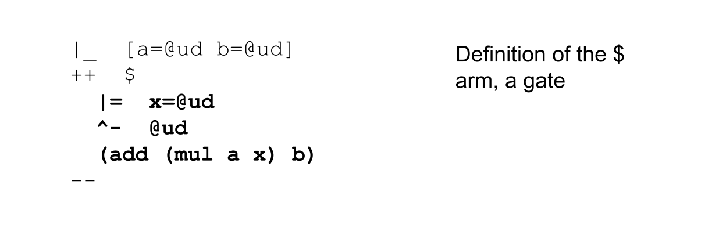
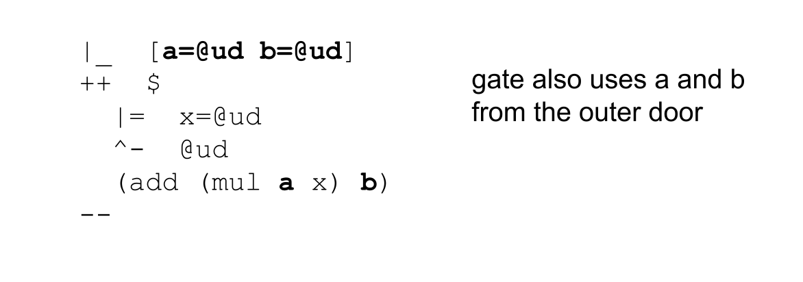

#   Exploring the Power of Cores
##  Hoon Academy Lesson 6

**Homework**: https://forms.gle/YUgNNWue48EUccKB7 

**Video**: https://youtu.be/s1D0iJyKDDo 

In last lesson we introduced the pattern called a **core** and explored its mechanics. Today, we will learn that cores can evolve into all sorts of useful structures, which are all cores underneath. The `|` (bar) rune family is for making cores, and we will learn several `|` (bar) runes that are all special cases of a `|%` (barcen) core.


## Doors

Recall that in last lesson, we learned that cores are a pair `[battery payload]`, where the battery is code and the payload is data. 

```
[battery payload]
         core
    /            \
battery        payload
```

We also learned that cores often have a piece of data pinned to the head of the subject before their creation. This piece of data becomes the **sample** of the core.

```
[battery [sample context]]
         core
    /            \
battery       /      \
           sample   context
```

For example, in this core, the sample is the value `n=5`.

```
  =/  n  5
  |%
  ++  $  (gth n 10)
  --
```


There is a special rune that we can use for this case. A **door** is a core with a sample pinned to the head of its payload. You can create one with the `|_` (barcab) rune. It takes a first argument which is a *sample type definition* (in structure mode). It sets the bunt of that type as the sample for creating a core.


Recall that a bunt is the default value for a type, and recall that the syntax `^*  type` or `*type` grabs the bunt. For example, the bunt of `@ud` is the number `0` and the bunt of `@p` is `~zod`.
 
Let's use our new rune to write our core from above. The only difference is `n` now starts with a value of `0` rather than 5.

```
|_  n=@ud
++  $  (gth n 10)
--
```


We can perform all the same operations that we did with the `|%` (barcen) core since it's the same structure.

 We can compose it with a call to `n` to see that `n` is assigned the value `0`

```
> =>
  |_  n=@ud
  ++  $  (gth n 10)
  --
  n

0
```

We can compose it with a call to its `$` (buc) arm to return `%.n` since `0 < 10`.

```
> =>
  |_  n=@ud
  ++  $  (gth n 10)
  --
  $

%.n
```

We can make a new copy of the door with a changed value `n=11`, then invoke the `$` arm of the new door to return `%.y` since `11>10`


```
> =>
  |_  n=@ud
  ++  $  (gth n 10)
  --
  =>
  %=  .
  n  11
  ==
  $

%.y
```

And we can perform the same action in one step with `%~` (censig).

```
> =>
  |_  n=@ud
  ++  $  (gth n 10)
  --
  %~  $  .  11

%.y
```

With sugar syntax for `%~`:

```
> =>
  |_  n=@ud
  ++  $  (gth n 10)
  --
  ~($ . 11)

%.y
```

## Gates

In Hoon, the purpose of a function is fulfilled by what are called **gates**. So far, we have heard the term gate, and that utilities such as `add`, `mul`, `gth` and so on are gates. However, we haven't learned exactly what they are underneath, until now.

*A gate is simply a door with a single arm `$` (buc)*. But instead of writing out the door and the arm, we can define it more succinctly with the rune `|=` (bartis). 

Here we write our above door equivalently as a gate. 

```
> |=  n=@ud
  (gth n 10)
```

This is a much shorter syntax.

We can perform all the operations we did before, since it's the same structure.

We can grab the value of the sample `n`
```
> =>
  |=  n=@ud
  (gth n 10)
  n
0
```

Even though the `$` arm is now hidden, we can still grab it and return `%.n` since `0` (the default sample value) is less than `10`.

```
> =>
  |=  n=@ud
  (gth n 10)
  $
%.n
```

We can make a new copy of the gate with a new value `n=11`, and compose that with a call to the `$` arm of the new gate to get `%.y`.

```
> =>
  |=  n=@ud
  (gth n 10)
  =>
  %=  .
  n  11
  ==
  $

%.y
```

And we can do this in one step with `%~` (censig)


```
> =>
  |=  n=@ud
  (gth n 10)
  ~($ . 11)

%.y
```

In general, usage of `|=` looks like this.  


Let's reintroduce something familiar. Recall that we learned early on to use `%-` (cenhep) to call a gate, such as `%-  div  [8 2]` or `(div [8 2])` in sugar syntax.

We can now use `%-` with the gate we wrote.

```
> =>
  |=  n=@ud
  (gth n 10)
  %-  .  11

%.y
```

To make the syntax more familiar, we can pin it to a face `gth-10` and call it with that face:

```
> =/  gth-10
  |=  n=@ud
  (gth n 10)
  %-  gth-10  11

%.y
```

This leads us to a deeper understanding of the `%-` (cenhep) rune. It actually runs the `$` arm of a core after substituting for the sample.


Since gates are just cores with a sample and a `$` arm underneath, `%-` also works on things that are written with `|%` or `|_`, as long as they have the right parts.

Here we have our 3 equivalent representations of the `gth-10` gate, which can each be called with `%-`.


```
> =>
  =/  n  *@ud
  |%
  ++  $  (gth n 10)
  --
  %-  .  11

%.y
```


```
> =>
  |_  n=@ud
  ++  $  (gth n 10)
  --
  %-  .  11

%.y
```

```
> =>
  |=  n=@ud
  (gth n 10)
  %-  .  11

%.y
```

## Investigating `add`.

Now that we know the underlying mechanics of gates, we can confirm this knowledge by investigating gates from the standard library. Since gate is just a core with a sample at the head of the payload, and an arm `$`, we should be able to access these parts.

Here we have a diagram showing the structure of the `add` gate.


Address `+2` returns the battery, containing the uncomputed Nock to add two numbers.

```
> =>  add  +2
[6 [5 [1 0] 0 12] [0 13] 9 2 10 [6 [8 [9 2.398 0 7] 9 2 10 [6 0 28] 0 2] 4 0 13] 0 1]
```


Address `+6` returns the sample, so the default values for `add` are `[a=0 b=0]`.

```
> =>  add  +6
[a=0 b=0]
```

Calling the `$` arm of `add` computes it on the default values of `[a=0 b=0]`.
```
> =>  add  $
0
```

We can use `%=` (centis) to create a new `add` gate with a modified sample, then run its `$` arm.
```
> =>
  add
  =>
  %=  .
  a  10
  b   5
  ==
  $

15
```

We can use `%~` (censig) to perform the same operation in one step.

```
> =>
  add
  %~  $  .  [10 5]

15
```


## Gate Typing with ^-

When writing a gate, it's good form to use `^-` (kethep) to specify the type of the output. This lets you catch errors, debug faster, and help others read your code.

We generally add `^-` (kethep) right below the `|=` (bartis). For example in our `gth-10` gate, 

```
|=  n=@ud
^-  ?(%.y %.n)
(gth n 10)
```

Recall that `?(%.y %.n)` is sugar syntax for `$?`, a type union over `%.y` and `%.n`.


## Generators
Suppose that you want to save a gate so you can call it like a script from the Dojo. This is a **generator**. Let's walk through creating and using a generator.


First, make sure your `base` desk (or any other desk) appears on earth by running `|mount %base`. 

Next, open a new file in your IDE and put the code for some gate in it, such as our `gth-10` gate from above.

```
|=  n=@ud
^-  ?(%.y %.n)
(gth n 10)
```

The `gen` folder in a desk is used for storing generators, so save this as `gth-10.hoon` in the folder `zod/base/gen` (if you're using a fakezod).

Then run `|commit %base` in the Dojo. You can now run your generator in the Dojo with the syntax:

```
+gth-10 11
```

Note that there's only one space after the `+gth-10` -- Dojo syntax is different than Hoon syntax.

If we want to edit the generator, just edit the file and run `|commit %base` again. Let's change our generator to compare two numbers, and save it as `gth-a-b.hoon`.

```
|=  [a=@ud b=@ud]
^-  ?(%.y %.n)
(gth a b)
```

Now the gate takes a cell of two numbers as a sample. To call it as a generator, we give the two arguments as a single noun:

```
> +gth-a-b [8 7]
%.y
```

## Gate-Building Doors

Recall from last lesson that cores can contain other cores in their arms. Of course this means cores can have gates in their arms, since gates are cores.


Here we have a core with three arms, `double`, `triple` and `quadruple`, each of which are a gate that takes a number `a` and multiplies it.
```
|%
++  double   |=(a=@ (mul 2 a))
++  triple   |=(a=@ (mul 3 a))
++  quadruple   |=(a=@ (mul 4 a))
--
```

Composing this core with a call to `triple` builds the gate (which itself is a core).

```
> =>
  |%
  ++  double   |=(a=@ (mul 2 a))
  ++  triple   |=(a=@ (mul 3 a))
  ++  quadruple   |=(a=@ (mul 4 a))
  --
  triple

< 1.qmx
  [ a=@
...
```

We can grab `triple` and use it as a gate.

```
> =>
  |%
  ++  double   |=(a=@ (mul 2 a))
  ++  triple   |=(a=@ (mul 3 a))
  ++  quadruple   |=(a=@ (mul 4 a))
  --
  %-  triple  4

12
```

In fact, this is what is happening when you call a gate in the standard library from the Dojo. The `=>` is hidden.

```
=> big-core-containing-library-arms
%-  mul  [5 6]
```


The outer core can be a door (core with sample), and we can use the sample to the outer door in the definitions of the inner gates. This is called a **gate-building door**, and can be used to represent a general family of gates all at once.

For example, we are probably all familiar with linear equations like `y=ax+b`, where `a` denotes the slope of the line and `b` denotes where it crosses the vertical y-axis.


Let's build a door that can produce any linear equation as a gate. 

```
|_  [a=@ud b=@ud]
++  $  
  |=  x=@ud
  ^-  @ud
  (add (mul a x) b)
--
```

Let's go over the parts of this code to understand it.








Let's pin this to the head of the subject under the face `linear`, then use `%~` to call its `$` arm with a sample.

This builds a gate which represents the function `y=4x+2`.

```
> =/  linear
  |_  [a=@ud b=@ud]
  ++  $  
    |=  x=@ud
    ^-  @ud
    (add (mul a x) b)
  --
  %~  $  linear  [4 2]

< 1.yja
  [ x=@ud
...
```

Or in sugar syntax:
```
> =/  linear
  |_  [a=@ud b=@ud]
  ++  $  
    |=  x=@ud
    (add (mul a x) b)
  --
  ~($ linear [4 2])
```

After building a gate that corresponds to `y = 4x+2`, we can plug `x = 1` into it to get `y = 4*1+2 = 6`

```
> =/  linear
  |_  [a=@ud b=@ud]
  ++  $  
    |=  x=@ud
    ^-  @ud
    (add (mul a x) b)
  --
  %-  ~($ linear [4 2])  1

6
```

## Recursion in Hoon

Now, let's pivot to another powerful usage of cores.

Recall that in lesson 0, we studied a simple recursive function like this.


This function says, given an input `n`, if `n=0`, then return `n`. Else return the function computed on `n-1`. So if I give the function `n=3`, it will take the else branch and compute `function(2)`. Then what does `function(2)` compute? It takes the else branch and computes `function(1)`. `function(1)`  takes the else branch and computes `function(0)`. Finally `function(0)` returns `0`. This function returns `0` on any positive whole-numbered input.

Let's understand such a function in Hoon.

```
=/  n  3
|%
++  $  
  ?:  =(n 0)
    n
  %=  $
  n  (sub n 1)
  ==
--
```

Let's understand the parts here.


Recall that the `?:` (wutcol) rune says, if the first child produces `%.y`, take the second child, otherwise take the third child.


The first child of `?:` is the expression `=(n 0)`. Recall this is the sugar form of `.=` which returns `%.y` if two nouns are equal, and `%.n` otherwise.


This piece of code is a core by itself. So if we enter it in the Dojo, it just returns the core. 

```
> =/  n  3
  |%
  ++  $  
    ?:  =(n 0)
      n
    %=  $
    n  (sub n 1)
    ==
  --

< 1.ibq
  [ n=@ud
...
```

But if we call the `$` arm of this core, it runs and returns `0`

```
> =>
  =/  n  3
  |%
  ++  $  
    ?:  =(n 0)
      n
    %=  $
    n  (sub n 1)
    ==
  --
  $

0
```

Let's go through what happened when the code executed.


A core with a single arm `$` is  called a **trap**. There is a rune to write it more conveniently, `|.` (bardot).

The rune takes a single child and puts it as the single `$` arm of a core.


We can write our above code more shortly. Instead of writing the `|%` and declaring the `$` arm, we simply use `|.`


Let's run it to make sure it does the same thing.

```
> =>
  =/  n  3
  |.
   ?:  =(n 0)
     n
   %=  $
   n  (sub n 1)
   ==
  $

0
```

If we have a core with a single arm `$`, and we wish to immediately run that arm, we can compress our code even further with the rune `|-` (barhep).This is called building a trap and kicking it. `|-` (barhep) is the rune you'll use most often for writing recursion in Hoon.


We can again shorten our recursive code:


Note how we get rid of the `=>` and `$` because `|-` immediately runs the `$` arm.

Let's test the code:

```
> =/  n  3
  |-
   ?:  =(n 0)
     n
   %=  $
   n  (sub n 1)
   ==

0
```

Finally, we can shorten our code once more by using sugar syntax for `%=`

```
> =/  n  3
  |-
   ?:  =(n 0)
     n
  $(n (sub n 1))

0
```

What happens if we put `=/  n  3` inside the trap? Maybe this would cause an infinite loop, because every time we return to the `$` arm, `n` is reset to `3`?


Let's run it and see.

```
> |-
   =/  n  3
   ?:  =(n 0)
     n
   %=  $
   n  (sub n 1)
   ==

-tack.n
-find.n
```

Turns out we get an error message, no infinite loop. What's going on here?

Recall that when something is in an arm of a core, it's unbuilt code. Putting `=/  n  3` inside the trap puts it inside the hidden `$` arm. So  `%=` looks at its own parent core and can't find an `n` inside the core to change!

Here we show the two different positions of `=/  n  3` and where it ends up in the tree produced by the core. When it's in the payload, `%=` can find it because that's already built data.


## Using Traps

Our previous example was a simple, but useless trap to illustrate how recursion works. Let's do something slightly more useful with recursion -- add up all the numbers from `1` to an input.

```
> =/  n  5
  =/  total  0
  |-
    ?:  =(n 0)
      total
    %=  $
    n  (sub n 1)
    total  (add total n)
    ==

15
```

The code gave us `5+4+3+2+1=15`. What happened when we ran the code?


We can shorten this code further. A useful and elegant style called *natural recursion* allows us to get rid of the `total` variable by putting the recursive call inside of a gate call.

```
=/  n  5
|-
  ?:  =(n 0)
    n
  (add n $(n (sub n 1)))
```

Here's how to interpret this code:


And for our particular input:


We can put the `|-` trap in a gate to allow it to take custom inputs.

```
|=  n=@ud
|-
  ?:  =(n 0)
    n
  (add n $(n (sub n 1)))
```

To use the gate, we can give it a face and call it.

```
> =/  add-nums
  |=  n=@ud
  |-
    ?:  =(n 0)
      n
    (add n $(n (sub n 1)))
  (add-nums 5)

15
```

We can save this gate as a generator `add-nums.hoon` in `zod/base/gen`.

```
|=  n=@ud
|-
  ?:  =(n 0)
    n
  (add n $(n (sub n 1)))
```

After running `|commit %base` from the Dojo, we can call the generator from the Dojo with:

```
> +add-nums 5
15
```

Let's explore one more useful example of recursion. It's common to use recursion to work over lists. Let's use a trap to add up all the numbers in a list of numbers.

```
> =/  numlist  `(list @ud)`~[21 35 2 8 49]
  =/  total  0
  |-
    ?~  numlist
      total
    %=  $
    total  (add total i.numlist)
    numlist  t.numlist
    ==

115
```

The code successfully added up `~[21 35 2 8 49]` to get `115`. Here's the explanation:


Recall that the `?~` (wutsig) rune says, if the first child is `~`, run the second child, otherwise run the third child. Recall than an empty list is represented as `~`.


Recalling our natural recursion from the last example, we can similarly simplify this code:

```
=/  numlist  `(list @ud)`~[21 35 2 8 49]
|-
  ?~  numlist
    0
  (add i.numlist $(numlist t.numlist))
```


We could have also put the `|-` into a gate so it can take any list of numbers. We can then save it as a generator `add-numlist.hoon` in `zod/base/gen`.
```
|=  numlist=(list @ud)
|-
  ?~  numlist
    0
  (add i.numlist $(numlist t.numlist))
```

After running `|commit %base`, we can run it from the Dojo with:

```
> +add-numlist ~[21 35 2 8 49]
115
```

##  Polymorphic Cores (Optional Further Reading)
For those with previous functional programming or theoretical programming languages experience, you may be interested in Hoon implements polymorphic (type generic) cores. For others, no need to worry about this, as you won't need it in the vast majority of coding situations.

https://docs.urbit.org/courses/hoon-school/R-metals 

## Conclusion

We saw that cores are flexible and powerful enough to enable a wide variety of uses such as functions, generating a class of functions, and recursion. By understanding cores through lessons 5 and 6, we've covered Hoon's biggest concept. We're now on the way to having a good understanding of the whole language, and in lessons 7 and 8 we will wrap up the course by exploring the standard library, understanding the system, and building production-ready code.