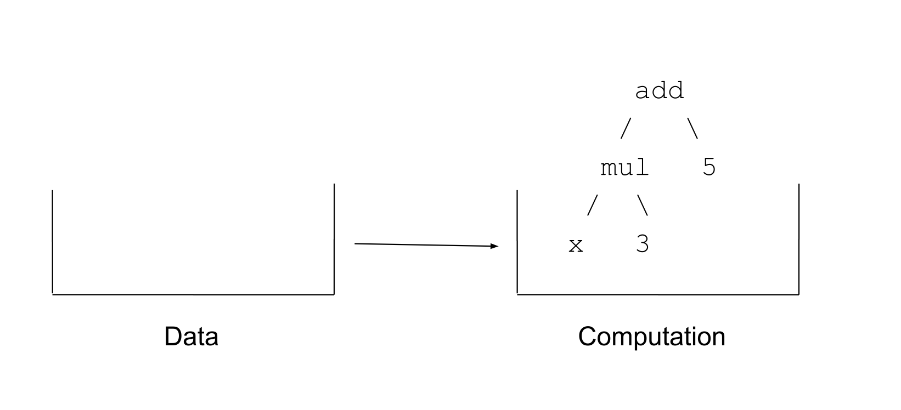
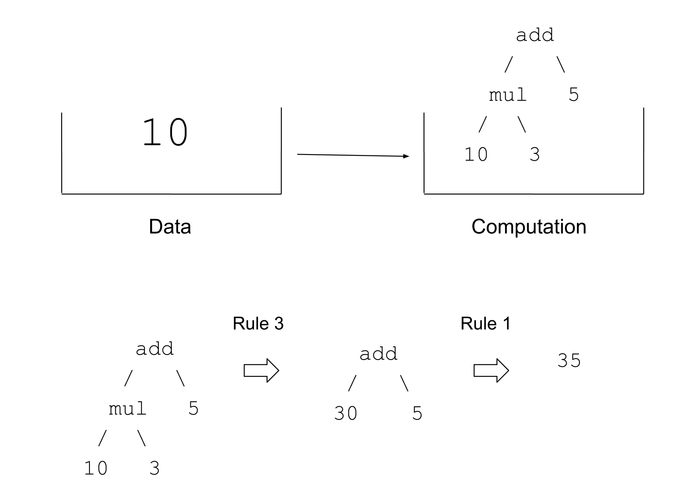
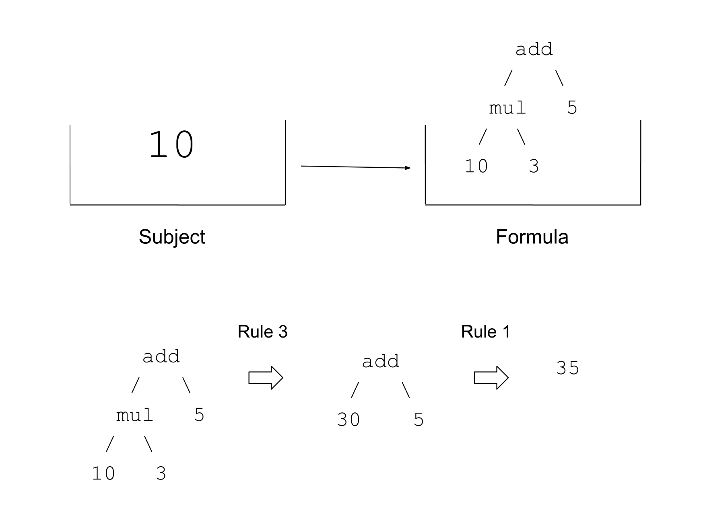
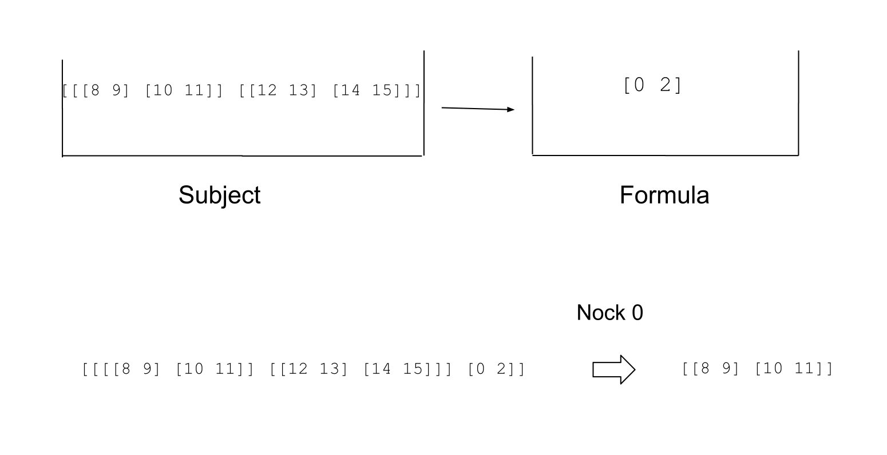
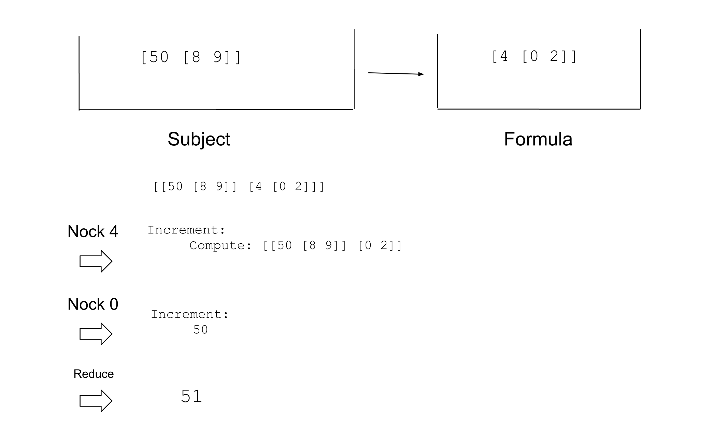
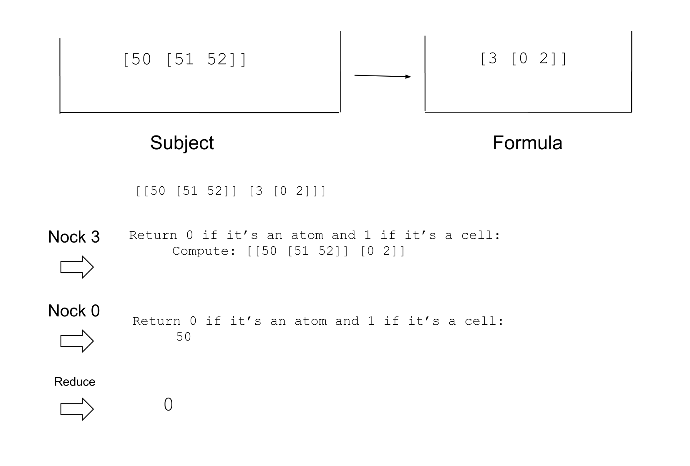
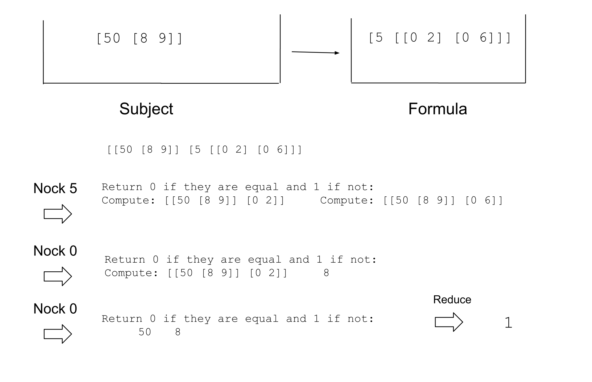
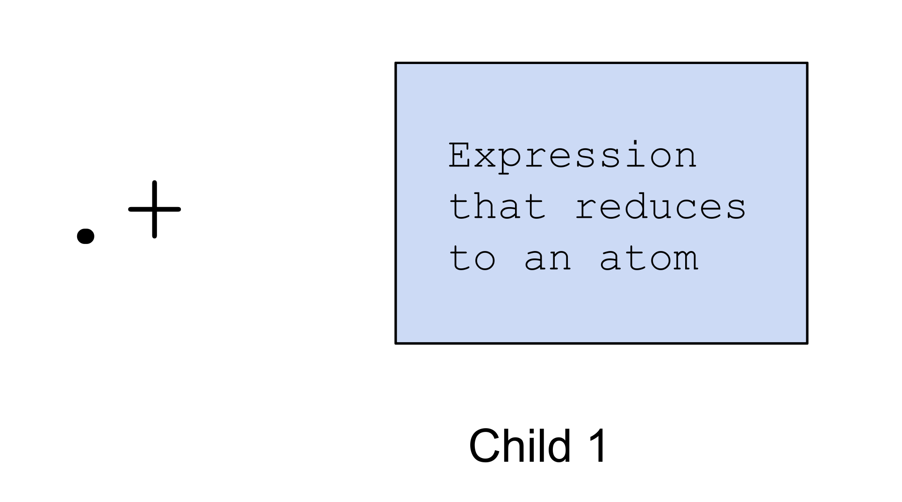
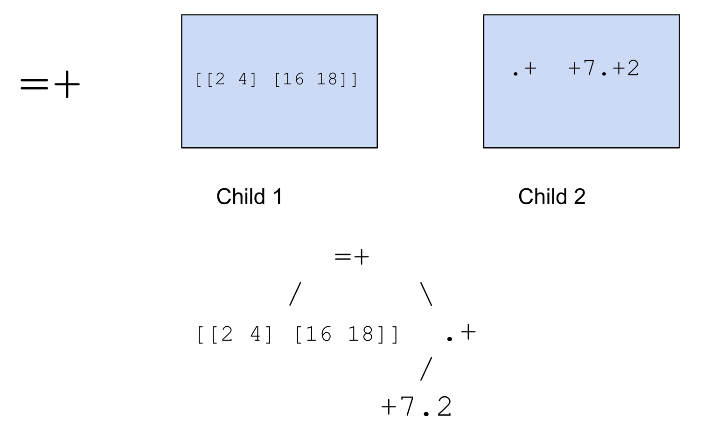
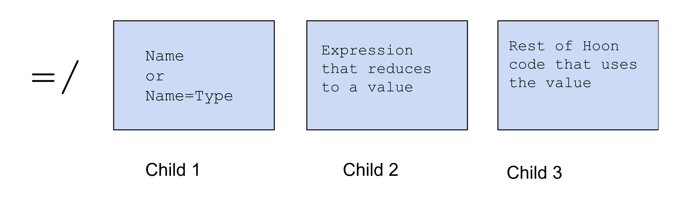

#   Introduction to Urbit and Hoon
##  Hoon School Lesson 1

**Homework**: https://forms.gle/ToKD8sjsSBJYaV9H7

**Video**: https://www.youtube.com/watch?v=06xhXt49nDA

## Urbit Preliminaries

So far, you may have heard talk about planets,moons and stars, and so on. What are these things exactly? An Urbit ship is a running instance of Urbit with a unique network identity like ~sampel-palnet. As a computer, an Urbit ship has state (which ultimately reduces to data stored as 0s and 1s), and operations (formal rules for transforming the 0s and 1s).

Your planet that you use on the network is whats called a **liveship**. Live network identities are finite and valuable -- there are 4,294,901,760 planets, 65,280 stars, and 256 galaxies. To be safe with live identities, most people prefer to develop on what are called **fakeships**. You can run Urbit instances on your local machine that are not connected to the wider network. 

To do so, first download the Urbit binary using the instructions here: https://urbit.org/getting-started/cli . Scroll down to section 2 and select the architecture of your system. Then copy and paste the command into your terminal, when you have navigated your terminal to the directory you want your /urbit folder to live in. A note -- Urbit will run on any Unix based machine. If you use Windows, we suggest Windows subsystem for Linux to simulate Linux running on Windows, or you can dual boot Linux.

After you've done that, you'll want to navigate to your `/urbit` directory that you've just created and run the executable inside to boot an instance of a fakeship. We do this with the -F flag

```sh
./urbit -F zod
```

After a few minutes of processing, this will boot your fakezod -- you'll see a welcome screen. When a fakeship ship is already booted, simply run it from the directory containing your urbit executable with the command 

```sh
./urbit /path/to/fakezod/folder
```

In this case, it's just

```sh
./urbit zod
```

## Files and Folders on Earth and Mars
So now that we've booted our ship, we are introduced to something called the **Dojo**. The Dojo is simply Urbit's command line environment, where you can use commands to access and manipulate your computer.

If we run `+ls %` , similar to the same command in the Unix terminal, we can see a list of the files and folders at our current directory in our Urbit instance. What happens if we go to the `/zod` folder in Unix? Strange -- nothing is there.

What's going on? Here we introduce an analogy called Earth and Mars. Earth is your Unix computer and Mars is where Urbit lives. On Mars, Urbit organizes collections of code and data as **desks**. Every ship loads with just one desk by default -- the `%base` desk. However, you can create other desks too. Importantly, desks are not synced with Earth by default. If you want a desk (in this case, the `%base` desk) to be seen from Earth, you run the command
```
|mount %base
```

Now we can go back to Earth, and check the folder under `/zod` -- the `%base` desk folder just appeared. If we go in there, we can see the corresponding files and folders that showed up when we ran `+ls %` on Mars. So that shows us how to download information from Mars to Earth. How about the other way?

Suppose you want to make some manual change to your Urbit such as adding or editing a file. You would do this on Earth and then push the changes to Mars by committing. Let's try an example. A **generator** is a saved snippet of code that you can run from the Dojo. Suppose we wanted to run a generator (which takes no arguments) called `hello-world` -- we would run it with this syntax:
```
+hello-world
```
What happens if we try to run it now? We get an error message. It's not necessary to understand the whole error, but what it means is that that generator doesn't exist on Mars.
```
clay: read-at-aeon fail [desk=%base care=%a case=[%da p=~2023.7.2..12.30.06..e6cb] path=/gen/hello-world/hoon]
[%file-not-found-mist /gen/hello-world/hoon]
[%error-validating /gen/hello-world/hoon]
[%error-building /gen/hello-world/hoon]
clay: %a build failed [%base 611 /gen/hello-world/hoon]
dojo: %writ fail [i=%~.hand t=/gen/hello-world]
> +hello-world
/gen/hello-world/hoon
%generator-build-fail
```

On Earth, we will open up a text editor and paste the following Hoon code into it:

```hoon
:-  %say
|=  *
:-  %noun
"hello world"
```

Then we can save the file in `/zod/base/gen/hello-world.hoon`. On Mars, in the Dojo we then run the following command:

```
> |commit %base
```
This syncs the changes we just made on Earth into Mars. Now we can try to run our generator again, and it works:
```
> +hello-world
"hello world"
```

In future lessons, we will use this series of actions to store and run code that you're developing.

To close your ship at any time, either type `|exit` or `Ctrl`+`d` to send the stop signal.  When you start your ship again (with `./urbit zod` only), it will resume at the exact event from which you left off.

As you learn to develop programs in Hoon, you will inevitably break your fakeship. To save time, you can back up your fakeship, so you can restore from backup. 

```sh
$ cp -r zod zod-backup
```

To restore, simply rename zod-backup to zod, and boot it from there.

Optional further reading on setting up your Urbit dev environment is here: https://developers.urbit.org/guides/core/environment

## Running Code in Dojo

The Dojo is not just for poking around in your Urbit system and accessing files. You can also run Hoon code directly in your Dojo. The important thing to keep in mind is that the Dojo will only let you input syntactically correct Hoon code. If you try to type something invalid, it will stop you from doing so and make a sound.

For example, in Hoon, numbers greater than 999 are represented with dots marking each 3 digits, instead of commas. This is fine:
```
> 999
999
```

If you try to type this, Dojo won't let you past the second "0".
```
> 1000
```

However, correcting the syntax like this lets you input the number.
```
> 1.000
1.000
```

This misformed number also can't be inputted:
```
> 100.0
```


## Binary Trees
What is your Urbit?

We discussed last week that information is data + interpretation. On one level it's a very long sequence of 1s and 0s. If we go up to the highest level of intepretation, it's a computer that lets you use apps, network with other computers, and so on. But in between those, there are different levels we could understand the computer on. If we go up one level of interpretation from the binary code, we can say your Urbit is a big binary tree of positive integers (positive whole numbers). This binary tree structure is at the heart of the Urbit system, so it's important to understand it well.

In particular, everything in Urbit is a **noun**. A **noun** is defined recursively as an **atom**, which is a single value (positive integer), or a cell of two nouns.

Here are some examples of atoms:
```
0
1
5
168
2.000.000.001
...
```

And here are some examples of nouns:
```
5
[4 2]
[[15 7] 8]
[[1 1] [2 9]]
[[29 3] [8 [6 8.452]]]
...
```


But I just mentioned that Urbit's structured as a binary tree, and these are cells containing cells -- how these correspond to each other? These structures are actually isomorphic -- they are entirely the same structure, just represented two different ways. Here we can see the correspondence:


 In particular, note how a single number being replaced with a cell corresponds exactly to expanding a single node in the binary tree into a left and right branch.


If we are storing data in binary trees, we need to be able to access parts of the tree. We can number the nodes of the tree as follows, and obtain addresses for every location in the tree. For example, 8 corresponds to the value stored in node 8, 1 corresponds to the whole tree, 2 corresponds to the subtree under node 2, 5 corresponds to the subtree under node 5, and so on.


For a concrete example, consider the following noun:
```
[[[8 9] [10 11]][[12 13] [14 15]]]
```
We can represent it in a tree in the following manner.


Grabbing address 1 grabs the whole tree. Grabbing address 2 grabs the left subtree [[8 9] [10 11]]. Grabbing address 5 grabs the right subtree of the left subtree, [10 11]. And grabbing address 10 grabs the value 10. 

To see this more clearly, we can also consider this equivalent representation. Here we show the structure returned at each address within the tree node.


## Tree Navigation in Urbit

Using the same tree we just examined, let's try this operation in the Dojo. This is called pinning a face -- storing a data value under a name so you can refer to it later.

```
=tree [[[8 9] [10 11]] [[12 13] [14 15]]]
```

Now, we can grab subtrees of the tree with the following syntax:
```
> +5.tree
[10 11]
> +10.tree
10
```

### Tuples
We may not always want to express data structures as pairs of pairs. For example, an extremely common data structure is a tuple, an object which contains 3 things, or 4 things, or 5, and so on. In Hoon we express tuples in the following way, with a rightward branching tree structure.
```
[1 [2 3]] = [1 2 3]

  /  \
 1  /  \
   2    3
```

```
[1 [2 [3 4]]] = [1 2 3 4]

  /  \
 1  /  \
   2  /  \
     3    4
      
```

We can test this in the Dojo to see that they are equivalent:
```
> [1 [2 3]]
[1 2 3]

> [1 [2 [3 4]]]
[1 2 3 4]
```
Note that this means `[1 [2 [3 4]]]` and `[1 2 3 4]` are simply two ways of writing the underlying structure. No modification or computation is being done here.

### Lark Notation
Above, when we used addresses to navigate within a tree, that's a bit like navigating in the real world with an instruction like, "Go to 200 Main St. in Springfield, Illinois". However, you could also navigate with something like "go right for 1 block, then go left for 2 blocks, then go right for 1 block." In Urbit this is what's called **lark notation**.


Lark notation uses the four characters, `-, +, <, >`. You always begin with `-`  or`+` to indicate left or right, then `<` or `>` to indicate left or right, then continue alternating between these pairs. To see an example, we can return to our previous tree example in the Dojo.

```
> =tree [[[8 9] [10 11]] [[12 13] [14 15]]]

> -.tree
[[8 9] 10 11]

> +.tree
[[12 13] 14 15]

> -<.tree
[8 9]

> -<-.tree
8
```

Returning to our analogy of navigating in the real world, sometimes addresses are so notable that you don't need specific directions. For example, "Go to the Eiffel tower", or "Go to the White House" are quite clear about your destination. 

In Urbit, we can assign what are called **faces** to parts of our tree. Going back to our Dojo example, we have the same tree, but with names attached to some parts of it.

```
> =tree [[[8 9] [a=10 b=11]] [c=[d=12 13] [14 15]]]
> a.tree
10

> b.tree
11
> c.tree
[d=12 13]

> d.c.tree
12
```

You can even use duplicated faces -- there is no error or namespace collision. When you call a face, Hoon performs a depth first search and returns the first match. 

_In case you are unfamiliar, a depth-first search will go down the tree, choosing the left branch whenever possible, then when it hits bottom, back up and take the first unexplored rightwards branch, then continue going all the way down leftwards, back up and take the first rightwards branch, and so on and so forth. If that's unclear, there are resources online to understand it_

In this Dojo example, `b=1` is the first value found by the depth-first-search for the face `b`.

```
> =a [b=1 [b=2 [b=3 b=4]]]
> b.a
1
```

However, we can access all the matches with this notation:
```
> ^b.a
2

> ^^b.a
3

> ^^^b.a
4
```

## Nock
We have just given a high level overview of the way that data is stored in your Urbit. However, we have said nothing about how the computer actually computes. **Nock** is the formal system that underlies Urbit. A Nock computation is a transformation from one binary tree of positive integers to another, using clearly specified rules.

In the last lecture, we covered a simple arithmetical formal system. To jog your memory, here's the specification of the system, and an example of a derivation in the system.


Recall that, not only could we reduce a tree that has specific values for every entry, we introduced the idea of a system that can't be computed until it receives an input.  We called this a **function**.



Once it receives the input, it can substitute it, and then carry out the sequence of mechanical operations to return a particular output.




Let's do some renaming. Instead of data, I will call it the **subject**, and instead of computation, I will call it the **formula**.



We are approaching something that describes Nock, Urbit's machine code. In particular, any Nock code is a cell -- the head of which is the **subject**, (the data input to the computation), and the tail of which is the **formula**, (the computation to be performed). Both subject and formula are binary trees of positive integers.

Let's go through a concrete example. **Nock 0** is a code that says "take the number immediately after the 0, and return what's at that address in the subject". Here, our subject is our binary tree `[[[8 9] [10 11]] [[12 13] [14 15]]]` that we worked with earlier. Interpreting the formula `[0 2]` we grab the subtree of that tree under address 2, returning `[[8 9] [10 11]]`. (If you forget why address 2 is that subtree, feel free to scroll up and look at the tree numbering again).



Nock operations can also be chained together. **Nock 4** is a code that says "compute the formula after the 4 on the subject, and then increment the result by 1". Here, we first pull out the Nock 4 to get `[[50 [8 9]] [0 2]]`. Then, recalling the Nock 0 rule, we pull out the data in the subject at address 2, which is the atom `50`. Finally, we increment `50` to get `51`.



**Nock 3** works similarly to Nock 4, except it returns a `0` if the result of the computation is an atom, and `1` if it's a cell.



A **Nock 5** is followed by two formulas. It says: compute both of these formulas on the subject. Then return 0 if the results are equal, and 1 if not.


The point of this section is not to fully and completely understand Nock. However, we want to get the flavor of it. Nock is a simple, mechanical formal system based on binary trees that underlies all of Urbit. Hoon compiles to Nock and is close to it structurally. By getting a feel for Nock, we can get a feel for why Urbit and Hoon are the way they are.

_Some computer science nerd bait -- the Nock rules 0-5 are enough to make it Turing-complete. There are 12 rules total -- the rest are just for ease of annotation and can be reduced to combinations of rules 0-5._

If you're interested, I would highly recommend this clear and simple Nock guide written by ~timluc-miptev: https://blog.timlucmiptev.space/part1.html

The official Nock documentation is here: https://developers.urbit.org/reference/nock

##  Runes

Runes are combinations of two symbolic characters. They are Hoon's way of specifying operations -- like keywords in other languages. The simplest possible rune we can learn is the rune to make a cell -- `:-` (pronounced "colhep")
```
>  :-  1  2
[1 2]
```

We don't have to just give atoms as input to the rune, we can give a cell:

```
>  :-  [1 2]  3
[[1 2] 3]
```

Something important to note about Hoon's syntax is spacing. In particular, Hoon differentiates between an "ace" which is exactly one space, and a "gap", which is 2 or more spaces. If I try to run the previous code with just one space, Dojo won't let me type it. But I can run it with three or more spaces in between. Or I can even press the enter key in between.
```
>  :-        1       2
[1 2]

>  :-
>  1
>  2
[1 2]
```

Hoon has a system by which every symbol used is mapped to a monosyllable name, so that each rune has a two syllable name. As we mentioned the rune we used above is called "colhep". You don't have to learn them all immediately, but you'll learn them over time as you read and write Hoon code. Here is a link that has a table with all the pronounciations: https://developers.urbit.org/guides/core/hoon-school/A-intro

Going back to our humble colhep rune, here we see something interesting.

```
:-  1  :-  2  3
```
 The colhep rune takes two arguments. But it seems that its second argument is not a number or a cell, but a colhep rune followed by two numbers. What's going on here? 

Colhep is a rune with two children, like so


Each of these two children could be nouns, but more generally, they can be any valid Hoon expression that reduces to a noun.


What we did here is shown in the following image. It's perfectly correct Hoon. In this case the inner Hoon expression `:-  2  3` parses to the noun `[2 3]`


Recalling Urbit's binary tree structure, we can parse Hoon expressions as trees of runes and their children. It's very useful to be able to translate back and forth between a piece of Hoon and its tree form.


Consider the similar Hoon expression
```
:-  :-  1  2  3
```
Again, this may be slightly confusing at first. Is a rune a child of a rune? Does the second `:-` have three children? But no, the expression parses as a tree in the following way. The inner `:-` grabs the `1  2` as its two arguments, and reduces to a cell `[1 2]` That cell becomes the first argument of the outer `:-`.
```
> :-  :-  1  2  3
[[1 2] 3]
```


## Nock-like Operations
Let's learn a few more runes and do some very Nock-like operations with them.

The `=+` rune takes two children. The first one is some noun to set as the head of the subject, and the second is a complete Hoon expression, perhaps doing something with the noun you just pinned.


What does it mean to make something the head of the subject? Consider the graphic here. Outside of an expression  `=+  x`, the subject is `old subject`. Inside of it, the new subject is a tree whose leftmost branch is `x` and rightmost branch is `old subject`. Remembering our tree addressing, this means that `x` lives at address 2, and the old subject, which used to live at address 1, now lives at address 3.


```
     1
  2      3
4   5  6   7
```

For example, we can pin [5 7] to the head of the subject, then just return it with the address +2
```
>  =+  [5 7]  +2
[5 7]
```


We can also get the +3 address of the thing in the +2 address, which is the number 7.
```
>  =+  [5 7]  +3.+2
7
```

Finally, instead of explicit addressing, we could have used lark notation for all of the above. (Note that `-` here does the same thing as `+2` did before)
```
>  =+  [5 7]  -
[5 7]
```

```
>  =+  [5 7]  +.-
7

>  =+  [5 7]  -.-
5
```

The .+ rune takes one child that reduces to an atom, and simply increments the atom by 1



```
>  .+  1
2

>  .+  100
101
```

Let's try combining the two runes we just learned into one Hoon expression. We pin a noun to the head of the subject, grab it, grab an address from it, and increment the atom in the address we got. Here the `+7` address of `[[2 4] [16 18]]` is the value `18`.
```
>  =+  [[2 4] [16 18]]  .+  +7.+2
19
```

To parse this expression as a tree,



These operations pretty much correspond to Nock 0 and Nock 4 that we learned earlier.


## Calling Functions

However, most of the coding we do isn't just basic tree addressing and manipulation -- these are very low-level operations. Our day-to-day use of programming languages involves things like storing data in lists or maps, manipulating text, doing arithmetic, and so on. Like many programming languages, Hoon has built in standard library functions to handle these use cases.

To invoke these tools in Hoon, we do something called "calling a **gate**". It looks like this:
```
> %-  add  :-  1  2  
3
```
What's going on here? `%-` is the rune used to call a gate. Its first child is a gate to call, and its second child is the _single_ argument (single Hoon expression that reduces to a single noun) to that gate. In this case, the single argument is the cell `[1 2]`.


Somewhere in Urbit's big binary tree, there is something defined called `add`. When we call `%- add`, it looks up the closest instance of `add` that is defined in the tree, and substitutes it (recall how we searched for the face `b` in the structure `[b=1 [b=2 [b=3 b=4]]]` earlier). In this case the closest definition is the standard library function, but if you redefined `add` locally, it would grab that definition instead.

The definition of the gate `add` specifies that the argument must be a cell of two atoms. If we give it something else, it will throw an error. Keep in mind that this error is coming from the gate `add` and not the `%-` rune.
```
> %-  add  1
-need.[a=@ b=@]
-have.@ud
nest-fail
```

```
> %-  add  :-  1  :-  2  3
-need.@
-have.@ud
nest-fail
```

If we expand this piece of code into the tree view, it looks like this:


There are several other standard arithmetic gates that do what you expect
```
>  %-  sub  :-  5  1
4
```

```
> %-  mul  :-  4  3
12
```
```
> %-  div  :-  8  2
4
```

For convenience of notation, you can collapse the `:-`
```
>  %-  div  [8 2]
4
```

## Atoms and auras

So far we have been working with the assumption that atoms -- or singular values, are just positive integers. In Nock, that's true. However, for practical computing, we need to represent more data types, such as negative numbers, floating point numbers, text strings, and so on. Hoon's type system is a metadata layer over Nock, which tells you to parse the underlying integer a certain way.

To interpret an atom as a certain **aura**, we use this syntax with the ` tick character.
```
> `@`100 
100
```
`@` is the empty atom aura -- the most fundamental one.

We have several ways to represent numbers, including fractional numbers, binary and hexadecimal. As you can see here, they are all positive integers underneath.

```
> `@rs`1.078.529.622
.3.1415

`@ub`100
0b110.0100

> `@ux`100
0x64
```

We can handle text as well as `@p`, which you might know as ship names:
```
> `@t`478.560.413.032
'hello'

> `@p`1.624.961.343
~sampel-palnet
```

We don't have to start with an integer -- we can also go directly between different auras
```
> `@ud`~zod
0

> `@t`~dozpel-bicreg-famtul
'hello'
```

Note that `~dozpel-bicreg-famtul` is the integer `478.560.413.032` (the integer representation of 'hello') converted to a `@p`.

Hoon's type system has many more auras than what we can cover here. You can find a comprehensive reference here: https://developers.urbit.org/reference/hoon/auras


## Pinning Faces
When coding, we'd often like to assign a name to a value so we can reference it later. To do so, we usually use the rune `=/`, pronounced "tisfas". It takes three children. The first is either just a variable name (like `foo` or `n`) or name=type, like (`foo=@t` or `n=@ud`). The second is a complete Hoon expression that reduces to a noun. The third is another complete Hoon expression that probably uses the face you just assigned.




Expressed in a functional pseudocode, this rune would be saying:
```
Let Face=Value in:
    Function(Face)
```

Here's an example of it in use:
```
> =/  n  28  
> %-  add  :-  n  10
38
```

To help you parse it, here's the tree expansion of this Hoon expression:
```
    =/
 /  |   \
n   28   %-
        /  \
      add  :-
          /  \
         n   10
```

We can also specify the type of n:
```
> =/  n=@ud  3  
> %-  mul  [n  5]
15
```

And the value we assigned doesn't need to be precomputed, we can assign a face to the result of a computation:

```
> =/  n=@ud  %-  add  [7 1]
> %-  div  [n 2]
4
```

In the Dojo, we are able to use this syntax (with a single space in between)
```
> =n 28
> %-  add  :-  n  10
38
```

However, this is a Dojo specific shorthand to store face to values in your local session, and isn't usable in general Hoon code.

In short, we have learned how to set up your fake ship for development, and learned how to sync files between Earth and Mars. We studied how to address and manipulate binary trees and the fundamentals of Nock, Urbit's machine code. We began our study of Hoon with some straightforward runes and correspondences to Nock. We learned about auras, Hoon's type system for atoms, and we learned how to store values for later reference. That's quite a lot! If you made it to here, congratulations on starting to get a handle on Hoon.