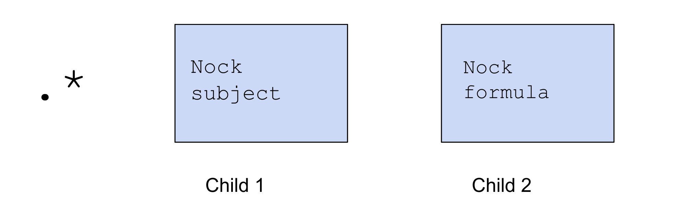
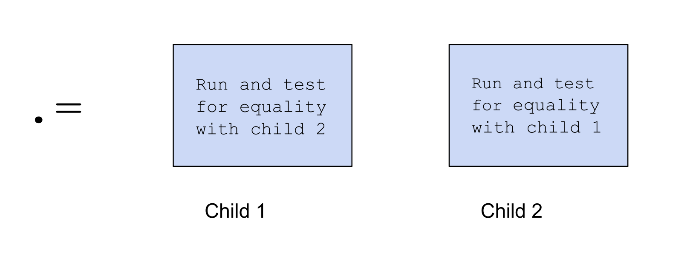

#   Subject Oriented Programming, Syntax, and Auras
##  Hoon School Lesson 2

**Homework**: https://forms.gle/R6W9tzCtXUUVQgNW9

**Video**: https://youtu.be/dH1FTd5jOgI

## Some Dojo Tips
Since we have started playing with Hoon code and using the Dojo to test things out, here are some useful tips and tricks to improve your Dojo experience.

* Pressing **up arrow** scrolls up through the history of things you've entered.
* Pressing **down arrow** scrolls down through them. Keep pressing down arrow and you'll clear the line.
* An inwards facing bracket `dojo<` means you have entered an incomplete Hoon expression. What you type next will be attached to the previous expression, unless you type **backspace/delete** to clear the incomplete line.
* **Ctrl+a** to navigate to the beginning of the text line.
* **Ctrl+e** to navigate to the beginning of the text line.
* Completions: typing something incomplete and then pressing **tab** shows you the valid commands you can input to finish the line.


## Nock Rehash

Recall that a Nock formula has two parts, the subject (which corresponds to the data input), and the formula, which corresponds to the computation we do on the input.

As a rehash of last lecture, here is an example of a computation we are doing using the rule Nock 5. Our subject is the tree `[50 [8 9]]`. Nock 5 says to evaluate both of the following formulas on the subject, and return 0 if they're equal and 1 if they're not. Both of the following formulas are Nock 0s, which grab the data at the address of the number following the 0, from the subject. We grab addresses `2` and `6`, which gives us `50` and `8`, which are not equal, so we return `1`.


If  you ever want to test run some Nock code in the dojo, there is a rune to do it:



For example, we can run the above Nock code:

```
> .*  [50 [8 9]]  [5 [0 2] [0 6]]
1
```

## More Nocking in Hoon

Let's learn some more runes that make Hoon's correspondence with Nock even clearer. Check out the following code, which looks suspiciously like our Nock above.

```
> =>  [50 [8 9]]  .=  +2  +6
%.n
```

What's going on here? To parse it, let's start from the left. The rune `=>` (tisgar) takes two children, the first of which is the subject, and the second of which is some to evaluate against the subject. This is basically the Hoon version of `[subject formula]` in Nock


A few more examples of using `=>`

```
> =>  [a=1 b=2 c=3]  b
2
```

Here, the dot means just to return the entire subject, so that's why it returns 9.

```
> =>  9  .
9
```


`=>` also has a sibling called `=<` (tisgal), which simply does the same thing but backwards.

```
> =<  b  [a=1 b=2 c=3]
2
```

```
> =<  .  9
9
```

The next rune is `.=` (dottis). It takes two children, runs them both against the subject, and returns whether or not they are equal to each other. `.=` is basically the Hoon version of Nock 5.



The .= rune doesn't necessarily have to use addressing, or to even refence the subject. For example, we can ask whether `3 = 2 + 1`, or if `5 = 6`.

```
> .=  3  .+  2
%.y
```
```
> .=  5  6
%.n
```

We can now confirm that our expression 

```
> =>  [50 [8 9]]  .=  +2  +6
%.n
```

is exactly the Nock code we showed in the first section. And if we swap the `8` to a `50` and run it, it'll say they're equal.

```
=>  [50 [50 9]]  .=  +2  +6
%.y
```

There seems to be one more difference --  we said that the Nock code returns 0 if the two computations are equal, and 1 if they're not. Yet here we are returning these constants %.y and %.n. Remembering how we learned to cast auras in last lecture, what happens if we cast %.y and %.n back to their underlying untyped atoms? Important to note that in Urbit *0 means true and 1 means false*. 

```
> `@`%.y
0
```
```
> `@`%.n
1
```

Now we see that our Hoon code is even returning 0 and 1 just like the Nock code, just dressed up so you can clearly read the numbers as meaning "yes" or "no".


## Subject oriented programming

Why are we learning these correspondences to Nock? For example, one may learn C while not needing to learn Assembly. However, Hoon and Nock have a particularly close relationship where the structure of Hoon derives directly from the structure of Nock.

In particular, Hoon operates under a model called **Subject Oriented Programming**. This is a very unique model among programming languages. Like in the Nock code, all Hoon code is evaluated against a data context called the subject, which is a binary tree. When running in the Dojo, the context is a very large tree which contains the whole state of your ship -- some of you may have run into this on the last homework.
 
Runes are organized into families, which all begin with the same first character. Runes in a family have similar actions. The family we want to study now is the `=` "tis" family. 

In this family we have already learned the following runes:

*  `=>`  takes subject, code as children and runs code against subject
*  `=<`  just `=>` but reversed
*  `=+`  pins something to the head of the current subject.

Let's introduce two more runes that allow us to work with the subject. The "dottis" rune allows us to modify a value in the subject. Technically, it creates a new copy of the subject with everything the same except one changed value. Then it uses that subject as the context for some code evaluation


Concretely, let's see an example of this. In this code, we use `=>` to set the cell `[a=1 b=2]` as the subject, then we use `=.` to create a new modified subject where `a` as the value `100`. Finally, the syntax `.` simply means to return the whole subject.

```
> =>  [a=1 b=2]  =.  a  100  .
[100 2]
```

Here's something interesting. This code doesn't work -- throwing an error `find.add`, which means that it was unable to find something named `add` in the subject. Why is that? 

```
> =>  [a=1 b=2]  =.  a  100  %-  add  [a 1]
-find.add
```

Here when we use the `=>` rune, we set the subject to literally just the cell `[a=1 b=2]`. That means that in this expression, we don't have access to the whole subject of the Dojo, which contains your whole Urbit ships state, and definitions for gates like `add`.

Let's make this code work by simply changing one rune, from `=>` (tisgar) to `=+` (tislus). As opposed to the `=>` rune, the `=+` rune simply pins a new value `[a=1 b=1]` to the head of the current subject, so the previous whole Dojo subject is still available.

```
> =+  [a=1 b=2]  =.  a  100  %-  add  [a 1]
101
```

Let's introduce one more `=` rune: `=:` (tiscol). `=:` does just what `=.` does, except it can change multiple things at once. This is the first rune that we've seen that doesn't have a fixed number of children, but a variable number. Let's look at an example.

```
> =>  [a='apple' [b='banana' c='cherry']]  
> =:  a  'avocado'  b  'berry'  ==  .
[a='avocado' b='berry' c='cherry']
```

Here, we set the tree `[a='apple' [b='banana' c='cherry']]` as the subject, then look for `a` in the subject and change it to 'avocado', look for `b` in the subject and change it to 'berry', and then return the new modified subject.

Notice that we had to close the `=:` expression with a `==` (tistis). This rune is used to terminate runes with variable number of children. In contrast to runes with fixed number of children, the compiler won't know when to stop parsing subexpressions unless you explicitly tell it to -- you do so with a `==`.


## Some terminology
As you may know, the Urbit system has a lot of unique terminology. A **limb** is simply the term for some singular address in the subject. For example, if this is the subject, a limb could be `fod`, `bat`, `-` `+` `+<` `+>`.

```
[fod=3 bat=[baz=1 moo=2]]
```

A **wing** is a search path in the subject consisting of one or more limbs strung together. In this case, a limb would be `fod`, `bat`, `baz.bat`, `moo.bat`, `-` `+` `-.+` `+.+`.

```
> =a [fod=3 bat=[baz=1 moo=2]]
> bat.a
[baz=1 moo=2]
> moo.bat.a
2
> +>.a
a
```

To help you remember this terminology, you can imagine the skeletal structure of a wing, which consists of several joints that articulate in different directions.


## Syntax Forms

So far we have been writing runes and expressions in a certain very constrained way, with expressions that look like this.

```
%-  add  :-  1  1
2
```

```
=/  x  %-  add  :-  1  1  =/  y  %-  div  :-  10  2  %-  pow  :-  x  y
32
```

This is the most formal way of writing Hoon, with two spaces between runes and their children. At first glance, with such a long statement, it may be difficult to parse Hoon written in this way. Which parts go under which runes? Let's try to tease apart this second piece of code. 


(Don't feel compelled to think through the whole thing) The `:-  x  y` parses to a single cell, which is the second argument to `%-  pow  :-  x  y`.  Then `%- pow  :-  x  y` is the third argument to `=/  y  %-  div  :-  10  2  %- pow  :-  x  y`, and the second argument is `%-  div  :-  10  2`, which reduces to `5` -- so we are setting `y=5`. So on and so forth! 

The long story short is that we are setting `x` to `(1 + 1) = 2`, setting `y` to `10 / 2 = 5`, and calculating `2^5`.

Although we should be able to read such Hoon code, that really was quite some mental work to parse the statement. Fortunately, this is not the only way that we can write Hoon. 

The way that we have learned to write so far is called **tall form**. Although tall form is the most formal way, and all Hoon has a tall form expansion underneath, we have other, more legible options for writing.

### Wide Form
Every Hoon rune also has something called **wide form**. Let's see the wide form for runes we've learned. So the important thing to note is that in tall form, you use double spaces (gap) only, but in wide form you use single spaces (ace), and surround the arguments with parentheses.

`:-` (colhep)

```
> :-  1  2
[1 2]

> :-(1 2)
[1 2]
```

`.+` (dotlus)

```
> .+  1
2

> .+(1)
2
```

`=>` (tisgar)

```
>  =>  [a=1 b=2]  a
1

>  =>([a=1 b=2] a)
1
```

`=+` (tislus)

```
> =+  100  -
100

> =+(100 -)
100
```

`%-` (cenhep)

```
>  %-  add  :-(1 2)
3

> %-(add :-(1 2))
3
```

`=.` (tisdot)

```
> =>  [a=1 b=2]  =.  a  100  .  
[a=100 b=2]

> =>  [a=1 b=2]  =.(a 100 .)
100
```

`=:` (tiscol) -- note how this one needs commas to separate the variable pairs of arguments

```
> =>  [a='apple' [b='banana' c='cherry']]  
> =:  a  'avocado'  b  'berry'  ==  .
[a='avocado' b='berry' c='cherry']

> =>  [a='apple' [b='banana' c='cherry']]  
> =:(a 'avocado', b 'berry' .)
[a='avocado' b='berry' c='cherry']
```

`=/` (tisfas)

```
> =/  x  2  %-  div  [20 x]
10

> =/(x 2 %-(div [20 x]))
10
```

At this point, you probably get the gist of how wide form is formatted. We surround the children of the rune with parentheses to clearly delineate where they are, and use single spaces in between.

Important note: **You can use wide form as a subexpression in tall form, but you can't use tall form as a subexpression in wide form.** 

For example, consider this expression. We are trying to use a wide form for `=/` (tisfas) outside and a tall form for `%-` (cenhep) and `:-` (colhep) inside. If you try to type this in the Dojo, it won't let you enter.

```
=/(x 2 %-  div  :-  20  x)
```
However, if we swap things and  use a wide form for `%-` and `:-` INSIDE of the tall form for  `=/`, such syntax is totally fine and encouraged.

```
=/  x  2  %-(div :-(20 x))
```

So always remember, wide inside tall, not tall inside wide. In fact, it's generally encouraged for readability to write Hoon code with tall form for outer expressions and wide form for inner ones.

### Sugar Syntax

Some Hoon runes have an even more readable version called  **sugar syntax**. Not every rune has sugar syntax, but the most commonly used ones tend to have them. Actually, we have already used a few forms of sugar syntax.

For example, the syntax `[1 2]` is actually sugar for the rune `:-  1  2`! There is also another sugar for :- we haven't yet seen:
```
> 1^2
[1 2]
```


To aid our understanding, let's first introduce a few more runes in the `:` (col) family for making cells. Recall that a triple is made in a nested fashion:

```
> :-  1  :-  2  3
[1 2 3]

> [1 [2 3]]
[1 2 3]
```

The rune `:+` (collus) can make it directly:
```
> :+  1  2  3
[1 2 3]

> :+(1 2 3)
[1 2 3]
```

It also has a sugar syntax, which is simply the triple,
```
> [1 2 3]
[1 2 3]
```

Similarly, we can construct a quadruple directly with the `:^` (colket) rune. This is all pretty similar to the last one, with a similar sugar syntax:

```
> :^  1  2  3  4
[1 2 3 4]

> :^(1 2 3 4)
[1 2 3 4]

> [1 2 3 4]
[1 2 3 4]
```

Finally, for tuples of size larger than 4, there is a one size fits all rune `:*` (coltar), which works like this:
```
> :*  1  2  3  4  5  6  7  8  ==
[1 2 3 4 5 6 7 8]

> :*(1 2 3 4 5 6 7 8)
[1 2 3 4 5 6 7 8]

> [1 2 3 4 5 6 7 8]
[1 2 3 4 5 6 7 8]
```

Note that we have to close the tall form with a `==` (tistis) rune since we have a variable number of arguments.

The important thing to note here is that all of these tuples are sugar syntax that correspond to different runes underneath. 

```
[1 2]
[1 2 3]
[1 2 3 4]
[1 2 3 4 5]
```

To help us learn more sugar syntax, let's consider runes for calling gates, in the `%` (cen) family.

The rune we learned already is `%-` (cenhep). This is the most standard rune that can be used with any gate. Why? Every gate can be considered to take a single argument -- a single noun -- even if that noun is a 5-tuple or 10-tuple, for example.

`%-` has a sugar syntax:

```
> %-  sub  [4 1]
3

>(sub [4 1])
3
```

Let's introduce a few other runes for calling gates. If you know that the argument to your gate is a double, a cell of two things, you can use the rune `%+` (cenlus). It takes 3 children, the gate and the two arguments.


In particular, for all the arithmetic gates we learned, we could have been calling them as

```
> %+  sub  4  1
3

> %+(sub 4 1)
3
```

Sugar:
```
> (sub 4 1)
3
```

The sugar version is probably the easiest and most common way to invoke a 2-argument arithmetic gate, but you must remember what it desugars to.

Similarly to cells, we also have runes for more arguments. `%^` is for gates that take 3 arguments. We haven't learned such a gate yet, so I'll use an imaginary one.

```
> %^  triple-gate  a  b  c

> %^(triple-gate a b c)
```

Sugar:
```
> (triple-gate a b c)

```

Finally, for gates with 4 or more arguments there is the `%:` (cencol) rune, which has a sugar syntax that looks just like what we've seen before.


The important point is tha you may call a gate with 1 argument
```
(gate a)
```
and a gate with two arguments
```
(gate a b)
```
and a gate with three arguments
```
(gate a b c)
```
all with this similar syntax, but they desugar to different runes, so you need to understand the underlying tall form when you use the sugar.

There's one more sugar syntax for a rune we've seen, the `=<` (tisgal) rune.


If we'll recall, this rune means to evaluate the first expression with the second expression as the subject. So in the dojo:
```
> =<  bat  [fod=3 bat=[baz=1 moo=2]]
[baz=1 moo=2]

> bat:[fod=3 bat=[baz=1 moo=2]]
[baz=1 moo=2]

> moo.bat:[fod=3 bat=[baz=1 moo=2]]
2
```

Similarly to wide form, sugar syntax is ok under tall form, but you can't use tall form within sugar syntax (it's ok to mix sugar and wide). For example this piece of code tries to use tall form for `%-` and `:-` within a sugar syntax for `%+`. The Dojo won't let you enter it:

```
(mul 2 %-  add  :-  1  2)
```

However, syntax like this is totally correct and encouraged
```
> %+  mul  (add 1 2)  (add 2 3)
15
```

It's good to use sugar syntax and wide form to make your code shorter and more readable, but a good Hoon developer will remember that there is a tall form expansion behind the code and be able to convert back and forth between them.


## More Auras

Last lesson, we began our study of auras. If you'll recall, every singular value in Hoon is a positive integer underneath, which can get interpreted as different auras.

For example, we can pass the atom 0 to a @p and get ~zod

```
`@p`0
~zod
```

Or pass it to a text cord @t and get the empty text

```
`@t`0
''
```

Let's introduce a new family of runes for working with types, the `^` (ket) family
```
^-
^+
^*
^=
```
###  Kethep  ^-

The kethep rune casts the Hoon expression in the second child as the type of the first child. If the result of the second child doesn't nest under the specification in the first child, it crashes. `^-` is used all throughout Urbit's code for making sure that the results returned by various operations are correctly typed.

For example

```
>  ^-  @ud  (add 1 2)
3
```

And here's an example of a failure:
```
> ^-  @p  'hello'
mint-nice
-need.@p
-have.@t
nest-fail
```

What does it mean for an aura to nest under another? Hoon has a very interesting system here, which involves trees.


Basically, if an aura `@xy` nests characterwise in another aura `@xyz`, then that means any data of type `@xyz` will not crash being when being as an aura `@xy`. Also, the empty aura `@` can be parsed to any other aura as well.

For example, `@u` nests within `@ux` characterwise. So I can cast a hexadecimal as a `@u` with `^-`.

```
> ^-  @u  0xabc
2.748
```

The empty aura `@` fits within every aura. So any data will pass `^-  @` (but lose its type information):

```
> ^-  @  'hello'
478.560.413.032

> ^-  @  123
123

> ^-  @  ~sampel-palnet
1.624.961.343

> ^-  @  .3.1415
1.078.529.622
```

However, because `@t` does not nest characterwise inside `@ux`, this throws a `nest-fail` error:

```
> ^-  @ux  'hello'
mint-nice
-need.@ux
-have.@t
nest-fail
```

But if you'll recall from last lesson, we can actually interpret the `@t` text 'hello' as a `@ux` with this syntax that we learned before:
```
> `@ux`'hello'
0x6f.6c6c.6568
```

So what's going on here? It turns out that this tick notation we used before is actually sugar syntax for a *double application* of kethep. It expands like this:

```
`@ux`'hello'
^-  @ux  ^-  @  'hello'
```

The tick notation means, first let me take your data and cast it as an atom -- this is possible with every kind of data. Then it says, let me take that atom and cast it to the particular type you specified.


###  Ketlus  ^+

`^+` (ketlus) is very similar to `^-` (kethep), but instead of casting to an explicitly specified type, it infers the type of the first child and uses that to cast the second.


```
> ^+  ~zod  ~sampel-palnet
~sampel-palnet
```

```
> ^+  ~zod  `@`47.580.416
~tamlut-modnys
```

```
> ^+  'hello'  ^-  @  28.562.436.146.556.775
'goodbye'
```


###  Kettar ^*

Another rune, `^*` (kettar) takes one child, which is a type specification, and gets the default value of it. Every type has a default value, and this rune is used throughout the system for purposes such as populating data structures with default information, for example.

```
> ^*  @ud
0

> ^*  @p
~zod
```

This rune also has a sugar syntax:
```
> *@ud
0

> *@p
~zod
```

###  Kettis  ^=

If you'll recall we have previously created structures with faces attached to various elements such as
```
[a=1 b=2]
```

It turns out this is actually sugar for another ^ rune `^=`. The ^= rune takes two children: a face (or possibly some faces in a structure) and a Hoon expression, and returns that Hoon expression with faces attached.

```
> ^=  a  1
a=1
```

```
> :-  ^=  a  'foo'  ^=  b  'bar'
[a='foo' b='bar']
```

Interestingly, it also works on cells by pattern matching, like this:

```
> ^=  [a b]  [1 2]
[a=1 b=2]
```

Sugar:

```
> [a b]=[1 2]
[a=1 b=2]
```

```
> ^=  [a [b c]]  [1 [2 [3 4]]]
[a=1 b=2 c=[3 4]]
```

Sugar:

```
> [a [b c]]=[1 [2 [3 4]]]
[a=1 b=2 c=[3 4]]
```

```
> ^=  [a [b c=[x y]]]  [1 [2 [3 4]]]
[a=1 b=2 c=[x=3 y=4]]
```

Sugar:

```
> [a b c=[x y]]=[1 2 [3 4]]
[a=1 b=2 c=[x=3 y=4]]
```

And an example of using the faces we attached:
```
=>  ^=  [a [b c=[x y]]]  [1 [2 [3 4]]]  x.c
```

```
=>  [a [b c=[x y]]]=[1 [2 [3 4]]]  x.c
```


### Terms (@tas)

There is one more interesting feature of the aura system. Hoon has a distinguished type called **term**, which has an aura `@tas`. Based on what we just learned about aura nesting, just knowing the name of the aura tells us something -- it must nest into the auras `@t` and `@ta`.

Indeed this is true, while a @t, otherwise called a **cord** can be any UTF-8 unicode text, a @tas can only be the lowercase alphabetical characters, a hep `-` (a dash) and the numbers 0-9 (and the first character must be alphabetical).

```
> ^-  @tas  %abc
%abc

> ^-  @tas  %dog1
%dog1

> ^-  @tas  %t-e-r-m
%t-e-r-m
```

**The special thing about terms is that Hoon treats each one as a type in and of itself.**

For example, this passes.

```
> ^-  %abc  %abc
%abc
```

but this fails with a type mismatch error.

```
> ^-  %ab  %abc
mint-nice
-need.%ab
-have.%abc
nest-fail
```

Terms are used as tags very often throughout Urbit's core system and apps. We will soon get used to working more with them.

### Zapgar !>

Finally, I will show you a useful tool to use if you're ever unsure about the type of something in Hoon. 

`!>` (zapgar) takes one child, a Hoon expression that reduces to a noun, and returns a cell of `[type-of-noun noun]`. So if you apply `!>` to something and read the first entry, it will tell you what type it is. 

```
> !>  0b1010
[#t/@ub q=10]

> !>  'hello'
[#t/@t q=478.560.413.032]
```

Particularly, it will show us that a type of term is itself.
```
> !>  %some-term
[#t/%some-term q=2.018.938.226.465.636.708.211]
```