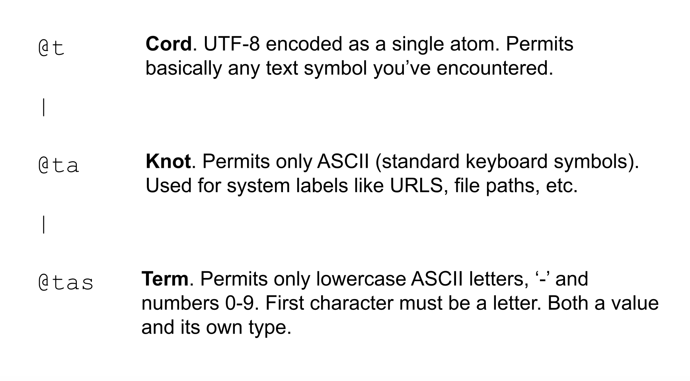

#   Working with Lists and Text
##  Hoon School Lesson 4


**Homework**: https://forms.gle/nESWxbDbjN5QAEWL8

**Video**: https://youtu.be/fLmywRkMsRk


Let's begin the lesson by wrapping up a few things from previous classes.

##  Short Discussion on Style

### Usage of Different Syntaxes

 So far, we have been doing a lot of work on converting between sugar, wide, and tall forms. Why do we learn all these? Production Hoon code will generally use all of tall, wide and sugar forms. For example, if I'm making a cell of two values, it's usually easy to just use cell notation instead of the `:-` rune.
```
[1 2]
[(add 2 3) (add 3 5)]
```

But what if I wanted to make a cell with a complex expression as one of its elements? Recall from last lesson that we made a `reptile` type union and used it in a switch statement like this. Here we declare the type union `reptile` and an instance of it `r`, with the value `%snake`. Then we pass `r` to the `?-` (wuthep) switch statement.

```
> =/  reptile  $?  %snake  %lizard  %crocodile  ==
  =/  r  ^-  reptile  %snake
  ?-  r
    %snake  'im a snake'
    %lizard  'im a lizard'
    %crocodile  'im a crocodile'
  ==

'im a snake'
```

What if we wanted to return a cell of `r` and the result of passing `r` to the switch statement, like `[%snake 'im a snake']`? . In this case since the `?-` switch statement is tall form, it won't fit inside the cell notation (recall that tall cannot go into wide or sugar). So to get the output we want, we should write it in the following way. Notice that the only change in the code is the `:-  r` on the third line.

```
> =/  reptile  $?  %snake  %lizard  %crocodile  ==
  =/  r  ^-  reptile  %snake
  :-  r
  ?-  r
    %snake  'im a snake'
    %lizard  'im a lizard'
    %crocodile  'im a crocodile'
  ==

[%snake 'im a snake'] 
```


This is an example where it's necessary to use the tall form for `:-`.

In one of your homework problems from last lesson, I had you desugar the following Hoon code to use entirely tall form.

```
^-  [num=@ud text=@t]  [n=1 t='hello']
```
In real code, you would almost always use the sugar syntax here. However, learning the sugar without understanding the underlying runes will lead to confusion. Taking the time to practice desugaring will make you a more effective Hoon programmer and help you avoid bugs out in the wild.

### Proper form for Tall Form

As you may recall, Hoon differentiates between a single space (ace) and two or more space (gap). When using runes in tall form, each child is separated by a gap. So any  formatting of a tall form rune where you separate the children by two or more spaces is valid. 

However, there's generally a stylistically preferred way to write tall form runes. As we are beginning to write longer and more complex code, it's good to check the docs for a rune to see what proper style for it is.

For example, it would technically be valid to write our `reptile` switch statement all on one line as:

```
=/  reptile  $?  %snake  %lizard  %crocodile  ==
=/  r  ^-  reptile  %snake
?-  r  %snake  'im a snake'  %lizard  'im a lizard'  %crocodile  'im a crocodile'  == 
```

But that's quite hard to read. If we check the docs for `?-`, we can see that the proper form would be:
```
?-  r
  %snake  'im a snake'
  %lizard  'im a lizard'
  %crocodile  'im a crocodile'
== 
```


##  Type Instance Shorthand

Here's a useful shorthand that you will sometimes see. Suppose you have defined a mold and want to declare an instance of it. Instead of making another face for the instance, you can use this syntax:


In the 2nd line, `=reptile` means we declared an instance of type `reptile`and ALSO with the face `reptile`. In the 3rd line, `reptile` then refers to the instance we declared, which has value `%snake`, rather than the general mold.

Here we can see it more clearly. 

```
> =/  reptile  $?  %snake  %lizard  %crocodile  ==
  =/  =reptile  %snake
  reptile

%snake
```

Recall that `^reptile` skips the first match to the face `reptile` and grabs the second.
```
> =/  reptile  $?  %snake  %lizard  %crocodile  ==
  =/  =reptile  %snake
  ^reptile

...long mold definition...
```

## Floating point Library
So far we have been using standard library gates such as `add`, `sub`, `mul`, `div`, `gth`, `gte`, etc. which operate on atoms (nonnegative integers). All of these gates, and more, exist for floating point numbers, using the `rs` library. You call them like this.

```
> %+  add:rs  .-1.234  .5.678
4.444
```
```
> %+  div:rs  .5  .2
.2.5
```
```
> %+  gth:rs  .3.1415  .3.1416
%.n
```
```
> %-  sqt:rs  .100.1
.10.004998
```

## Lists

Let's get into our big topic for today.

### List representation

Recall from last lecture that the cell types we made with the `$:` (buccol) rune expect a certain, fixed number of children.

For example, if I made a structure that's a cell of two numbers, that won't fit a cell of 3 numbers.

```
> =twonums $:  @ud  @ud  ==
  ^-  twonums  [1 2 3]
mint-nice
-need.@ud
-have.[@ud @ud]
nest-fail
dojo: hoon expression failed
```

Likewise, a type that's a cell of three numbers won't fit a cell of two numbers.

```
> =threenums $:  @ud  @ud  @ud  ==
  ^-  threenums  [1 2]
mint-nice
-need.[@ud @ud]
-have.@ud
nest-fail
dojo: hoon expression failed
```

However, sometimes you need a data type that doesn't know in advance how many entries it will have. This is fulfilled by lists in Hoon. A list is a structure with the same data type in all entries and a variable length. 

Let's try a simple example of making a list of numbers

```
^-  %-  list  @ud  [1 2 3 4 5 ~]
```

What's going on here? Let's dissect it bit by bit. Starting from the rightmost expression `[1 2 3 4 5 ~]`, let's recall that everything in Urbit is a binary tree. The internal data representation of `[1 2 3 4 5 ~]` looks like this:

```
 /  \
1  /  \
  2  /  \
    3  /  \
      4  /  \
        5    ~
```
We have a rightward branching binary tree whose last element is the null character `~` (sig). This is called a **null-terminated tuple**, which is the necessary structure for something to be a list. Written as a cell of cells, it looks like this:

```
[1 [2 [3 [4 [5 ~]]]]]
```
which sugars to
```
[1 2 3 4 5 ~]
```

Whenever you have a null-terminated tuple, there is another possible sugar syntax.
```
~[1 2 3 4 5]
```

is equivalent to
```
[1 2 3 4 5 ~]
```

This is easier to read, because it makes it clear that the cell is list-shaped without having to read all the way to the end.


If I replaced the `~` at the end with another number, that structure would just be a 6-tuple and could not be a list because it's not null-terminated.

```
[1 [2 [3 [4 [5 6]]]]]
[1 2 3 4 5 6]
```

The character `~` by itself can be a list, the empty list. The following are all possible list-shaped structures.
```
~
[1 ~]
[1 1 ~]
[1 1 1 ~]
...
```

However, just because something is a list shaped structure doesn't necessarily mean it's a list. You may want to use the character `~` to signify just a null atom, rather than a list. Or you may want to have the cells
```
[~ ~]
[~ ~ ~]
```
These are all null-terminated tuples, but you wouldn't want Hoon to automatically parse them as lists. The Hoon compiler will not assume that your null-terminated tuple is a list unless you explicitly cast it to one, which is what we did in the code above.

```
^-  %-  list  @ud  [1 2 3 4 5 ~]
```


### `List` as a Mold Maker

Going back to that code,

```
^-  %-  list  @ud  [1 2 3 4 5 ~]
```

We should notice the `%-` rune being used. If you'll recall this means that we are calling a gate. In particular, the term `list` refers to a gate. `list` is what's called a **mold maker gate**. It takes as input a mold (in this case `@ud`) and returns a mold which is a list of the input mold. In production Hoon code you'll most often see this syntax in the sugared version:

```
^-  (list @ud)  [1 2 3 4 5 ~]
```

But you should always recall that this desugars to a gate call using the gate `list`. There are other mold maker gates that we will learn later, such as `set` which takes a type and creates a set of that type, and `map`, which takes two types and creates key-value pairs of those types.

We can use the mold maker `list` with any types, including our custom ones:

Using our type union `reptile`,
```
=reptile $?  %snake  %lizard  %crocodile  ==
^-  %-  list  reptile  [%crocodile  %snake  %lizard  ~]
```

Sugared:
```
^-  (list reptile)  [%crocodile  %snake  %lizard  ~]
```

Using the cell type `reptile-tracker`,
```
=reptile-tracker $:  species=reptile  meals=@ud  ==
^-  %-  list  reptile-tracker  [[%crocodile 2] [%snake 3] [%lizard 5] ~]
```

Sugared:
```
^-  (list reptile-tracker)  [[%crocodile 2] [%snake 3] [%lizard 5] ~]
```

We can even make lists of other lists. Here we have a list of lists of `@t`.

```
^-  %-  list  %-  list  @t  [['a' 'b' 'c' ~] ['d' 'e' 'f' ~] ['x' 'y' 'z' ~] ~]
```

Sugared:
```
^-  (list (list @t))  [['a' 'b' 'c' ~] ['d' 'e' 'f' ~] ['x' 'y' 'z' ~] ~]
```


### Prepending to a list

If lists are represented as this binary tree, is it faster to add something to the head of the list, or the tail of the list?

It's much faster to add something to the head rather than the tail, because the head is immediately accessible, while adding to the tail requires navigating to the end. We can add something to the head of a list in a very simple way using cell notation.

```
> =/  mylist=(list @ud)  [2 3 4 ~]
  ^-  (list @ud)  :-  1  mylist
~[1 2 3 4]
```

Or using the sugar notation for `:-`.

```
> =/  mylist=(list @ud)  [2 3 4 ~]
  ^-  (list @ud)  [1 mylist]
~[1 2 3 4]
```

Here we have created a new list which has the value `1` as the head of the list and `mylist` as the tail of the list. Visualized as a binary tree, this is what we have done:


We have to make sure to cast the output with `(list @ud)`, otherwise the Hoon compiler will parse it as a cell of the value `1` and `mylist` (which is list-shaped, but not necessarily a list)

```
> =/  mylist=(list @ud)  [2 3 4 ~]
  :-  1  mylist
[1 ~[2 3 4]]
```

### Lists and Lests
As we mentioned, an empty/null list would just be the single character `~` (sig). Hoon has a special type for lists that you know are not empty/null, called `lest`. For example I can cast both of these to a `list`:

```
> ^-  %-  list  @ud  [1 2 3 4 5 ~]
~[1 2 3 4 5]

^-  %-  list  @ud  ~
~
```

However for a `lest`, the first works and the second fails:

```
> ^-  %-  lest  @ud  [1 2 3 4 5 ~]
[i=1 t=~[2 3 4 5]]

> ^-  %-  lest  @ud  ~
mint-nice
-need.[i=@ud t=it(@ud)]
-have.%~
nest-fail
dojo: hoon expression failed
```

If you'll notice above, the output was slightly different between the two. If the compiler knows that your `list` is a `lest`, it attaches faces to the head and tail. You can grab the head of the list (the first element), with the face `i`, and the tail of the list (the rest of the list) with the face `t`
```
> =/  a   ^-  (lest @ud)  [1 2 3 4 5 ~]  
  i.a
1

> =/  a   ^-  (lest @ud)  [1 2 3 4 5 ~]  
  t.a
~[2 3 4 5]
```

If the compiler only knows it's a regular `list` as opposed to a `lest`, you can't do that, throwing a `find.fork` error.

```
> =/  a   ^-  (list @ud)  [1 2 3 4 5 ~]  
  i.a
-find.i.a
find-fork
dojo: hoon expression failed
```

You can also make the compiler know a list is non-null in the following way. Let's look at this following code and try to understand it:

```
=/  a   ^-  (list @ud)  [1 2 3 4 5 ~]
?~  a  !!
i.a
```

Recall that the `?~` (wutsig) rune says, compute the first child, if it reduces to `~`, then compute the second child, otherwise compute the third child.


The `!!` rune we haven't learned yet simply crashes the program.

```
> !!
dojo: hoon expression failed
```

Going back to our code, we can interpret the second line as saying "if `a` is null, then crash". This means that if we are in the third child of the `?~`, where we return `i.a` the Hoon compiler knows that `a` must not be null -- it knows its a `lest` rather than a `list` -- and we can grab with the faces.

```
> =/  a   ^-  (list @ud)  [1 2 3 4 5 ~]
  ?~  a  !!
  i.a
1

> =/  a   ^-  (list @ud)  [1 2 3 4 5 ~]
  ?~  a  !!
  t.a
~[2 3 4 5]
```

Taking that line out reintroduces the `find.i.a` error. 

```
> =/  a   ^-  (list @ud)  [1 2 3 4 5 ~]
  i.a
-find.i.a
find-fork
```


### List Library
The main benefit of structuring data as a list is that Hoon comes with a really broad library of gates to manipulate lists. Here is a link you can use to reference all the library gates: https://developers.urbit.org/reference/hoon/stdlib/2b

Some of these gates require that you prove that a null-terminated tuple is a list before it will accept it as input, while others will simply accept the null-terminated tuple. I don't have a great answer to why the behavior differs.

Let's go through some examples.

`flop` simply takes a list a reverses it.

```
> %-  flop  [1 2 3 4 5 ~]
~[5 4 3 2 1]
```

`gulf` takes as input two nonnegative integers and returns a list containing all the elements in that range.
```
> %+  gulf  5  20
~[5 6 7 8 9 10 11 12 13 14 15 16 17 18 19 20]
```

`lent` returns the length of a list.

```
%-  lent  [1 2 3 4 5 ~]
5
```

`limo` is an interesting one. It proves to the compiler that a null-terminated tuple is a list, basically like casting to a list with `^-`, except the advantage is `limo` doesn't need to know the inner type.

```
%-  limo  [1 2 3 4 5 ~]
[i=1 t=[i=2 t=[i=3 t=[i=4 t=[i=5 t=~]]]]]
```

`snag` gets the element at a certain index.`snag` needs to know the input is a list, so we either use `limo` or cast it.

```
> %+  snag  3  (limo ['dog' 'cat' 'mouse' 'rabbit' 'deer' ~])
'rabbit'

> %+  snag  3  `(list @t)`['dog' 'cat' 'mouse' 'rabbit' 'deer' ~]
'rabbit'
```


`snap` replaces the element at an index with another. We also need to use `limo` or a casting here.

```
%^  snap  `(list @t)`['dog' 'cat' 'mouse' 'rabbit' 'deer' ~]  3  'squirrel'
```

```
> %^  snap  (limo ['dog' 'cat' 'mouse' 'rabbit' 'deer' ~])  3  'squirrel'
[i='dog' t=<|cat mouse squirrel deer|>]

> %^  snap  `(list @t)`['dog' 'cat' 'mouse' 'rabbit' 'deer' ~]  3  'squirrel'
[i='dog' t=<|cat mouse squirrel deer|>]
```

`sort` takes as input a list and a comparison gate -- this can be any gate that takes two nouns and returns a `%.y` or `%.n`. It then uses that comparison operator to sort the list. For example, if we pass in `lth`, it sorts these atoms in ascending order.

```
%+  sort  [5 3 7 9 ~]  lth
~[3 5 7 9]
```

And if we pass in gth, it sorts them in descending order.
```
%+  sort  [5 3 7 9 ~]  gth
~[9 7 5 3]
```

`weld` concatenates two lists

```
%+  weld  [1 2 ~]  [3 4 5 ~]
~[1 2 3 4 5]
```

`roll` does something interesting. Perhaps you can infer it's behavior from these examples?

```
> %+  roll  (limo [1 1 1 1 ~])  add
4

> %+  roll  (limo [1 1 1 1 ~])  mul
1

> %+  roll  (limo [1 2 3 4 ~])  mul
24
```

It takes the input gate and applies it pairwise across the elements of the list, accumulating a result, then outputting it. (There are some more important details about how it works, but we won't get into that until we begin learning about gates). It's the equivalent of `reduce` in other languages.

`turn` is very interesting too. It takes a gate and applies it to every element of the list, returning the transformed list. It's the equivalent of `map` in other languages. 

Here, `dec` is a gate that takes a positive integer and decreases it by 1.

```
> %+  turn  [2 3 4 5 6 ~]  dec
~[1 2 3 4 5]
```

The gate you use as input to `turn` doesn't have to be predefined -- you can write one yourself (same goes for `roll`, `sort`, etc.). We will learn how to write custom gates soon -- don't worry about it yet. Here we define a custom gate called `mul5`, which takes a number and multiplies it by 5. 

```
> =/  mul5  |=(a=@ud (mul a 5))
  %+  turn  [1 2 3 4 5 ~]  mul5
~[5 10 15 20 25]
```

`turn` doesn't need to preserve types:
```
> =/  numtoship  |=(a=@ud `@p`a)
  %+  turn  [1 2 3 4 5 ~]  numtoship
~[~nec ~bud ~wes ~sev ~per]
```

`skim` takes a list and a gate that takes one argument and returns either `%.y` or `%.n`. It returns a list of only the elements that made the gate return `%.y`. It's the equivalent of `filter` in other languages.

Here in the example, we define a custom gate `isodd` which returns `%.y` if a number is even and `%.n` otherwise.

```
=/  is-even  |=(a=@ud =((mod a 2) 0))
%+  skim  `(list @ud)`[1 2 3 4 5 6 7 8 9 10 ~]  is-even
```


## Text

Let's get into our last major topic for this lesson, Hoon's text system. So far we have learned about and used the `@t` aura, which stores arbitrary text as an atom, and the `@tas` aura, which is more restricted and does double duty as type/value. The following graphic shows all the ways that you can represent text as atoms



If you'll recall nesting properties for auras, this means `@tas` nests within `@ta` which nests within `@t`.

If you want to check whether some text is valid as a certain aura, you can use the library gate `sane`. Sane is a gate that builds a gate (just like `list` was a gate that builds a mold) which takes as input an aura formatted as a `@tas` (like `%p` or `%ta` instead of `@p` or `@ta`), and returns a gate that returns `%.y` or `%.n` whether an input string is valid in that aura.

```
> =/  ta-check-gate  %-  sane  %ta
  %-  ta-check-gate  'ångström'
%.n
```

Sugared,
```
=/  ta-check-gate  (sane %ta)
(ta-check-gate 'ångström')
```

Written in the shortest way,
```
> ((sane %ta) 'ångström')
%.n
```

Suppose you'd like to send some Urbit data to a web app to display on the frontend. If you'd like to convert a atom with aura to a cord, you can use `scot`. `scot` also takes an aura formatted as a `@tas` for its first argument, and a cord for its second argument.
```
> ^-  @t  %+  scot  %p  ~sampel-palnet
'~sampel-palnet'

> `@t`(scot %p ~sampel-palnet)
'~sampel-palnet'

> `@t`(scot %ux 0x12f)
'0x12f'
```

Suppose you're parsing some user input from a web frontend to be stored in your Urbit backend. You can convert cords to atoms using `slav`. However it returns the raw atom, so you have to cast it to the aura.

```
> %+  slav  %p  '~sampel-palnet'
1.624.961.343

> ^-  @p  %+  slav  %p  '~sampel-palnet'
~sampel-palnet

> `@p`(slav %p '~sampel-palnet')
~sampel-palnet
```

Giving it an invalid input causes a failure:

```
%+  slav  %p  '~abcdef-ghijkl'
dojo: hoon expression failed
```


## Tapes
Besides `@t` `@ta` and `@tas`, which all represent text as atoms, there is one more possible representation of text in Hoon. You can represent text as a list, which is powerful because it gives you access to all the list manipulation tools we learned while working on text.

In particular a **tape** is a list `@tD`. The aura `@tD`, means it's data of type `@t`, but limited to 8 bits (which is what the ending `D` represents). So a tape is a list of `@t` data each limited to 8 bit chunks. In Hoon, the term `tape` means the exact same thing as the mold `(list @tD)` Whenever you see text with double quotes, that will be a **tape** (recall that cords (@t) use single quotes). 

```
> ^-  tape  "hello"
"hello"

> ^-  (list @tD)  "hello"
"hello"

> ^-  tape  "ångström"
"ångström"

> ^-  (list @tD) "ångström"
"ångström"

> ^-  tape  "Welcome to M@RS~"
"Welcome to M@RS~"

> ^-  (list @tD)  "Welcome to M@RS~"
"Welcome to M@RS~"
```


Any `cord` can be stored as a `tape`, and vice versa. `crip` converts a tape to cord (cord rip) and `trip` converts a cord to tape (tape rip).

```
> %-  crip  "Welcome to M@RS~"
'Welcome to M@RS~'

```

```
> %-  trip  'Welcome to M@RS~'
"Welcome to M@RS~"
```

Tapes are easier to work with than cords, but use about 6x as much storage due to being stored in a list. A common practice is to use a `cord` for data storage, convert to a `tape` for processing the text, and convert back to a `cord`.


You can convert an atom of any aura to a tape with `scow`:

```
> %+  scow  %p  ~sampel-palnet
"~sampel-palnet"

> (scow %p ~sampel-palnet)
"~sampel-palnet"

> (scow %ux 0x12f)
"0x12f"
```

### Working with Tapes

`cuss` makes a tape all uppercase:

```
> %-  cuss  "i wanna be loud"
"I WANNA BE LOUD"
```

`cass` makes a tape all lowercase:

```
> %-  cass  "I WANNA BE QUIET"
"i wanna be quiet"
```

`trim` splits a tape into a cell of two tapes:

```
> %+  trim  26  "No tree can grow to heaven unless its roots reach down to hell."
[ p="No tree can grow to heaven"
  q=" unless its roots reach down to hell."]
```

As mentioned, we can use the list library gates to do many useful things with tapes.

`find` returns the index of a matching substring within a string:
```
> %+  find  "needle"  "aaaaaaaaaaaaneedleaaaaaaaaaaaa"
[~ 12]
```

`flop` reverses a list.
```
%-  flop  "URBIT"
"TIBRU"
```

`weld` concatenates lists
```
%+  weld  "sweet"  "potato"
"sweetpotato"
```

`snap` replaces an element at an index.

```
> %^  snap  "there are bats in my house"  10  'c'
[i='t' t="here are cats in my house"]
```
To format the output nicely, we can cast back to a `tape`:
```
^-  tape  (snap "there are bats in my house" 10 'c')
"there are cats in my house"
```

Recall that a tape is a `list` of `@tD` atoms, so don't make the mistake of trying to replace a character in a tape with another tape (here the error is `"c"` instead of `'c'`):

```
> %^  snap  "there are bats in my house"  10  "c"
-need.?(%~ [i=?(%~ [i=@tD t=""]) t=it(?(%~ [i=@tD t=""]))])
- have
[ ?(i=%~ i=[i=@tD t=""])
  ?(t=%~ t=[i=@tD ?(t=%~ t=[i=@tD ?(t=%~ t=[i=@tD t=""])])])
]
nest-fail
```

Since a `tape` is a `list`, we can append things to the head of a tape easily using cell notation:

```
> ^-  tape  ['a' "bcdef"]
"abcdef"
```

You can render a Hoon expression as a tape with angle brackets around it (the Hoon expression must be wide/sugar form):

```
> <(sqt:rs .42)>
".6.4807405"
```

You can also interpolate a tape within another tape with curly brackets:
```
> =/  x  "Love"
  "{x} is the answer"
"Love is the answer"

> =/  x  "Cake"
  "{x} is the answer"
"Cake is the answer"
```

Finally, you can combine both the angle bracket and curly bracket notation:

```
=/  x  (sqt:rs .42)
"The square root of 42 is {<x>}"
```

## Anonymous feedback:
https://forms.gle/Ufih5kmbigT6bcrZ8