#   Cores and Doors
##  Hoon School Lesson 5

**Homework**: https://forms.gle/X6qbu65E6h8SfnFMA
**Video**:  https://youtu.be/PdsQfplKmZw

We now begin learning about the very important pattern called **cores**. Cores are the last remaining major concept in learning Hoon. Once you understand them, you are over the hump and on your way to having a good understanding of the whole language. Basically every working piece of Hoon code you will encounter, from big to small, is a core, so understanding their fundamentals is important.

## Core Basics

What are cores? They are simply a pattern for **storing code as data**. What does that mean? If you'll recall from the earlier lectures, Hoon compiles to Nock, and everything in Nock is a binary tree of non-negative whole numbers. 

If you'll recall, every piece of Nock code is a pair of `[subject formula]`, with the subject being the data input for a computation, and the formula being the computation. Both of them are binary trees.

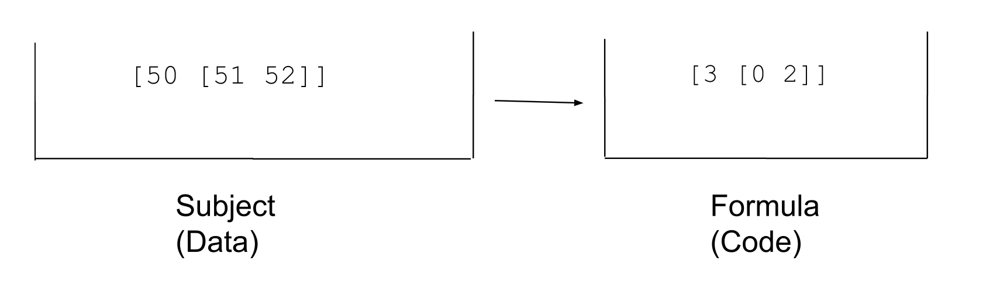

We should recall that the formula encodes deterministic rules to transform the input data and get an output. For example, in the above code, we would first pull the `3` out of the formula, which says "compute the result and return `0` if it's a cell, and `1` if it's an atom". Then `[0 2]` means pull the data at the `+2` address in the subject. We pull the value `50` and return `1` because it's an atom.

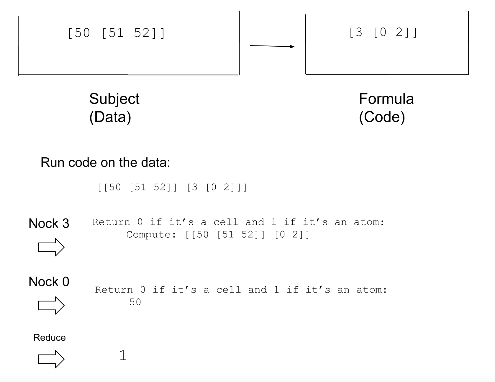


Since in Nock (which underlies Hoon), both code and data are binary trees of numbers, it would be nice to store a binary tree at some location and say, this is code that you can pull out and run later whenever you wish. This is precisely what cores allow you to do.

A core is simply a pattern for storing both code as data, and data as data in a binary tree. It's as simple as can be. The code as data goes on the left side, and the data as data goes on the right.

```
[code-as-data data-as-data]
          core
    /              \
code-as-data    data-as-data
```

In Urbit terminology, the left side of the core, containing the code-as-data, is called the **battery**. The right side of the core, containing the data-as-data, is called the **payload**

```
[battery payload]
         core
    /            \
battery         payload
```

A core stores code in named addresses called **arms**, which go in the left side of the binary tree (the battery). Then it stores the subject that you built the core in, containing all the environment data, in the right side of the binary tree (payload).

To make this more concrete, let's look at an example. Consider the following code which makes a core:

```
|%
++  increment-100  .+  100
--
```

Let's look at a breakdown of this code here:


We are introducing a new rune called `|%` (barcen). `|%` is the general rune to declare a core. Since a core can have indefinitely many arms, it takes indefinitely many pairs of children and is closed with a `--` (hephep).


What happens if we run our above code? 

```
> |%
  ++  increment-100  .+  100
  --

< 1.oks
  [ [our=@p now=@da eny=@uvJ]
    < 17.ayh
      34.ygp
      14.usy
      54.fbg
      77.kga
      232.mmf
      51.qbt
      123.ppa
      46.hgz
      1.pnw
      %140
    >
  ]
>
```

It returns cell, the head of which is summarized as `1.oks`, indicating that there is one arm in the core -- the `increment-100` arm. The tail of it is the entire Dojo subject, containing a bunch of other cores with 17, 34, 14, 54, etc. arms.


If you have a lot of history in your Dojo subject and you enter the above code, it may take a long time to print everything out. If you run `:dojo|wipe` to clear the history and thenn run it, it will run quickly and return a fairly short output like above.

## Modifying the Payload
If we pin something to the head of the Dojo subject, and then build our core, then we can see that it shows up in the core's payload (the data branch). Recall that the `=+` (tislus) rune pins something to the head of the subject and then computes the rest of the Hoon expression using that subject.


Below, right after the `1.oks`, see that `num1=@ud` has appeared in the payload.

```
> =+  num1=1
  |%
  ++  increment-100  .+  100
  --

< 1.oks
  [ num1=@ud
    [our=@p now=@da eny=@uvJ]
    < 17.ayh
      34.ygp
      14.usy
      54.fbg
      77.kga
      232.mmf
      51.qbt
      123.ppa
      46.hgz
      1.pnw
      %140
    >
  ]
>
```

We can also do this with the `=/` (tisfas) rune which does the same thing as `=+`, just separates out the face as a separate argument.

Below see that `num2=@ud` appears right after `1.oks`
```
> =/  num2  2
  |%
  ++  increment-100  .+  100
  --

< 1.oks
  [ num2=@ud
    [our=@p now=@da eny=@uvJ]
    < 17.ayh
      34.ygp
      14.usy
      54.fbg
      77.kga
      232.mmf
      51.qbt
      123.ppa
      46.hgz
      1.pnw
      %140
    >
  ]
>
```


Finally we can do the same thing by using the Dojo specific syntax to pin something to the head of the Dojo subject. Note that in this case `num3=3` persists in the subject for future expressions as opposed to the previous examples.


```
> =num3 3
> |%
  ++  increment-100  .+  100
  --
```

In all cases we see the newly pinned element show up at the head of the core's payload.

Let's recall the `=>` (tisgar) rune which takes two children and sets the first child as the subject to compute the second child. We will be making use of this rune quite a lot on this lesson. 


Let's also recall the `=<` (tisgal) rune which does the same thing but with arguments reversed.

Consider the following code. It's saying to build a core against a subject which is null `~`.

```
> =>  ~
  |%
  ++  increment-100  .+  100
  --

<1.oks %~>
```

The output tells us it's a core with 1 arm and an empty payload.


## Code Stored as Data

Arms in a core are stored as uncomputed Nock. They're not evaluated yet. Let's prove this by pulling out the raw data in an arm.

If we recall our tree addressing, if the whole core is at the +1 address, then if the arm is stored in the left subtree, it should be at the +2 address, and the subject the core was built against should be at the +3 address.


The following code means, build the core and set it as the subject, and grab the +2 address of it. So, we should get what's in the arm of the core.

```
> => 
  |%
  ++  increment-100  .+  100
  --
  +2

[4 1 100]
```

Notice that what comes out isn't the computed result of `100+1`, `101`, but the raw uncomputed Nock formula.

```
[4 1 100]
```

Let's confirm that this Nock formula corresponds to the code in our `increment-100` arm. When an arm is run, it's run against its parent core as the subject.

To reduce, Nock 4 says to increment the result of the remaining computation. Nock 1, which we hadn't learned before, says simply to throw away the subject and return what comes after the 1. So the [1 100] evaluates to 100, and then we increment 100 to get 101.


We can also check by running the Nock code with the `.*` (dottar) rune. The first argument to `.*` is the subject and the second is the formula, since the subject doesn't matter we just give it a null input.

```
> .*  ~  [4 1 100]
101
```

However, let's compare that to a different method of storing `100+1`. Recall that the =/ rune pins something to the head of the subject (which should be the `+2` address of the subject).  Let's use it to store `increment-100` in the subject and grab the stored data.

```
> =/  increment-100  .+  100
  +2
increment-100=101
```

In this case we get the already computed result, `increment-100=101`. 

There's an important difference here: **arms in a core are stored uncomputed, and are computed when you call them**, while pinning with `=/` or `=+` computes the result and then stores it.

## Running Arms

Grabbing and running an arm in a core is pretty simple. If the (unnamed) core is in the subject, you can just call the arm by name.

```
=>
|%
++  increment-100  .+  100
--
increment-100
```

If the core is in the subject under a name, you have to use addressing to grab the arm. For example, this fails:

```
> =/  mycore
  |%
  ++  increment-100  .+  100
  --
  increment-100

-find.increment-100
```

While this succeeds:

```
> =/  mycore
  |%
  ++  increment-100  .+  100
  --
  increment-100.mycore

101
```

Arms in cores can have reference to faces and values in the payload. Consider the following code, which is represented in the following graphics.

```
=>
=+  n=5
|%
++  increment-n  .+  n
--
increment-n
```

Bolded parts show correspondences:

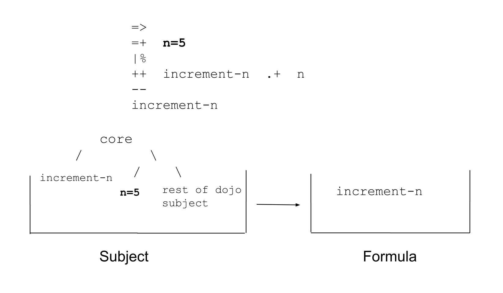
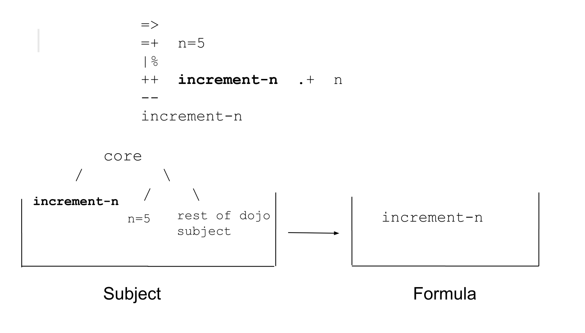
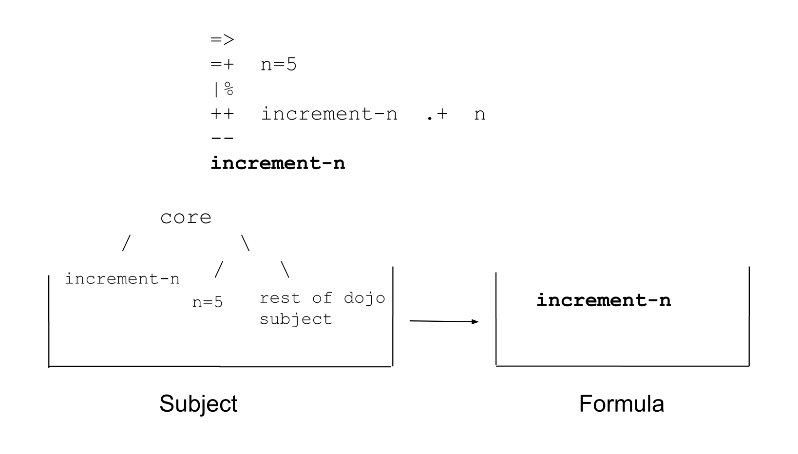

Running it computes `5+1 = 6`

```
> =>
  =+  n=5
  |%
  ++  increment-n  .+  n
  --
  increment-n

6
```

Of course, a different value for `n`, gives us different results from calling `increment-n`.

```
> =>
  =+  n=7
  |%
  ++  increment-n  .+  n
  --
  increment-n

8
```

As we mentioned before, the left branch of a core, with arms containing code, is called the **battery**. The right branch containing data is called the **payload**.

```
[battery payload]
         core
    /            \
battery         payload
```

It's a really common pattern to pin something to the head of the subject before creating a core. This makes the pinned noun show up in the head of the payload. When this happens, we say the payload is a cell with the **sample** as the head and the **context** (data context) as the tail.

```
[battery [sample context]]
         core
    /            \
battery       /      \
           sample   context
```

We can map these terms back to our `increment-n` example.

```
=>
=+  n=5
|%
++  increment-n  .+  n
--
increment-n
```


We've been looking at cores with a single arm for simplicity, but that doesn't need to be the case.

```
> =>
  |%
  ++  one  1
  ++  two  2
  ++  three  3
  ++  four  4
  --
 four

4
```

Arms in cores can also refer to each other.

```
> =>
  |%
  ++  one  1
  ++  two  .+  one
  ++  three  .+  two
  ++  four  .+  three
  --
  four

4
```

## Some Shape Rotation

Let's take a moment to make sure we understand what's going on. Whenever we use the `|%` (barcen) rune, we are storing a copy of the subject at the time the code was executed. We put that in the left branch, and we put some arms (code) in the right branch. We can think of a core as "wrapped around" the subject it was built against.

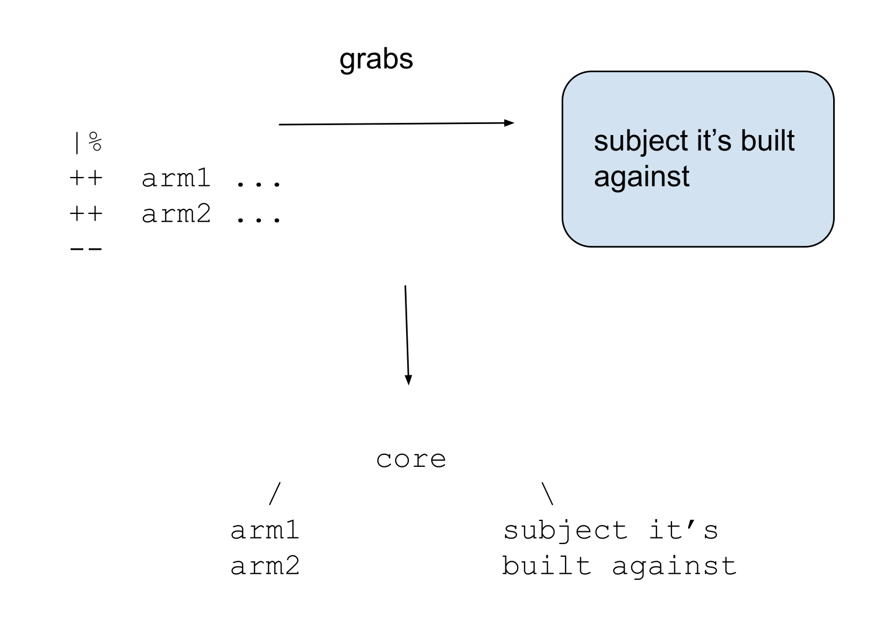

So if we then set the core as the subject to run some code, then there is a subject in the subject, as seen in the graphic.

```
=>
|%
++  arm1  ...
++  arm2  ...
--
some-code
```


If I use `=/` to make a core, name it, and pin it to the head of a subject, something different happens.

```
=/  mycore
|%
++  arm1  ...
++  arm2  ...
--
some-code
```

In particular, the new subject for the evaluation of `some-code` now has two copies of the old subject in it, one stored in the core that's pinned to the head of the new subject, and one in the tail of the new subject.


Fortunately, memory management in Hoon and Nocks' implementation level (Arvo) prevents this from actually creating a physical duplicate and using twice the memory.


## Core Composition
We can compose cores by putting one core in the payload (the data branch) of another.
Let's break down and understand this code here.

```
> =>
  |%
  ++  inner-core-arm  "this arm is in a core in the payload of another core"
  --
  =>
  |%
  ++  outer-core-arm  "this arm is in the outer core"
  --
  inner-core-arm

"this arm is in a core in the payload of another core"
```

To help us parse the Hoon, the syntax tree of this expression looks like this. The first `=>` has two children, a core with arm `inner-core-arm` and the rest of the expression. The second `=>` has two children, a core with arm `outer-core-arm` and the code `inner-core-arm`


The data structure produced by the code looks like this:

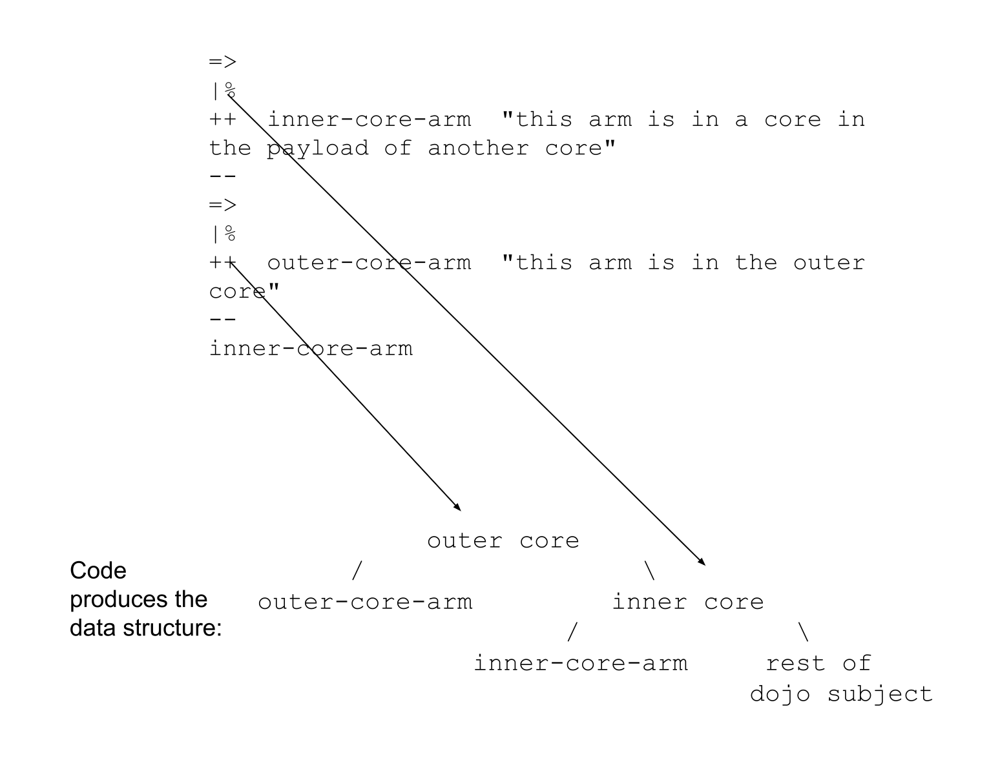

## Scoping

This code shows you that when arms are pulled and run, they are run against their parent core as the subject. Note that it returns `2` rather than `1`.


```
> =>
  |%
  ++  inner-core-arm  n
  ++  n  2
  --
  =>
  |%
  ++  outer-core-arm  n
  ++  n  1
  --
  inner-core-arm

2
```

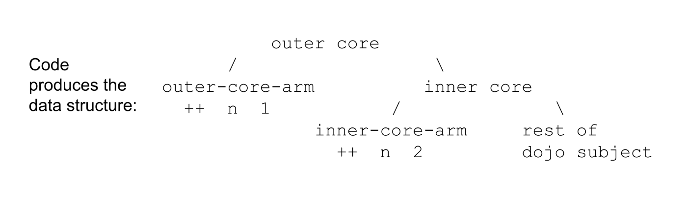

The same thing happens even if we pin a new value for `n` before pulling the arm. Even though visually, it looks like we pin `n=10` right before calling something that invokes `n`, the n=10 is not in scope for `inner-core-arm`.


```
> =>
  |%
  ++  inner-core-arm  n
  ++  n  2
  --
  =>
  |%
  ++  outer-core-arm  n
  ++  n  1
  --
  =/  n  10
  inner-core-arm

2
```

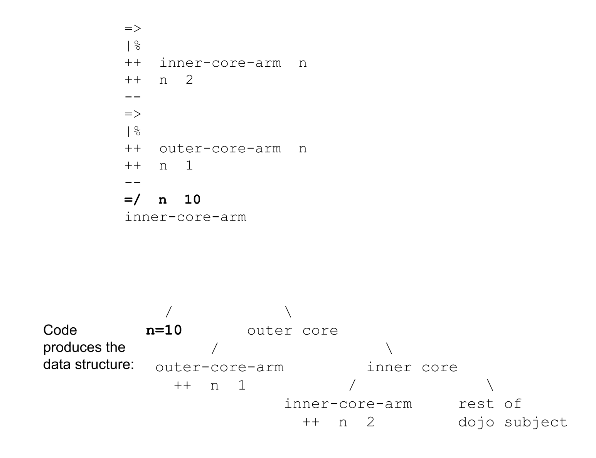

If we pin `n=10` before defining the inner core, it ends up in the payload of the inner core, but `inner-core-arm` still finds the arm `n` first.

```
> =>
  =/  n  10
  |%
  ++  inner-core-arm  n
  ++  n  2
  --
  =>
  |%
  ++  outer-core-arm  n
  ++  n  1
  --
  inner-core-arm

2
```

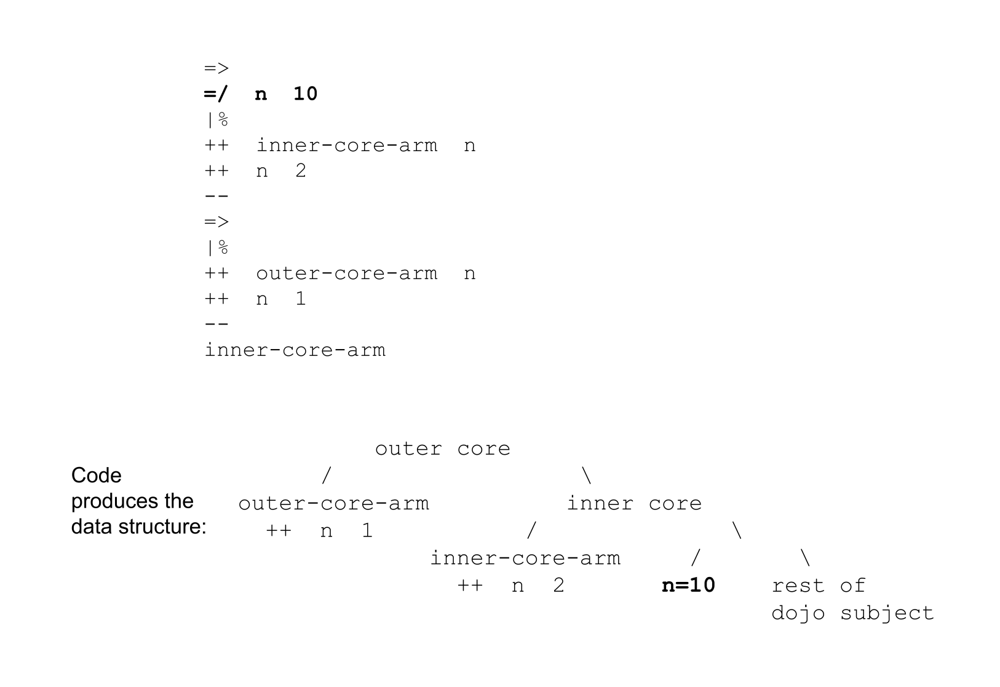


If we delete the arm `n` from within the inner core, then we return the pinned value in the payload, `n=10`.

```
> =>
  =/  n  10
  |%
  ++  inner-core-arm  n
  --
  =>
  |%
  ++  outer-core-arm  n
  ++  n  1
  --
  inner-core-arm

10
```


If we move pinning `n=10` back to the outermost level,  `inner-core-arm` fails because it can't find `n` in its local scope. 


```
> =>
  |%
  ++  inner-core-arm  n
  --
  =>
  |%
  ++  outer-core-arm  n
  ++  n  1
  --
  =/  n  10
  inner-core-arm

-find.n
```


We can nest cores as deep as we want using composition. Consider this code. Usually when a core only has one arm, it's given a default face of `$` (buc). `$` is just a face and has no special properties besides that. 

If we then return the arm `$`, it searches for the closest match in the tree, which is in the outermost core and has the value 1.

```
=>
|%
++  $  3
--
=>
|%
++  $  2
--
=>
|%
++  $  1
--
$
```


Recall that when Hoon searches for a name in a binary tree, it does a depth-first search. Because of the way these nested cores are laid out, this means that it searches all the arms of the cores before searching the rest of the subject. 

Recall that `^` (ket) before a face skips the first match to that face and returns the next one. We can use `^$` to grab `$` from the inner core, and `^^$` to grab it from the inner-est core.

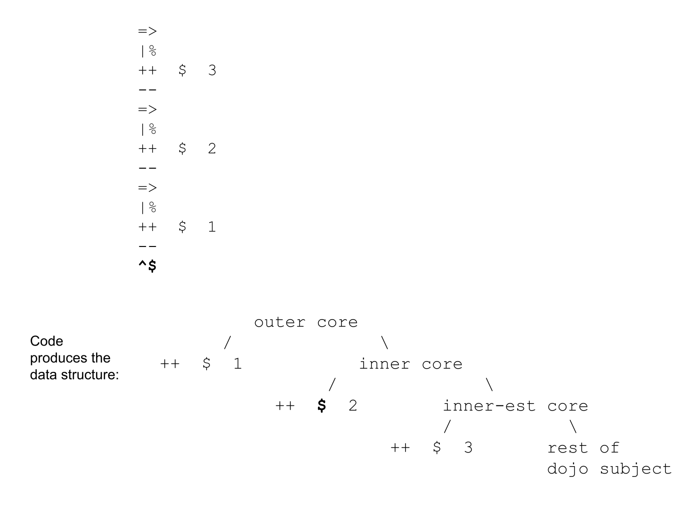
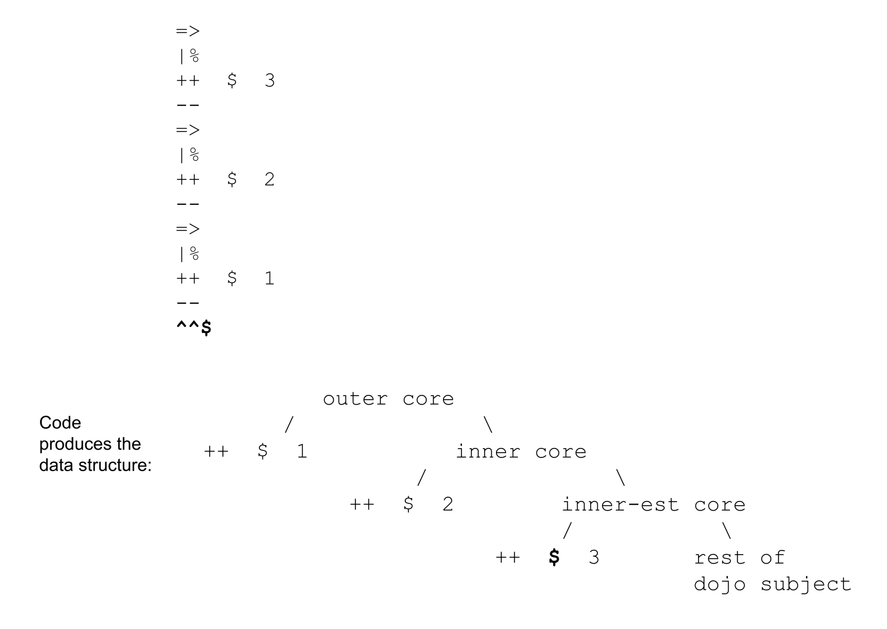


## Cores in Arms
There's another way to nest cores inside each other. You can put cores in the arms of other cores.

In this case, if we directly call inner-arm, it will fail. Why is that? Recall from our previous discussion that arms of cores are stored as uncomputed Nock code. That means that `core-in-arm` isn't built yet, and inner arm doesn't exist, until we call it and build it.

```
> =>
  |%
  ++  core-in-arm
    |%
    ++  inner-arm  "I'm inside an unbuilt core"
    --
  --
  inner-arm

-find.inner-arm
```

This code corresponds to the following subject-formula pair.


However, if we compute `core-in-arm` and pull it into the subject, then `inner-arm` is available. Here we show 3 equivalent syntaxes for doing so. The third is sugar syntax for the second.


Everything substantial in Hoon is a core. If you can understand cores nested within cores, you can understand the structure of any Hoon program.


##  Modifying Parts of Cores

Consider the following core. It has the value `n=5` pinned to the head of its subject, and has a single arm `$` which computes if `n` is greater than 10. 


Composing it with a call to the `$` arm returns `%.n` since `5` is not greater than `10`.

```
> =>
  =/  n  5
  |%
  ++  $  (gth n 10)
  --
  $

%.n
```

We can pin this core to head of the subject with the `=/` rune and call it `gth-10`, and return the whole core by calling `gth-10`, 

```
> =/  n  5
  =/  gth-10
  |%
  ++  $  (gth n 10)
  --
  gth-10

< 1.qet
  [ n=@ud
    [our=@p now=@da eny=@uvJ]
    < 17.ayh
      34.ygp
      14.usy
      54.fbg
      77.kga
      232.mmf
      51.qbt
      123.ppa
      46.hgz
      1.pnw
      %140
    >
  ]
>
```

Or we can run it by calling the `$.gth10` arm. Recall that when a named core is pinned in the subject, you have to use `arm.core` to grab an arm, just `arm` will fail.

```
> =/  n  5
  =/  gth-10
  |%
  ++  $  (gth n 10)
  --
  $.gth-10

%.n
```

It doesn't matter if `=/  n  5` is inside or outside the `=/  gth-10`. These two codes produce the same data structure.

```
=/  n  5
=/  gth-10
|%
++  $  (gth n 10)
--
```

```
=/  gth-10
=/  n  5
|%
++  $  (gth n 10)
--
```

What if we wanted to change the value of `n` before invoking the `gth-10` arm? To do that, we'll learn a new rune. 

The `%=` (centis) rune first takes a wing of the subject (any address, but in this case our core `gth-10`). Then it takes an indefinite number of pairs. The first element of the pair is a subwing of the first argument, and the second is a new value for it. We close the rune with `--` because it has an indefinite number of children.

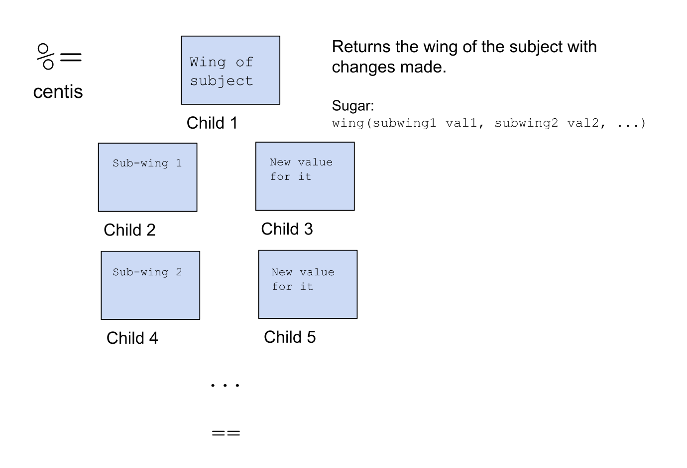

Let's use it to create a new copy of our `gth-10` core, but with the value of `n` changed to `11`.

In tall form:
```
=/  gth-10
=/  n  5
|%
++  $  (gth n 10)
--
%=  gth-10
n  11
==
```

Sugar syntax:
```
=/  gth-10
=/  n  5
|%
++  $  (gth n 10)
--
gth-10(n 11)
```

However, if we run this code, it returns the whole core and just shows `n=@ud`, so we can't actually see the change.

To see the change, we can set the new core as the subject with `=>` and call its `$` arm.

```
> =/  gth-10
  =/  n  5
  |%
  ++  $  (gth n 10)
  --
  =>
  %=  gth-10
  n  11
  ==
  $

%.y
```

Sugar syntax:
```
> =/  gth-10
  =/  n  5
  |%
  ++  $  (gth n 10)
  --
  =>  gth-10(n 11)  $

%.y
```

This time, it returned `%.y` because `11` is greater than `10`.

There is a neat trick where if the first argument to `%=` is the arm of a core, it immediately computes the arm after making changes to wings in the parent core of the arm. So we could have gotten rid of a `=>` with the following syntax:

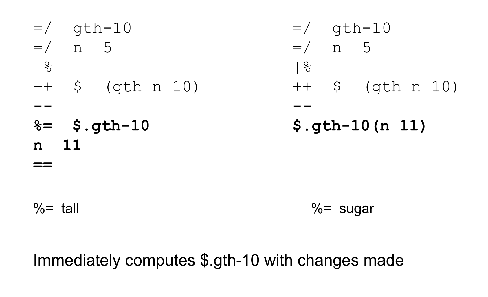

```
> =/  gth-10
  =/  n  5
  |%
  ++  $  (gth n 10)
  --
  $.gth-10(n 11)

%.y
```

If instead of using `=/` to pin the core to a face, we set the core as the subject, then the code becomes shorter. Now we can just grab the `$` arm directly.

```
> =>
  =/  n  5
  |%
  ++  $  (gth n 10)
  --
  $(n 11)

%.y
```

We are not limited to changing a single value at once with `%=`. This core has the pair `[a=1 b=2]` at the head of the payload, and then compares if `a` is greater than `b`


Running its `$` default arm gives us `%.n` since `1 < 2`.

```
=>
=+  [a=1 b=2]
|%
++  $  (gth a b)
--
$
```

We can use `%=` to change both values at once and recompute the `$` arm in the core.

```
> =/  gth-a-b
  =+  [a=1 b=2]
  |%
  ++  $  (gth a b)
  --
  =>
  %=  gth-a-b
  a  5
  b  3
  ==
  $

%.y
```

In sugar syntax:

```
> =/  gth-a-b
  =+  [a=1 b=2]
  |%
  ++  $  (gth a b)
  --
  =>  gth-a-b(a 5, b 3)  $

%.y
```

##  Doors

As mentioned before, the pattern where we pin something to the head of the core's payload, as the sample, and use it in the core is very common. In fact, there is a special term and rune for this particular case.

A **door** is a core with a sample pinned to the head of a payload. You can create one with the `|_` (barcab) rune. It takes a first argument which is a *sample type definition* (in structure mode). It pins the bunt (default value) of that type to the head of the payload, then creates a core


To understand how doors are a special case of a core, we can write our `gth-10` core as a door instead.

Each of these 4 pieces of code do the same thing. The first is with the door syntax, and the other 3 are with the core syntax. Recall that `^*` (kettar) returns the bunt of a value, and the bunt of `@ud` is `0`, so it's the same as pinning `n` to `0`.

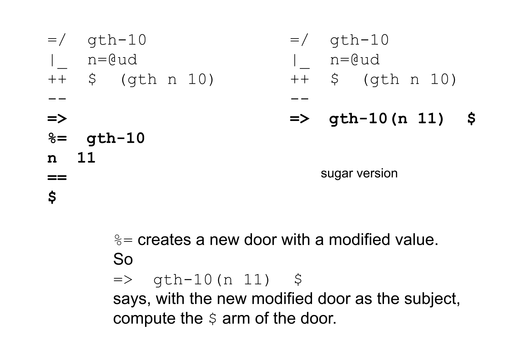

There is also a convenience rune called `=|` (tisbar) which pins the bunt of a type. This is also equivalent to the above:

```
=|  n=@ud
|%
++  $  (gth n 10)
--
```

Going back to our door, we can use it just as we did with the core.

```
=>
|_  n=@ud
++  $  (gth n 10)
--
$
```

which returns `%.n` since `n=0 < 10`.


We can also mutate the door with the `%=` rune, and recompute it.


```
> =/  gth-10
  |_  n=@ud
  ++  $  (gth n 10)
  --
  =>  gth-10(n 11)  $

%.y
```

##  %~  (Censig)

It would be great if we could simplify the above code further. Fortunately, there is a rune that will allow us to do so. The `%~` (censig) rune takes 3 arguments, an arm in a door, a door, and a sample value. It runs the arm after substituting in the new sample value.


Using `%~` our code becomes,


Tall:
```
=/  gth-10
|_  n=@ud
++  $  (gth n 10)
--
%~  $  gth-10  11
```

Sugar:
```
=/  gth-10
|_  n=@ud
++  $  (gth n 10)
--
~($ gth-10 11)
```

We can also substitute two values at once:

Tall:
```
=/  gth-a-b
|_  [a=@ud b=@ud]
++  $  (gth a b)
--
%~  $  gth-a-b  [100 2]
```

Sugar:
```
=/  gth-a-b
|_  [a=@ud b=@ud]
++  $  (gth a b)
--
~($ gth-a-b [100 2])
```

## Conclusion
Over the course of this lesson, we have been inching slowly towards something that looks like a basic reusable function, that you can grab and recompute with a custom input. We will make this even clearer in next lesson.

Great work getting to the end. This was a big lesson that covered the essential basics of cores and doors. Next lesson we will see how we can use these basics to develop any useful structure you might need, including reusable functions (called gates), recursive functions (called traps), and more.

