# Exploring the Standard Library and Building Production Code
##  Hoon School Lesson 7

Our final lesson of Hoon School Live. We will dig into data structures and a few more features of the language. We will wrap up with a discussion of `%say` generators, writing and testing production-ready code, and understanding the Urbit system.

## A Few Important Data Structures

Let's learn about some useful data structures that you will often find used in Hoon code.

## Units

In Hoon the character `~` stands for the value `0` -- not a null value! If we cast it to an atom aura, we can see this.

```
> `@`~
0
```
However suppose that we want to write a database with keys linked to values, and some keys may have no corresponding value. If we return `~`, we might think the key exists and corresponds to a value of `0`. How might we solve this?

In Hoon this is solved by a data structure called the **unit**. Formally, **unit** is a mold generator, just like **list**. It's a gate that takes a mold and creates a new mold.

Recall that we could apply
```
%-  list  @rs

(list @rs)
```
to get a mold that is a list of `@rs`, you can apply

```
%-  unit  @rs

(unit @rs)
```
To get a `unit` of a `@rs`. What is a `unit` though? It's a type union of either just `~`, or a cell `[~ value]`. When we get `~` from a unit, it indicates nothing was there, while `[~ value]` indicates `value` was there.

For example, this `^-` typecheck passes,

```
> ^-  (unit @rs)  ~
~
```

And so does this,
```
> ^-  (unit @rs)  [~ .1.234]
[~ .1.234]
```

But this one fails.
```
> ^-  (unit @rs)  .1.234
mint-nice
-need.u(@rs)
-have.@rs
```

### Unit Utilities

To put a value in a `unit`, you can use the library gate `some`

```
> (some 2)
[~ u=2]
```

And you can extract the value from a unit with `need`.
```
> (need (some 2))
2
```

If need is given an empty unit, it fails:

```
> (need ~)
dojo: hoon expression failed
```

There is also a sugar syntax to put something into a cell of `[~ value]`, which is using a tick:

```
> `2
[~ 2]
```

However, recall that a null-terminated tuple like `[1 2 3 ~]` is shaped like a list but not necessarily known to be a list. The same goes for units and structures shaped like `[~ value]`.

When designing apps, you may want to check a database for some value, that might be empty, and apply a gate to it. The library gate `bind` helps us with this.

`bind` takes a unit and any gate, and makes that gate take that unit and return a unit as output.


For example,
```
> %+  bind  (some [2 3])  add
[~ u=5]
```

If given an empty unit, it will make the gate return the empty unit too.
```
> %+  bind  ~  add
~
```

There are many more `unit` utilities that we don't have space to cover here, but are available at:
https://developers.urbit.org/reference/hoon/stdlib/2a


## Maps

Key-value pairs, or dictionaries, are really important constructs in any programming language. They let you store data under a name and search for it later by looking up the name.

In Hoon these implemented with **maps**. The term `map` is also a mold builder, which takes as input two different molds, and returns a mold which is a map with the first mold as key and second as value.

For example, the following creates a mold of a map with `@t` keys and `@ux` values.

```
%+  map  @t  @ux

(map @t @ux)
```

The standard library gate `my` takes a null-terminated tuple, each element of which is a pair, and creates a map using the pairs.

Suppose we are making an app and need to store and render some colors for the frontend. Let's make a map from `@t` text colors to their hexadecimal representations.

```
> (my ~[['red' 0xed.0a3f] ['green' 0x1.a638] ['blue' 0x66ff]])

[n=[p='green' q=0x1.a638] l=[n=[p='blue' q=0x66ff] l=[n=[p='red' q=0xed.0a3f] l={} r={}] r=~] r=~]
```

The output here with `n` `l` `r` refers to the underlying tree structure that the map is implemented on.

We can verify that this is indeed a `map` from `@t` to `@ux` using `^-`:
```
^-  (map @t @ux)  (my ~[['red' 0xed.0a3f] ['green' 0x1.a638] ['blue' 0x66ff]])
```

### Map Library `by`
How do we use our map to put values, delete them, and look them up? There is a standard library door for working with maps called `by`.


Let's demonstrate how to put a new element in our map. We are going to use the `by` door whose arms build gates that can operate on maps.

### Recap
Recall that in last lecture we learned about a door which could build a gate representing any linear equation. Here we have a door with a single `$` arm containing a gate. That gate uses its own input `x`, as well as the parameters `a` `b` from the door.

```
|_  [a=@ud b=@ud]
++  $  
  |=  x=@ud
  ^-  @ud
  (add (mul a x) b)
--
```

We could name this door `linear`` and then build the gate representing `y=4x+2`
```
=/  linear
|_  [a=@ud b=@ud]
++  $  
  |=  x=@ud
  ^-  @ud
  (add (mul a x) b)
--
~($ linear [4 2])
```

Then we could call that gate on some input like `x=1`

```
> =/  linear
  |_  [a=@ud b=@ud]
  ++  $  
    |=  x=@ud
    ^-  @ud
    (add (mul a x) b)
  --
  (~($ linear [4 2]) 1)

6
```

When we are working with the `map` library `by`, the same pattern is going on.

### Back to `by`

Let's go back to putting a new entry in our color map. To do so, we call  the `put` arm of the `by` door with our color map as a sample.


This call `~(put by colors)` resulted in a gate which takes a new pair, and returns the map with the pair added to it.

Let's see it used here -- note `['yellow' 0xfb.e870]` shows up in the output.

```
> =/  colors  (my ~[['red' 0xed.0a3f] ['green' 0x1.a638] ['blue' 0x66ff]])
  =/  colors  %-  ~(put by colors)  ['yellow' 0xfb.e870]
  colors

[n=[p='green' q=0x1.a638] l=[n=[p='blue' q=0x66ff] l=[n=[p='red' q=0xed.0a3f] l=~ r=~] r=~] r=[n=[p='yellow' q=0xfb.e870] l=~ r=~]]
```

Above, when we wanted to add something to the `colors` map, we didn't change the original data structure, we created a new copy of it with a change made. This was the same pattern when you modified cores with `%=` (centis).

To show that this operation just created a new copy of the map, we can even access the original `colors` map, without `'yellow'`, with the `^` notation:

```
> =/  colors  (my ~[['red' 0xed.0a3f] ['green' 0x1.a638] ['blue' 0x66ff]])
  =/  colors  %-  ~(put by colors)  ['yellow' 0xfb.e870]
  ^colors

[n=[p='green' q=0x1.a638] l=[n=[p='blue' q=0x66ff] l=[n=[p='red' q=0xed.0a3f] l={} r={}] r=~] r=~]
```

We can remove an element from a map with `del`. As with `put`, `del` is an arm in the `by` door. Calling this arm with a sample produces a gate which takes a key, and returns the sample map with the key removed.

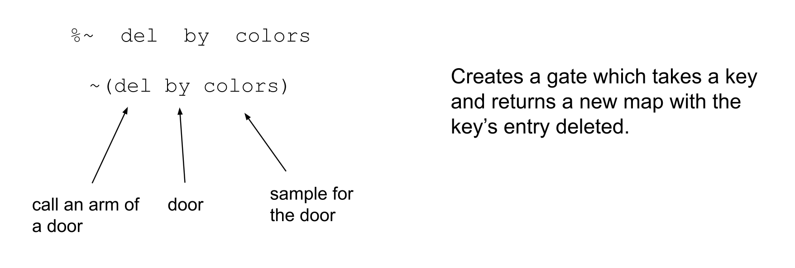

Let's see it in action. We can see the resulting map has the `green` entry removed:

```
> =/  colors  (my ~[['red' 0xed.0a3f] ['green' 0x1.a638] ['blue' 0x66ff]])
  =/  colors  %-  ~(del by colors)  'green'
  colors

[n=[p='blue' q=0x66ff] l=[n=[p='red' q=0xed.0a3f] l=~ r=~] r=~]
```

If we pass in a key that doesn't exist, the map is returned unchanged.

```
> =/  colors  (my ~[['red' 0xed.0a3f] ['green' 0x1.a638] ['blue' 0x66ff]])
  =/  colors  %-  ~(del by colors)  'orange'
  colors

[n=[p='green' q=0x1.a638] l=[n=[p='blue' q=0x66ff] l=[n=[p='red' q=0xed.0a3f] l=~ r=~] r=~] r=~]
```

We can look up the value associated with a key using `get`. get` returns a `unit`, which we just learned about.


```
> =/  colors  (my ~[['red' 0xed.0a3f] ['green' 0x1.a638] ['blue' 0x66ff]])
  (~(get by colors) 'red')
  
[~ 0xed.0a3f]
```

```
> =/  colors  (my ~[['red' 0xed.0a3f] ['green' 0x1.a638] ['blue' 0x66ff]])
  (~(get by colors) 'orange')

~
```

`got` works just like `get` but directly returns the value instead of wrapping it in a unit. However, it will crash if the key doesn't exist, so be careful (imagine a user crashing their app with an invalid lookup).

```
> =/  colors  (my ~[['red' 0xed.0a3f] ['green' 0x1.a638] ['blue' 0x66ff]])
  (~(got by colors) 'red')
  
[~ 0xed.0a3f]
```

```
> =/  colors  (my ~[['red' 0xed.0a3f] ['green' 0x1.a638] ['blue' 0x66ff]])
  (~(got by colors) 'orange')

~
```

We can convert an entire `map` to a `list` using `tap`. Unlike the previous pattern, calling the `tap` arm of `by` with a sample doesn't produce a gate, but  directly returns the result.


```
> =/  colors  (my ~[['red' 0xed.0a3f] ['green' 0x1.a638] ['blue' 0x66ff]])
  ~(tap by colors)

~[[p='green' q=0x1.a638] [p='blue' q=0x66ff] [p='red' q=0xed.0a3f]]
```

Similarly, `val` can return a list of only values,

```
> =/  colors  (my ~[['red' 0xed.0a3f] ['green' 0x1.a638] ['blue' 0x66ff]])
  ~(val by colors)

~[0x1.a638 0x66ff 0xed.0a3f]
```

And `key` can return a **set** of the keys, a data structure we will learn about next.

```
> =/  colors  (my ~[['red' 0xed.0a3f] ['green' 0x1.a638] ['blue' 0x66ff]])
  ~(key by colors)

{'red' 'blue' 'green'}
```


Just like with lists, there is a rich library of utilities for working with maps. For example, there is `urn`, which is like `turn`, which applies a gate over all the entries. The whole list is here:

https://developers.urbit.org/reference/hoon/stdlib/2i


## Sets

Suppose you'd like to keep track of who to invite to a party. You keep adjusting the invitees, sometimes adding and removing people. On a computer, you might not want to use a list to store this data, because a list could contain "Alice" twice, and that might make you send two invitations to Alice on accident.

A **set** is perfect for this situation. A set is an unordered grouping of data in which each entry is unique -- they can only appear once.

Like other data structures, the term `set` in Hoon is a mold generator which takes as input a mold and returns a mold which is a set of that mold.

```
%-  set  tape

(set tape)
```

To create a set instance from a null-terminated tuple, use `sy`:

```
> ^-  (set tape)  (sy ["Alice" "Bob" "Charlie" "Charlie" "Dave" ~])
{"Alice" "Dave" "Bob" "Charlie"}
```

Notice how `"Charlie"` only appeared once in the set even though the input list had him twice.

### Set Library `in`

Suppose we want to add someone to our party set. We can use the `put` arm of the `in` door.


Let's try it.

```
> =/  party  (sy ["Alice" "Bob" "Charlie" "Charlie" "Dave" ~])
  (~(put in party) "Emily")

[n=[i='C' t="harlie"] l=[n=[i='E' t="mily"] l={[i='A' t="lice"] [i='D' t="ave"]} r={[i='B' t="ob"]}] r=~]
```

Looking at the output here, the `n` `l` `r` tagged things refer to the raw underlying tree structure which is used to construct the `set`. 

We can cast the output to a `(set tape)` to get better formatting.

```
> =/  party  (sy ["Alice" "Bob" "Charlie" "Charlie" "Dave" ~])
  `(set tape)`(~(put in party) "Emily")

{"Alice" "Dave" "Emily" "Bob" "Charlie"}
```

Unfortunately, you just remembered that last time Dave was at your party, he got drunk and set the rug on fire. We can use the `del` arm of the `in` door to remove him from the set.


```
> =/  party  (sy ["Alice" "Bob" "Charlie" "Charlie" "Dave" ~])
  `(set tape)`(~(del in party) "Dave")

{"Alice" "Bob" "Charlie"}
```

We can use the `has` arm to check if an element exists in the set.


```
> =/  party  (sy ["Alice" "Bob" "Charlie" "Charlie" "Dave" ~])
  (~(has in party) "Frank")

%.n
```

```
> =/  party  `(set tape)`(sy ["Alice" "Bob" "Charlie" "Charlie" "Dave" ~])
  (~(has in party) "Alice")

%.y
```

We can convert a set to a list using `tap`


```
> =/  party  (sy ["Alice" "Bob" "Charlie" "Charlie" "Dave" ~])
  `(list tape)`~(tap in party)

<<"Charlie" "Bob" "Dave" "Alice">>
```

Notice that this sequence of operations returned the original list with any repeats removed. This is a useful trick to deduplicate lists.

You can apply a gate to every element of the set with `run`. 


Here we apply `cuss` to capitalize every tape in the set. Maybe our party invitations are very loud...

```
> =/  party  (sy ["Alice" "Bob" "Charlie" "Charlie" "Dave" ~])
  `(set tape)`(~(run in party) cuss)

{"BOB" "CHARLIE" "DAVE" "ALICE"}
```

As with maps and lists, there are many more utilities that we can't cover entirely, but all of them are here:

https://developers.urbit.org/reference/hoon/stdlib/2h

## Jars, Jugs, Mops

There are a few more data structures that have their own libraries. I believe some Hoon developer was using these structures a lot and decided to formalize them. 

A `jar` is a `map` whose values are `list`s. A `jug` is a `map` whose values are `set`s. A `mop` is a `map` with an ordering over the keys. We don't need to dig into them now, but it's good to know the libraries exist.

https://developers.urbit.org/reference/hoon/stdlib/2j
https://developers.urbit.org/reference/hoon/zuse/2m#mop

## Vases

A `vase` is like a container for a noun. It's a type-value pair -- a cell whose head contains the type and tail contains the noun. When you get into writing apps, you'll use these frequently.

To make a vase, use `!>` (zapgar).

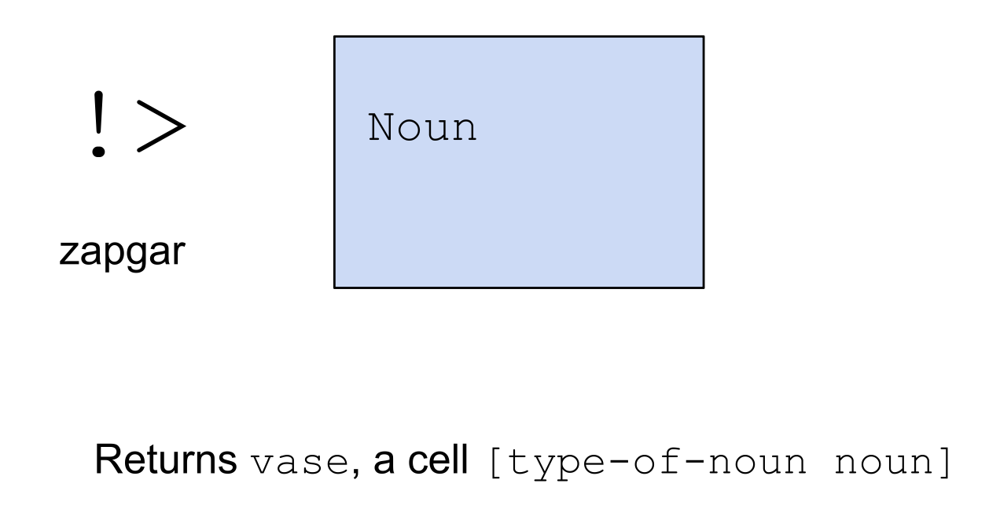

```
> !>(2)
[#t/@ud q=2]
```

To unpack a vase, use `!<` (zapgal). `!<` takes two children, the first a mold, and the second a vase. It tries to make the noun in the vase fit the mold, and fails if it can't.


```
> !<  @ud  !>(2)
2
```

```
> !<  @p  !>(2)
-need.@p
-have.@ud
nest-fail
```

## Functional Programming Tricks

For those with experience in other functional programming languages, these may be familiar. If you're not, you can just remember them as some tricks for modifying the behavior of gates.

Have you ever wanted to call `add` or `mul` on more than 2 numbers at a time? Now you can using the `;:` (miccol) rune. It converts a binary (2 argument) gate to a n-ary (n arguments) gate.

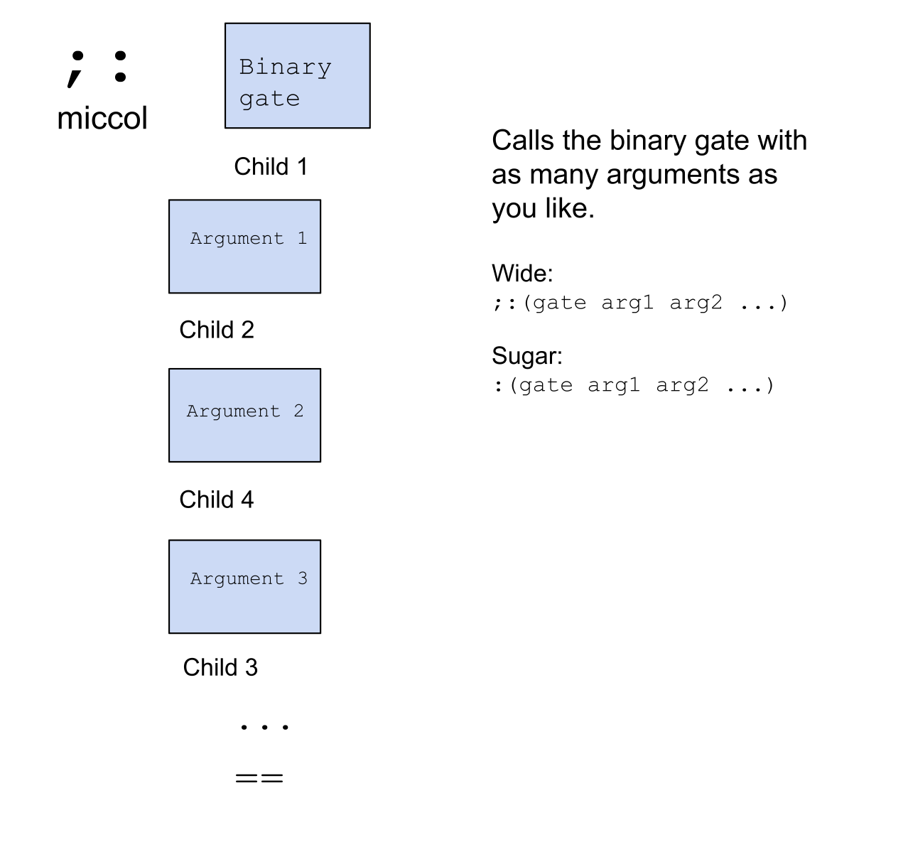

For example:

```
> ;:  mul  2  3  4  5  ==
120
```

In sugar form:

```
> :(mul 2 3 4 5)
120
```

**Currying** is the term for taking a gate and fixing one of its arguments to a certain value. This creates a new gate that already has an argument passed in, so takes one less argument than the original gate. 

Let's see an example. The gate `cury` binds the leftmost sample of a gate. In this case we can use it to bind the first argument to `mul`:

```
> =/  mul-10  (cury mul 10)
  (mul-10 4)

40
```

The gate `curr` binds the rightmost sample of the gate. We can use it to bind the second argument to `gth`

```
> =/  gth-10  (curr gth 10)
  (gth-10 11)

%.y
```

##  Some More Syntax

Let's briefly cover some syntax you might find in the wild in Hoon code. We have already seen `@` which represents the most generic type of any atom. There are a few more:


We can bunt these to get the default value for the type.

For example for a cell,
```
> ^*  ^
[0 0]
```

For a noun,
```
> ^*  *
0
```

For a loobean,

```
> ^*  ?
%.y
```

The following notation looks like mathematical operations, but is actually shorthand for creating cells.


```
> 1+2
[%1 2]

> dog+'dachshund'
[%dog 'dachshund']
```

```
> cat/'maine coon'
[%cat 'maine coon']
```

```
> 1^2
[1 2]

> =/  a  "alice"
  =/  b  "bob"
  a^b

["alice" "bob"]
```

## `%say` Generators

So far, we have learned how to work with regular generators -- writing them, saving them, and running them from the command line. The `%say` generator is the next level up for generators.

First let's look at a simple regular generator. What does this code do? It accepts any noun as input. Then it just returns the number 42 (not using the input at all.)

```
|=  *
(add 40 2)
```

We can save this as `test.hoon`, `|commit %base`, and run it. Note that to run it, it needs us to give it something as input, even though that something is totally unused.
```
> +test 'abc'
42

> +test 1
42
```

Calling it with no argument throws an error.

Let's write the above code as a `%say` generator. 

```
:-  %say
|=  *
:-  %noun
(add 40 2)
```

If we save this code, `|commit %base`, we can actually run it without passing in any arguments at all.

```
> +test
42
```

Let's look at the code and try to understand what's going on. We have a `:-` (colhep), whose first argument is `%say` and second argument is the gate. Inside the gate, there is a `:-` (colhep) whose first argument is `%noun` and second argument is the code inside the gate.

```
:-  %say
|=  *
:-  %noun
(add 40 2)
```

So our code will produce a structure that looks like this:


The tags `%say` and `%noun` are metadata information that's communicated to the Dojo. %noun in particular is what's called a **mark**, which in the Urbit system is like a file type. When running a `%say` generator, Dojo uses these metadata tags, but parses them out and we only see the result `42`.


### `%say` Generator Sample

In our above `%say` generator, the sample of the gate was just `*`, which is the most general argument possible -- any noun. We also didn't use the sample at all.

However, `%say` generators have a highly specific structure to their sample which gives them access to more information than regular generators get.

A `%say` generator sample is a triple, consisting of first a triple of `[now=@da eny=@uvJ bec=beak]`, then a list of named arguments (mandatory args), then a list of unnamed arguments (optional args).


`%say` generators can augment the power of our regular generators tremendously by letting us access useful system info, allowing us to use randomness, and letting us use optional arguments.


## Randomness
Above we saw that the argument `eny` to a `%say` generator lets us use randomness. This is a random seed, which is just a very large number, which is passed to Urbit from Linux's random number generation (which uses something called CPU jitter).

Let's go through an example of using `eny` to generate random outputs. Consider the code below, which we can save as `dice.hoon` in our `gen` folder, commit, and run with `+dice 6` (or any other number for an n-sided dice).

```
:-  %say
|=  [[now=@da eny=@uvJ bec=beak] [n=@ud ~] [bet=@ud ~]]
:-  %noun
[(~(rad og eny) n) bet]
```

Let's break down the parts of this code.

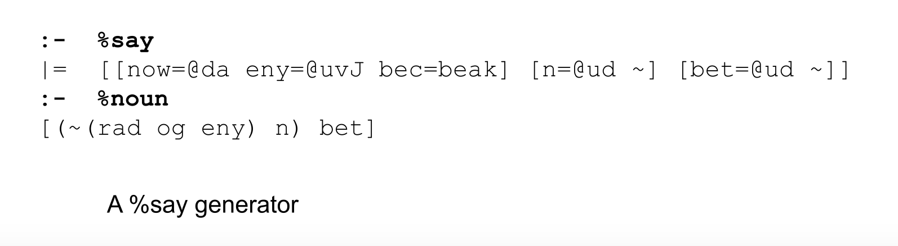


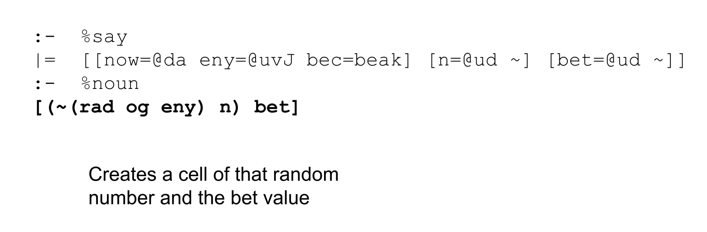

How does the random number generation work? The door `og` is a library for handling random number generation. By calling it's `rad` arm with a seed, we get a gate that takes a `@ud` and returns a number between `0` and the input.

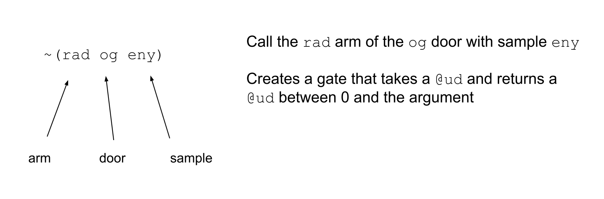

Our random seed `eny` is just some large number. But we can use any number as the seed.

```
> (~(rad og 0) 100)
5
```

```
> (~(rad og 222.222) 100)
69
```

Going back to our dice generator, we could have also called it with an optional `bet` argument

```
+dice 10, =bet 100
```

Note that when we called `+dice 6` and didn't pass in the optional `bet` argument, it used the bunt of the `@ud` type, which is `0`.

## Building Production Code

For this section, let's consider the following code, which generates a list of all the prime numbers between `2` and the input number:

```
|=  input=@ud
=/  output  (gulf 2 input)
=/  n  2
|-
  ?:  =(n input)
    output
  %=  $
  output  (skip output |=(a=@ud &(!=(a n) =((mod a n) 0))))
  n  (add n 1)
  ==
```

We can save it as `primes.hoon` in the `gen` folder, commit, and run it with `+primes 10`.

## Commenting

When building production code, it's important to include comments. This helps others and yourself understand your code.

To do so, simply use the `::` (colcol) rune. This makes everything typed after it on the same line into a comment. Note that `::` doesn't multiline, every line that has comments should start with one. You can use `::` on the same line after some code, though this is discouraged style these days.

Here we've augmented our `primes.hoon` generator with some informative comments, including a title at the top, and explanations for each step of the logic. We can save and run this, and it works the same.

```
::  primes.hoon
::  Outputs a list of prime numbers between 2 and the input number.
::
|=  input=@ud
::  create output list
::
=/  output  (gulf 2 input)
::  n is a counter to use for filtering out non-primes
::
=/  n  2
|-
  ::  terminate when n reaches the input number
  ::
  ?:  =(n input)
    output
  ::  recurse with: 
  ::
  ::  the output list filtered out by every number that's divisible by n,
  ::  unless it equals n
  ::
  ::  n incremented by 1
  ::
  %=  $
  output  (skip output |=(a=@ud &(!=(a n) =((mod a n) 0))))
  n  (add n 1)
  ==
```

## Testing and Logging

When we're building complex code, there's a variety of tools that we can use to test and make sure that things are working.

For example, in our `primes` code, it wouldn't have made sense if our input was `1` or `0` because the smallest prime number is `2`.

We can catch that case with a `?>` (wutgar), which asserts that a condition is true, and otherwise crashes. Check line 2 of the code below:

```
|=  input=@ud
?>  (gth input 1)
=/  output  (gulf 2 input)
=/  n  2
|-
  ?:  =(n input)
    output
  %=  $
  output  (skip output |=(a=@ud &(!=(a n) =((mod a n) 0))))
  n  (add n 1)
  ==
```


`?<` (wutgal) asserts that a condition is false, and otherwise crashes. This code does the same thing as before:

```
|=  input=@ud
?<  (lth input 2)
...
```

The `!!` (zapzap) rune just crashes the program. We can write the exact same logic using `?:` and `!!`.

```
|=  input=@ud

...
```

If code crashes, we can print out an output to let us know what happened, using the `~|` rune, which prints an error message to the terminal only when a crash occurs.


We can save and run the code below to see that it prints the message when running `+primes 1` or `+primes 0`

```
|=  input=@ud
~|  "Crashed because the input was less than 2"
?:  (lth input 2)
  !!
=/  output  (gulf 2 input)
=/  n  2
|-
  ?:  =(n input)
    output
  %=  $
  output  (skip output |=(a=@ud &(!=(a n) =((mod a n) 0))))
  n  (add n 1)
  ==
```
To always print to the terminal, we can use the `~&` (sigpam) rune. This is useful to peek inside of our code to see what's going on.

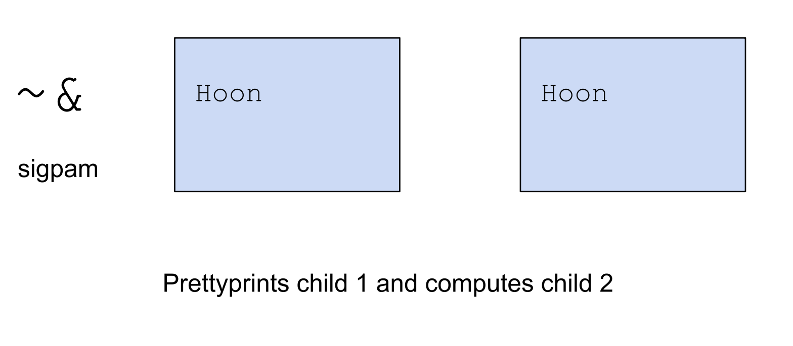

Below, on line 5, we added a `~&` to print out the intermediate stages of the `output` list in each iteration of the trap. 

```
|=  input=@ud
=/  output  (gulf 2 input)
=/  n  2
|-
  ~&  output
  ?:  =(n input)
    output
  %=  $
  output  (skip output |=(a=@ud &(!=(a n) =((mod a n) 0))))
  n  (add n 1)
  ==
```

Saving and running it:

```
~[2 3 4 5 6 7 8 9 10]
~[2 3 5 7 9]
~[2 3 5 7]
~[2 3 5 7]
~[2 3 5 7]
~[2 3 5 7]
~[2 3 5 7]
~[2 3 5 7]
~[2 3 5 7]
> +primes 10
~[2 3 5 7]
```

## Importing and using a library file

In Hoon, you can save a core containing pieces of code and import it as a **library file**, which you can then call and use in your other code. Let's try that with our primes code.

Let's save the following file as `primes-lib.hoon` in the `lib` folder. Essentially, we exported all of our logic to the `primes-to` arm of this library core.

```
|%
++  primes-to
  |=  input=@ud
  =/  output  (gulf 2 input)
  =/  n  2
  |-
    ~&  output
  ?:  =(n input)
    output
  %=  $
  output  (skip output |=(a=@ud &(!=(a n) =((mod a n) 0))))
  n  (add n 1)
  ==
--
```

Let's make this the new `primes.hoon` generator. The `/+` at the top is the rune to import a library file from the `lib` folder. Then we call the `primes-to` arm of the `primes-lib` library core with this syntax: `primes-to:primes-lib`.

```
/+  primes-lib
|=  input=@ud
(primes-to:primes-lib input)
```

If we import the library file with a `*` in front, we can access its namespace and just call the `primes-to` arm directly.

```
/+  *primes-lib
|=  input=@ud
(primes-to input)
```

## Importing Library Files to Dojo

Unlike generators, library files aren't immediately available to be used in the Dojo, but you can build them and use them with the following syntax:

```
> =primes-lib -build-file %/lib/primes-lib/hoon
> (primes-to:primes-lib 10)

~[2 3 5 7]
```

## Writing Unit Tests

Testing code is a very important part of shipping clean, high-quality software. Let's write and run some tests for our `primes` generator.

We create a `test` folder in the `base` desk and save the following code in there as `primes.hoon`.

```
/+  *test
/=  primes  /gen/primes
|%
::  tests to make sure code works
::
++  test-01
  %+  expect-eq
    !>  `(list @ud)`~[2 3 5 7]
    !>  (primes 10)
++  test-02
  %+  expect-eq
    !>  `(list @ud)`~[2]
    !>  (primes 2)
++  test-03
  %+  expect-eq
    !>  `(list @ud)`~[2 3 5 7 11 13 17 19 23 29 31 37 41 43 47]
    !>  (primes 50)
::  tests to make sure code fails
::
++  test-04
  %-  expect-fail
    |.  (primes 1)
--
```

Let's dig into the parts of this code to understand it.

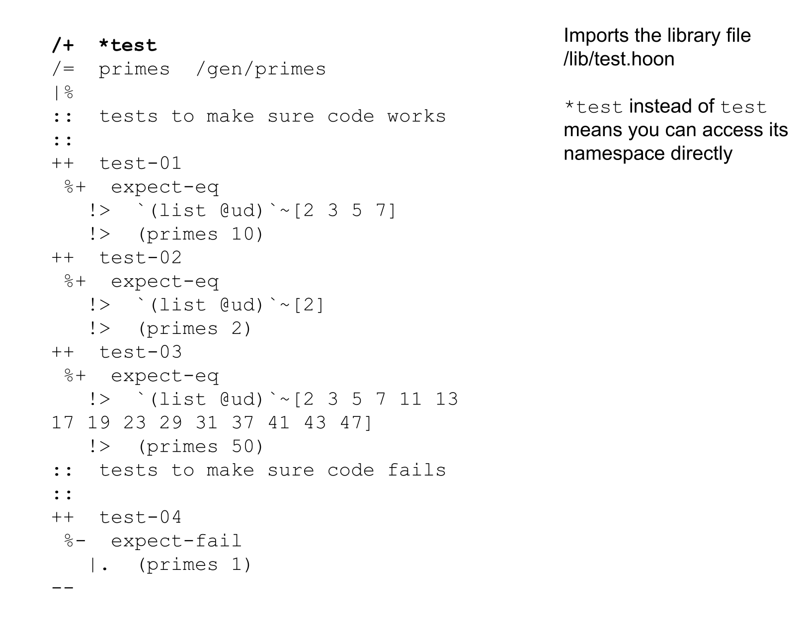

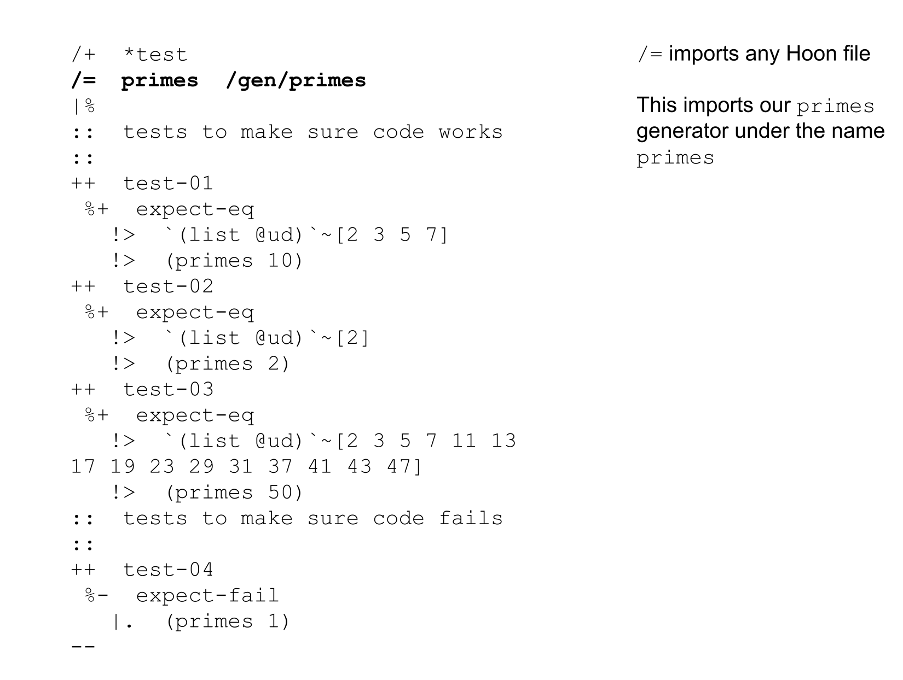


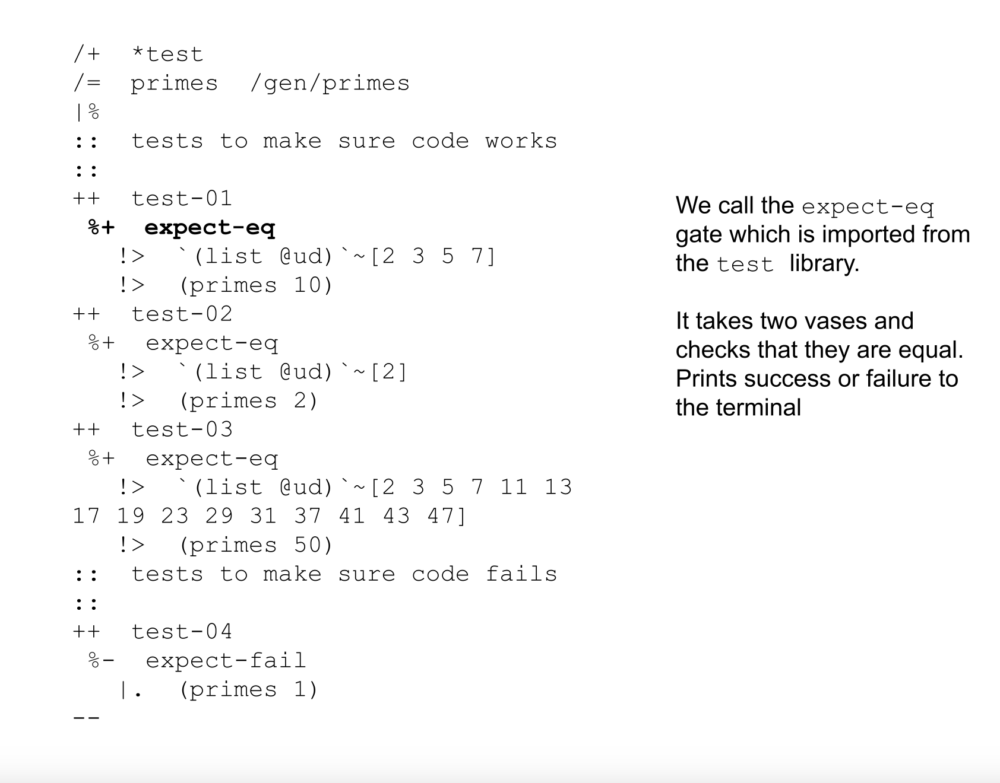

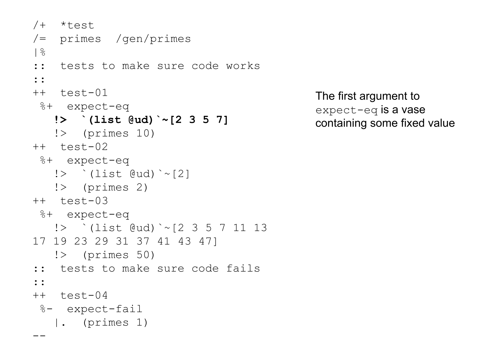

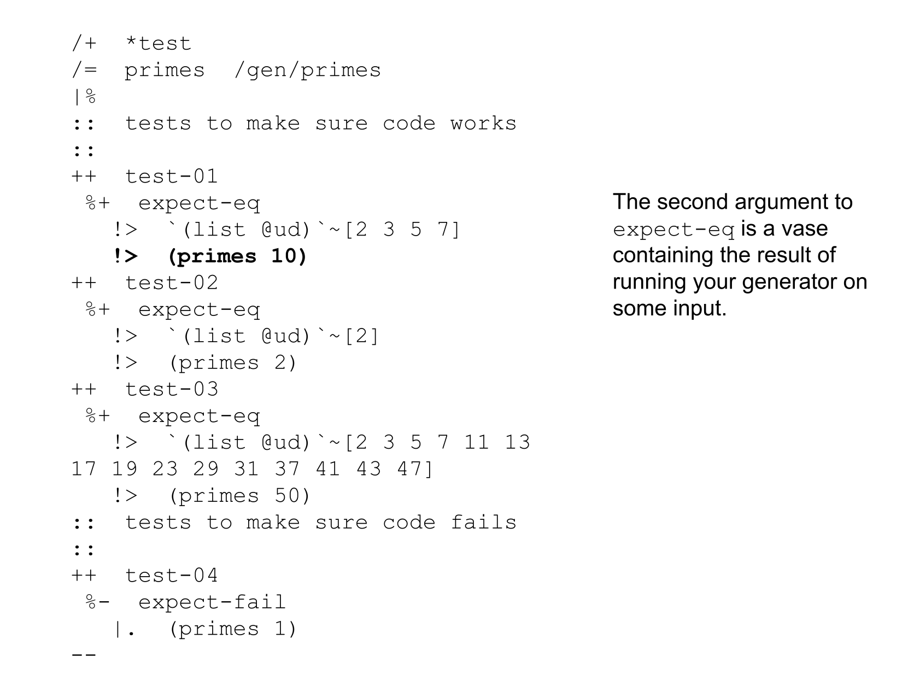


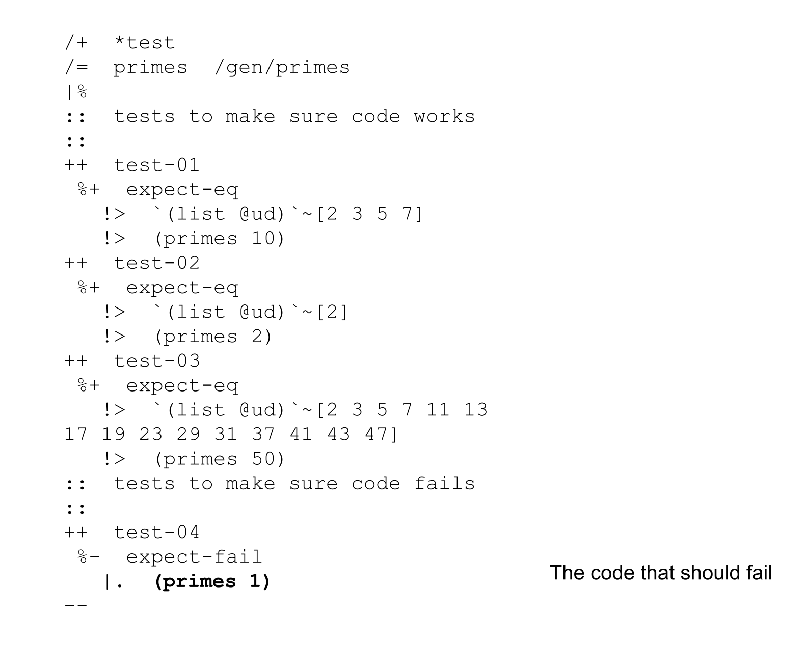


Once you've saved and commited the code, you can run the tests with the following commands.

```
-test %/tests/primes/hoon
```
OR
```
-test /===/tests/primes/hoon
```

In this case `%` or `/===` at the front of the path stands in for the beak, which is a triple of `[ship desk case]` that basically tells the Dojo where you are in the file system.

The syntax `-test` is the syntax to run a thread, which is something to learn about later.

Further reading on Urbit unit testing from Neal E. Davis:
https://medium.com/dcspark/writing-robust-hoon-a-guide-to-urbit-unit-testing-82b2631fe20a


## Exploring the Code base
Let's understand what's contained inside our ship. Navigating to our `base` folder on earth, we can see several folders.

* sys -- system files
* gen -- generators (reusable scripts)
* lib -- library files (utilities to be imported and used in other code)
* app -- app files that define gall agents (any app you install on your urbit will have a file here, you'll learn about these later)
* sur -- structure files for apps -- molds that apps use are defined here.
* mar -- marks that apps used are defined here. These are like file types that allow communication between apps or apps and the system.
* ted -- threads (transient computations). We used a thread to run our tests, you'll learn more about these later.


Let's take a look inside the sys folder.

* hoon.hoon -- language, compiler, standard library (including arithmetic, list library, set library, etc.)
* arvo.hoon -- the fundamental event processing machinery of the OS, plus some basic type definitions.
* lull.hoon -- type definitions used by Arvo.
* zuse.hoon -- a user library with tools to deal with crypto, formatting, json, html and other miscellaneous stuff.

Each of these files is a core, and these cores are composed together to form the standard subject, such as what you access in the Dojo.

```
=>  hoon  =>  arvo  =>  lull  zuse
```

Inside the `vane` folder are vanes, which are like kernel modules (discrete parts of the operating system that handle different jobs). For example, `gall` handles apps, `dill` handles the terminal, and `behn` handles timers.


## Hoon School Live Conclusion

As far as entire operating systems and network protocols go, Urbit is extremely small and simple. As a Hoon School finisher, you have a good foundation for starting to understand the entire system.

Urbit is a growing and evolving system that is still under construction. Don't consider anything you've learned in this course to be frozen or permanent. This is a system that can and will be changed. In particular, **YOU** the Hoon School graduate, will play an essential role in making this system better.

As a Hoon school graduate, you'll be a critical part of taking Urbit to the next level. You've jumped on the ride to making a new internet, and you can help steer too. Whether you want to work on the core system, improve our developer tooling, making an interesting app, or start a company, we're here to support you. If you ever want to consult on what you might like to do next on the network, always feel free to reach out.

We have a grants and bounty system that awards Stars to those that complete projects. This is also a great way to get noticed and work your way up -- it's how I got hired.

App School starts soon on August 22nd. It will be held at 3pm ET and run for 8 weeks until October 10. We also have the Hackathon which starts on August 28th up to a demo day on October 28 at Assembly in Lisbon.

We look forward to having you around the network and at our events. I'm excited to see what amazing things you will build with your new Hoon skills.